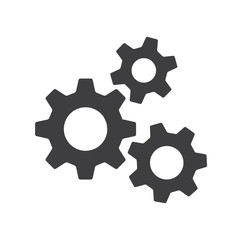
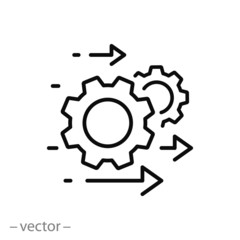

<body class="c19">

Funcionalidades existentes e previs&atilde;o de novas entregas

Funcionalidades existentes:

Todos os contratos e suas altera&ccedil;&otilde;es registrados no SIASG/SICON&nbsp;ser&atilde;o automaticamente importados para o Comprasnet Contratos, portanto &nbsp;&agrave;s inclus&otilde;es e altera&ccedil;&otilde;es realizadas no SIASG at&eacute; 31 de dezembro de 2020 ser&atilde;o automaticamente migradas &nbsp;para o novo sistema. Entretanto, ainda &eacute; poss&iacute;vel, de forma manual:

<table class="c0"><tbody><tr class="c28"><td class="c5" colspan="1" rowspan="1">
Incluir um novo instrumento contratual ou documentos substitutos
</td><td class="c5" colspan="1" rowspan="1">
Incluir uma altera&ccedil;&atilde;o contratual (Termo Aditivo, Apostilamento, Sub-roga&ccedil;&atilde;o, ou Recis&atilde;o) e Termo de Encerramento)
</td></tr><tr class="c11"><td class="c5" colspan="1" rowspan="1">
Vincular um ou mais empenhos a um contrato
</td><td class="c5" colspan="1" rowspan="1">
Cadastrar faturas de um contrato
</td></tr><tr class="c15"><td class="c5" colspan="1" rowspan="1">
Cadastrar e vincular fornecedores
</td><td class="c5" colspan="1" rowspan="1">
Cadastrar prepostos e terceirizados
</td></tr><tr class="c15"><td class="c5" colspan="1" rowspan="1">
Cadastrar e relacionar agentes p&uacute;blicos a um contrato (fiscais, gestores, autoridades&hellip;)
</td><td class="c5" colspan="1" rowspan="1">
Cadastrar despesas acess&oacute;rias de contratos (IPTU, condom&iacute;nio, etc)
</td></tr><tr class="c15"><td class="c5" colspan="1" rowspan="1">

</td><td class="c5" colspan="1" rowspan="1">

</td></tr></tbody></table>
Todos os empenhos tamb&eacute;m j&aacute; s&atilde;o automaticamente recebidos do SIAFI e vinculados aos contratos, por&eacute;m ainda &eacute; poss&iacute;vel, de forma manual:
<table class="c0"><tbody><tr class="c15"><td class="c5" colspan="1" rowspan="1">
Cadastrar empenhos
</td><td class="c5" colspan="1" rowspan="1">
Cadastrar Situa&ccedil;&atilde;o Siafi
</td></tr><tr class="c15"><td class="c5" colspan="1" rowspan="1">
Cadastrar Rubrica

</td><td class="c5" colspan="1" rowspan="1">
Cadastrar Situa&ccedil;&atilde;o RH
</td></tr></tbody></table>

Al&eacute;m disso &eacute; ainda poss&iacute;vel:
<table class="c0"><tbody><tr class="c11"><td class="c5" colspan="1" rowspan="1">
Cadastrar ocorr&ecirc;ncias de um contrato
</td><td class="c5" colspan="1" rowspan="1">
Extrair relat&oacute;rios de contratos
</td></tr><tr class="c15"><td class="c5" colspan="1" rowspan="1">
Acessar Painel Gerencial

</td><td class="c5" colspan="1" rowspan="1">
Cadastrar Situa&ccedil;&atilde;o RH
</td></tr></tbody></table>

Em breve:

<table class="c0"><tbody><tr class="c38"><td class="c20" colspan="2" rowspan="1">
Apropria&ccedil;&otilde;es de faturas padronizadas mediante incorpora&ccedil;&atilde;o do documento h&aacute;bil
</td></tr><tr class="c22"><td class="c20" colspan="2" rowspan="1">
Novo m&oacute;dulo de fiscaliza&ccedil;&atilde;o de contratos

* Gest&atilde;o da Conta Vinculada

* Gest&atilde;o por Fato Gerador

* Cadastro de IMR (ANS)

* Cadastro de ocorr&ecirc;ncias do IMR

* Apropria&ccedil;&atilde;o do IMR no recebimento provis&oacute;rio

* Recebimento provis&oacute;rio e definitivo

* Ateste de fatura

* Rateio de despesas

* Gest&atilde;o de ordens de servi&ccedil;os
</td></tr><tr class="c25"><td class="c20" colspan="2" rowspan="1">
Integra&ccedil;&atilde;o com SEI (incorpora&ccedil;&atilde;o e gera&ccedil;&atilde;o de documentos)
</td></tr><tr class="c25"><td class="c20" colspan="2" rowspan="1">
Aplicativo mobile
</td></tr></tbody></table>

2021
<table class="c0"><tbody><tr class="c12"><td class="c20" colspan="2" rowspan="1">
Cria&ccedil;&atilde;o do pr&eacute;-empenho e empenho
</td></tr><tr class="c12"><td class="c20" colspan="2" rowspan="1">
Recebimento autom&aacute;tico de faturas e intera&ccedil;&atilde;o direta com o fornecedor
</td></tr><tr class="c12"><td class="c20" colspan="2" rowspan="1">
Ordem de pagamento automatizada
</td></tr><tr class="c21"><td class="c20" colspan="2" rowspan="1">
Cria&ccedil;&atilde;o do Contrato diretamente no sistema, ap&oacute;s o resultado da compra
</td></tr><tr class="c11"><td class="c20" colspan="2" rowspan="1">
Integra&ccedil;&atilde;o com CAGED (informa&ccedil;&otilde;es de terceirizados)
</td></tr><tr class="c11"><td class="c20" colspan="2" rowspan="1">
Integra&ccedil;&atilde;o com SICAF (pesquisa automatizada de certid&otilde;es)
</td></tr><tr class="c11"><td class="c5" colspan="1" rowspan="1">
Integra&ccedil;&atilde;o com SIORG (valida&ccedil;&atilde;o da estrutura organizacional)
</td>

</tr><tr class="c11"><td class="c5" colspan="2" rowspan="1">
Integra&ccedil;&atilde;o com Spiunet (cadastro de edifica&ccedil;&otilde;es)
</td><

</tr><tr class="c11"><td class="c5" colspan="2" rowspan="1">
Modo de login &uacute;nico via gov.br
</td>

</tr><tr class="c11"><td class="c5" colspan="2" rowspan="1">
Integra&ccedil;&atilde;o com outros sistemas de compras e gest&atilde;o contratual

</tr></tbody></table>

Como aderir

Para aderir ao sistema, leia as orienta&ccedil;&otilde;es abaixo e preencha o formul&aacute;rio de ades&atilde;o.

 

        <a href="../OrientacoesIniciais/">
            
Orientações Iniciais

        </a>
<!--         <a href="">
            
Acesse aqui o   formulário de adesão

        </a> -->
        <a href="../Funcionalidades/">
            
Funcionalidades existentes e   previsão de novas entregas

        </a>
    

Atendimento e suporte

Em caso de d&uacute;vidas, entre em contato com a Central de atendimento <a href="https://portaldeservicos.economia.gov.br/">clicando aqui</a>&nbsp;ou pelo telefone 0800-978-9001.

Acompanhe as not&iacute;cias em <a class="c13" href="https://www.google.com/url?q=https://www.comprasgovernamentais.gov.br/&amp;sa=D&amp;ust=1606509142500000&amp;usg=AOvVaw1qiwhb8ZUWLuozKE8ny6az">https://www.comprasgovernamentais.gov.br/</a>.

</body>