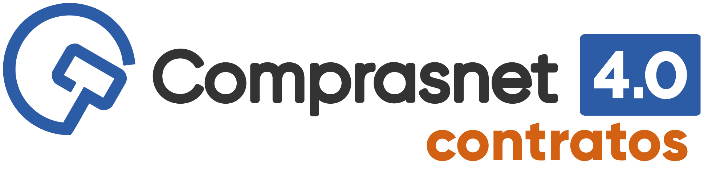

 
<body class="c25 c39">
Comprasnet Contratos - gest&atilde;o contratual e financeira

Com foco na busca pela efici&ecirc;ncia da gest&atilde;o e na melhoria do desempenho das institui&ccedil;&otilde;es p&uacute;blicas, o Minist&eacute;rio da Economia, em parceria com a Advocacia-Geral da Uni&atilde;o, ofertam aos &oacute;rg&atilde;os e entidades da administra&ccedil;&atilde;o p&uacute;blica, o&nbsp;Comprasnet Contratos.&nbsp;A ferramenta faz parte das medidas de efici&ecirc;ncia organizacional para o aprimoramento da administra&ccedil;&atilde;o p&uacute;blica federal direta, aut&aacute;rquica e fundacional estabelecidas pelo Decreto n&ordm; 9.739, de 28 de mar&ccedil;o de 2019 (Art. 6&ordm;, IX).

O Comprasnet Contratos&nbsp;&eacute; uma ferramenta do governo federal que automatiza os processos de gest&atilde;o contratual e conecta servidores p&uacute;blicos respons&aacute;veis pela execu&ccedil;&atilde;o e fiscaliza&ccedil;&atilde;o de contratos, tornando informa&ccedil;&otilde;es dispon&iacute;veis a qualquer momento e melhorando as condi&ccedil;&otilde;es de gest&atilde;o e relacionamento com fornecedores.

Quem pode utilizar: 
<ul class="c42 lst-kix_afpwpgmk2ivv-0 start"><li class="c27 c40 c25">&Oacute;rg&atilde;os e entidades da administra&ccedil;&atilde;o p&uacute;blica federal&nbsp;direta, aut&aacute;rquica e fundacional, bem como as empresas estatais; e </li><li class="c27 c25 c40">Demais &oacute;rg&atilde;os e entidades de outros poderes&nbsp;ou das esferas estadual e municipal.</li></ul>

Modelo de oferta do sistema: disponibilizado de forma centralizada, evitando altos custos com hospedagem e manuten&ccedil;&atilde;o de outros sistemas afins, de forma isolada, estabelecendo medidas de efici&ecirc;ncia organizacional para o aprimoramento da administra&ccedil;&atilde;o p&uacute;blica

Vantagens da plataforma:

- reduz os problemas&nbsp;relacionados &agrave;s rotinas de trabalho;

- pleno controle das informa&ccedil;&otilde;es&nbsp;do que acontece no &acirc;mbito dos contratos de um &oacute;rg&atilde;o ou entidade;

- promove a efici&ecirc;ncia&nbsp;na gest&atilde;o contratual;

- proporciona informa&ccedil;&otilde;es para apoiar as decis&otilde;es governamentais de aloca&ccedil;&atilde;o mais eficiente&nbsp;de recursos;

- infraestrutura centralizada, sem custos para &oacute;rg&atilde;os e entidades do Poder Executivo federal;

- maior transpar&ecirc;ncia das informa&ccedil;&otilde;es dos contratos&nbsp;celebrados por toda a administra&ccedil;&atilde;o p&uacute;blica, permitindo a padroniza&ccedil;&atilde;o de rotinas e procedimentos.

Principais caracter&iacute;sticas:

<table class="c9"><tbody><tr class="c29"><td class="c31" colspan="1" rowspan="1">

</td><td class="c5" colspan="1" rowspan="1">
M&oacute;dulo de importa&ccedil;&atilde;o de dados do SIASG
</td><td class="c44" colspan="1" rowspan="1">

</td><td class="c20" colspan="1" rowspan="1">
Gest&atilde;o financeira e or&ccedil;ament&aacute;ria integrada (SIAFI)
</td><td class="c31" colspan="1" rowspan="1">

</td><td class="c41" colspan="1" rowspan="1">
Gest&atilde;o de faturas

</td><td class="c30" colspan="1" rowspan="1">

</td><td class="c20" colspan="1" rowspan="1">
Gest&atilde;o de terceirizados
</td><td class="c14" colspan="1" rowspan="1">

</td><td class="c38" colspan="1" rowspan="1">
Intera&ccedil;&atilde;o com fornecedores e prepostos
</td></tr><tr class="c29"><td class="c31" colspan="1" rowspan="1">

</td><td class="c5" colspan="1" rowspan="1">
Calend&aacute;rio de vig&ecirc;ncia de contratos
</td><td class="c44" colspan="1" rowspan="1">

</td><td class="c20" colspan="1" rowspan="1">
M&oacute;dulo de transpar&ecirc;ncia ativa

</td><td class="c31" colspan="1" rowspan="1">

</td><td class="c41" colspan="1" rowspan="1">
Alertas ao fiscal, gestor e fornecedor
</td><td class="c30" colspan="1" rowspan="1">

</td><td class="c20" colspan="1" rowspan="1">
Seguran&ccedil;a e ader&ecirc;ncia normativa
</td><td class="c14" colspan="1" rowspan="1">

</td><td class="c38" colspan="1" rowspan="1">
Organiza&ccedil;&atilde;o das atribui&ccedil;&otilde;es dos envolvidos e registro de todos os atos praticados
</td></tr></tbody></table>
A ferramenta&nbsp;viabiliza: 
<table class="c9"><tbody><tr class="c33"><td class="c4" colspan="1" rowspan="1">
Emitir e editar minutas de empenhos 
</td><td class="c4" colspan="1" rowspan="1">
Registrar e publicar contratos e instrumentos de altera&ccedil;&atilde;o contratual 
</td></tr><tr class="c33"><td class="c4" colspan="1" rowspan="1">
Controle de documentos diversos
</td><td class="c4" colspan="1" rowspan="1">
Facilidade e praticidade&nbsp;nas sub-roga&ccedil;&otilde;es
</td></tr><tr class="c29"><td class="c4" colspan="1" rowspan="1">
Controle sobre os prazos de vig&ecirc;ncia dos contratos
</td><td class="c4" colspan="1" rowspan="1">
Padroniza&ccedil;&atilde;o das a&ccedil;&otilde;es de fiscaliza&ccedil;&atilde;o por parte dos fiscais
</td></tr><tr class="c29"><td class="c4" colspan="1" rowspan="1">
Gest&atilde;o sobre as informa&ccedil;&otilde;es or&ccedil;ament&aacute;rias e financeiras do contrato
</td><td class="c4" colspan="1" rowspan="1">
Controle dos atos administrativos praticados
</td></tr><tr class="c29"><td class="c4" colspan="1" rowspan="1">
Vis&atilde;o global das penalidades aplicadas aos contratados
</td><td class="c4" colspan="1" rowspan="1">
Controle sobre a fiscaliza&ccedil;&atilde;o realizada
</td></tr><tr class="c29"><td class="c4" colspan="1" rowspan="1">
Controle sobre o valor desembolsado em cada contrato e sobre todos os contratos do &oacute;rg&atilde;o ou entidade
</td><td class="c4" colspan="1" rowspan="1">
Contato f&aacute;cil com os fornecedores e solu&ccedil;&atilde;o r&aacute;pida de impasses
</td></tr><tr class="c29"><td class="c4" colspan="1" rowspan="1">
Gerenciamento dos diversos contratos sob a responsabilidade do gestor
</td><td class="c4" colspan="1" rowspan="1">
Controle sobre a realiza&ccedil;&atilde;o de aditivos contratuais
</td></tr></tbody></table>
    

    

        <a href="./OrientacoesIniciais/">
            
Orientações Iniciais

        </a>
        <a href="./Funcionalidades/">
            
Funcionalidades existentes e   previsão de novas entregas

        </a>
    

    

Atendimento e suporte

Em caso de d&uacute;vidas, entre em contato com a Central de atendimento clicando aqui&nbsp;ou pelo telefone 0800-978-9001.

Acompanhe as not&iacute;cias em <a class="c3" href="https://www.google.com/url?q=https://gov.br/compras&amp;sa=D&amp;ust=1606509226472000&amp;usg=AOvVaw2Sa1awiBz632uDO_13NJxf">gov.br/</a><a class="c3" href="https://www.google.com/url?q=https://gov.br/compras&amp;sa=D&amp;ust=1606509226472000&amp;usg=AOvVaw2Sa1awiBz632uDO_13NJxf">compras</a>

</body>