[TOC]

# Estrutura – Órgão

## 1. Cadastramento de Órgão

Para adicionar um Órgão, clique no menu

Administração >> Estrutura >> Órgão

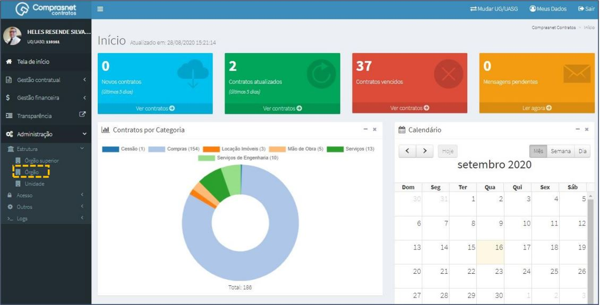

Será apresentada a tela para realização do cadastro. Para adicionar um
órgão clique em “Adicionar Órgão”.

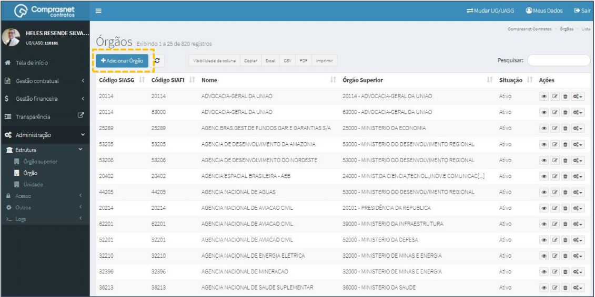

Preencha os campos dos dados solicitados. Após, clique em
“Salvar e voltar”.

Os campos marcados com “*” são de preenchimento obrigatório.

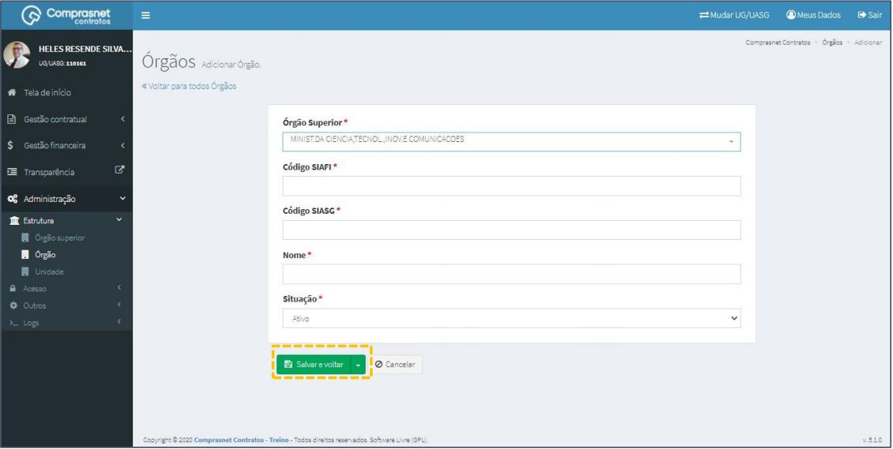

## 2. Pesquisa de Órgão

Para pesquisar o cadastro de um órgão, clique no campo “Pesquisar” e
informe os dados (Tipo Órgão,CPF/CNPJ/UG/ID GÉNÉRICO ou NOME/RAZÃO
SOCIAL).

Na tabela de Órgãos serão apresentados os resultados da pesquisa.

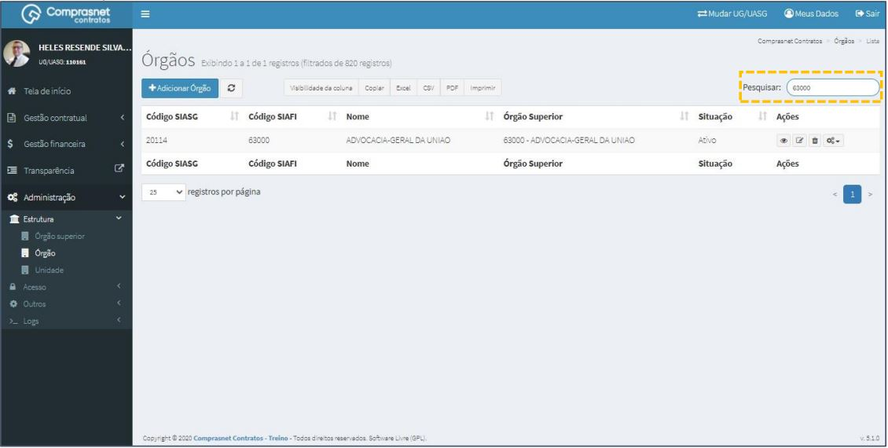

## 3. Editar Cadastro de Órgão

Para editar o cadastro de órgão, clique no ícone ““.

Será apresentada uma tela com os dados do órgão para edição.

Após a edição, clique em “Salvar e voltar”

## 4. Detalhar Cadastro de Órgão

Para detalhar o cadastro do órgão, clique no ícone ““.

Será apresentada uma tela com os detalhes do cadastro do órgão selecionado.

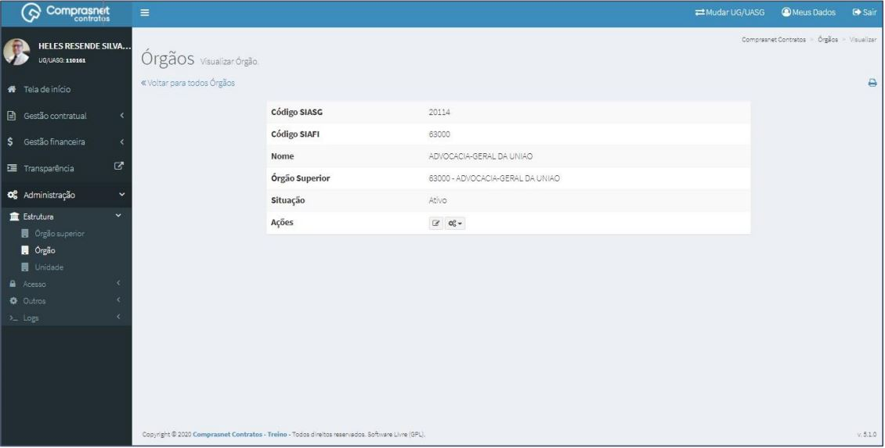

## 5. Excluir Cadastro de Órgão

Para excluir o cadastro de um órgão, clique no ícone ““.

## 6. Cadastramento de Configurações

Para adicionar uma configuração ao cadastro do órgão, clique no ícone
““.

Será apresentada a tela para realização do cadastro. Para adicionar uma
configuração clique em “Adicionar Configuração Órgão”.

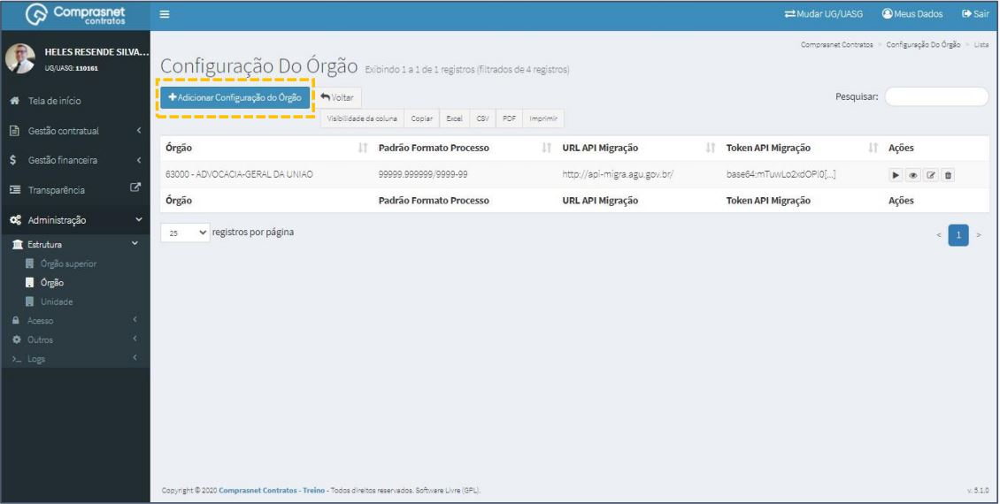

## 7. Pesquisa de Configuração

Para pesquisar o cadastro de um órgão, clique no campo “Pesquisar” e
informe os dados (Tipo Configuração Órgão,CPF/CNPJ/UG/ID GÉNÉRICO ou
NOME/RAZÃO SOCIAL).

Na tabela de configurações serão apresentados os resultados da pesquisa.

## 8. Editar Configuração

Para editar uma configuração de órgão, clique no ícone ““.

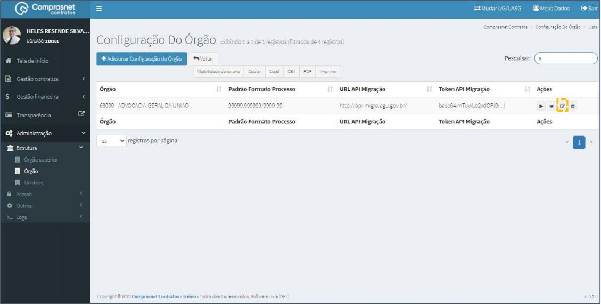

Será apresentada uma tela com os dados do órgão para edição: Básico

Após a edição, clique em “Salvar e voltar”

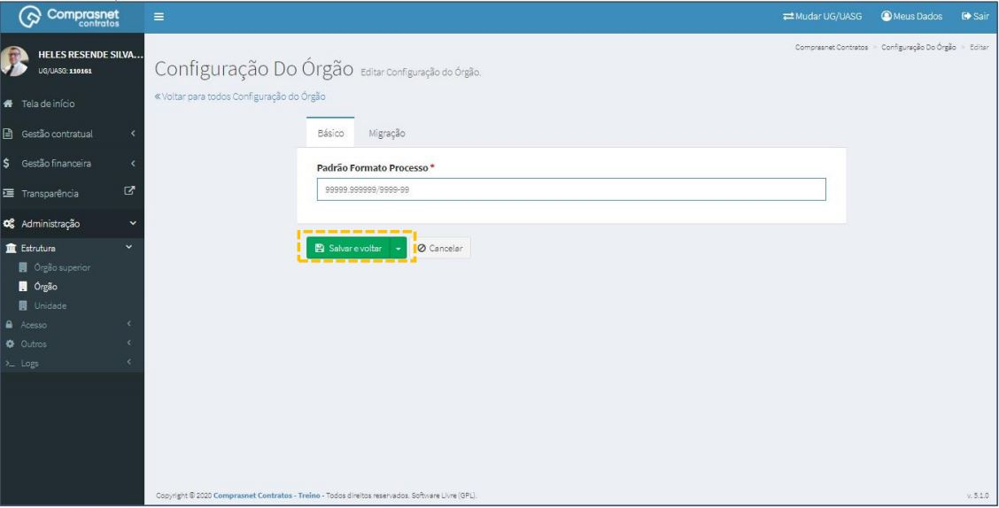

Será apresentada uma tela com os dados do órgão para edição: Migração

Após a edição, clique em “Salvar e voltar”

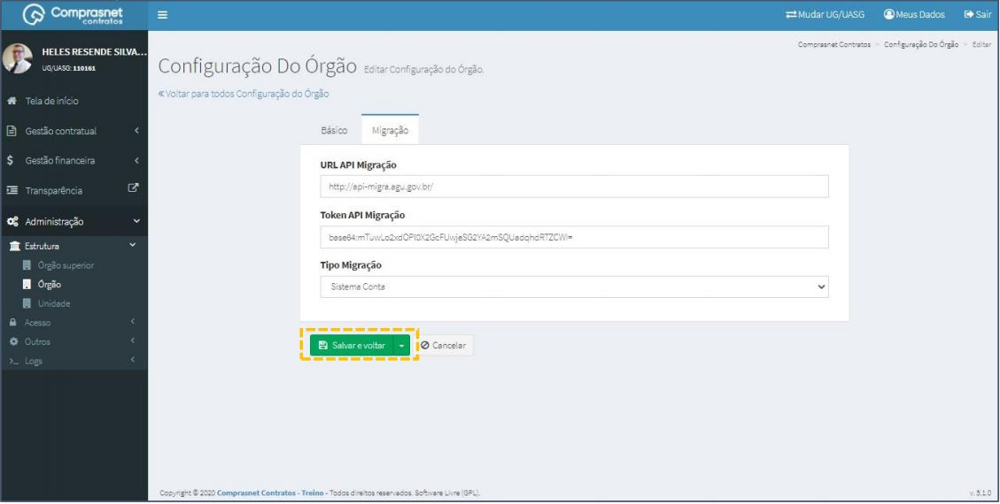

## 9. Detalhar Configuração

Para detalhar a configuração do órgão, clique no ícone ““.

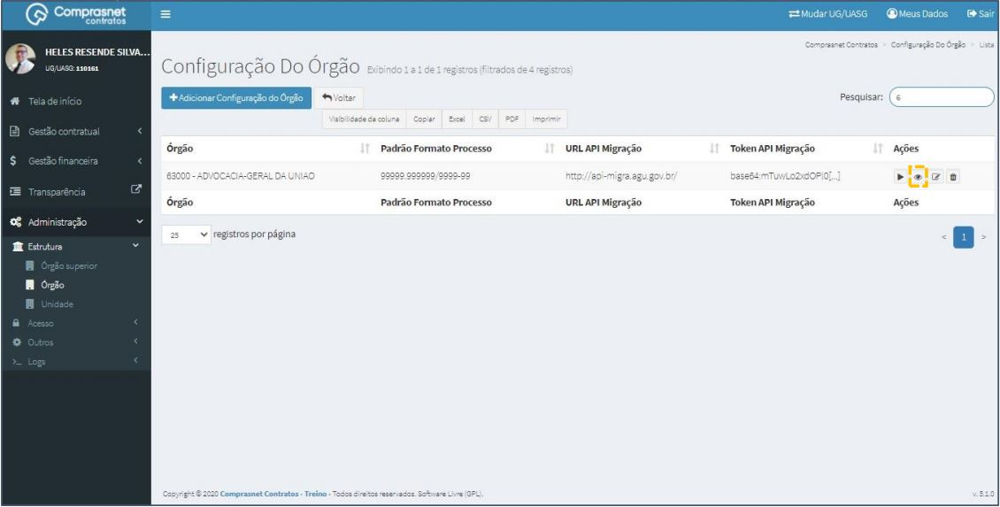

Será apresentada uma tela com os detalhes de configuração do órgão
selecionado.

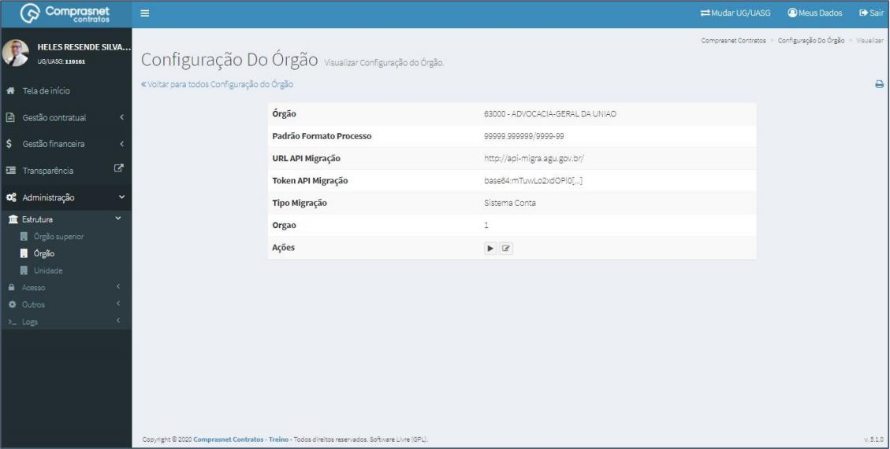

## 10. Excluir Configuração

Para excluir configuração de um órgão, clique no ícone “ “.

## 11. Executar Migração do Órgão

Para fazer a migração do órgão, clique no ícone ““.

## 12. Cadastramento de Subcategoria

Para adicionar uma subcategoria do órgão, clique no ícone ““.

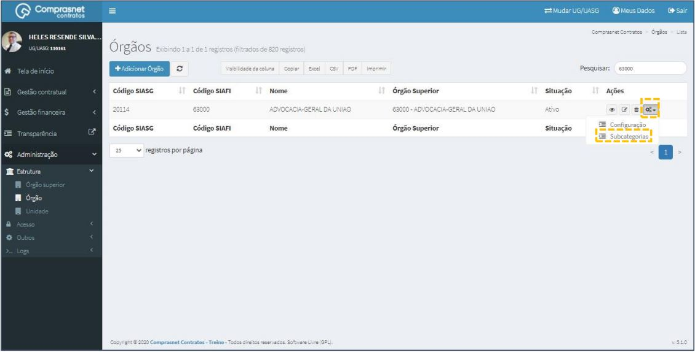

Será apresentada a tela para realização do cadastro. Para adicionar uma
subcategoria clique em “Adicionar Subcategoria do Órgão”.

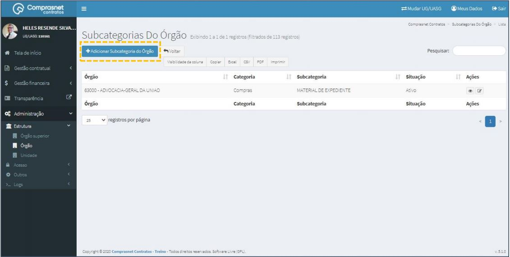

## 13. Pesquisa Subcategoria

Para pesquisar o cadastro de uma subcategoria, clique no campo “Pesquisar”
e informe os dados (Tipo Subcategoria,CPF/CNPJ/UG/ID GÉNÉRICO ou
NOME/RAZÃO SOCIAL).

Na tabela de subcategorias serão apresentados os resultados da pesquisa.

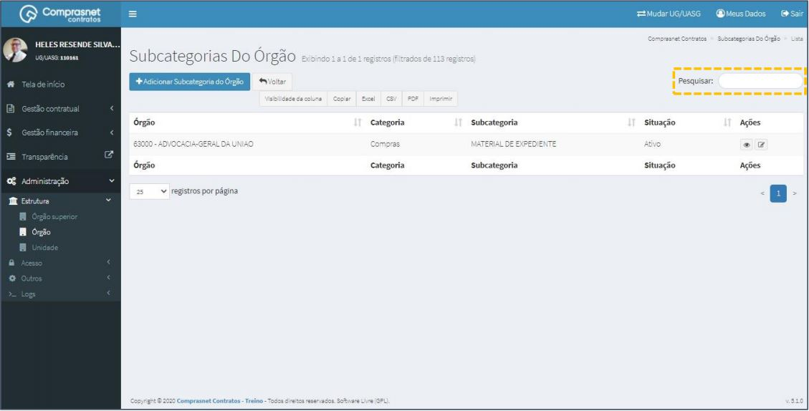

## 14. Editar Subcategoria

Para editar uma subcategoria do órgão, clique no ícone ““.

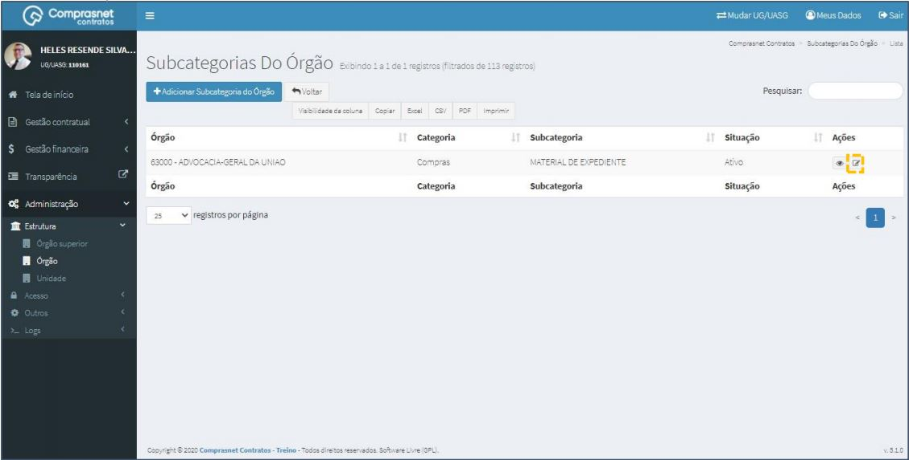

Será apresentada uma tela com os dados do órgão para edição.

Após a edição, clique em “Salvar e voltar”

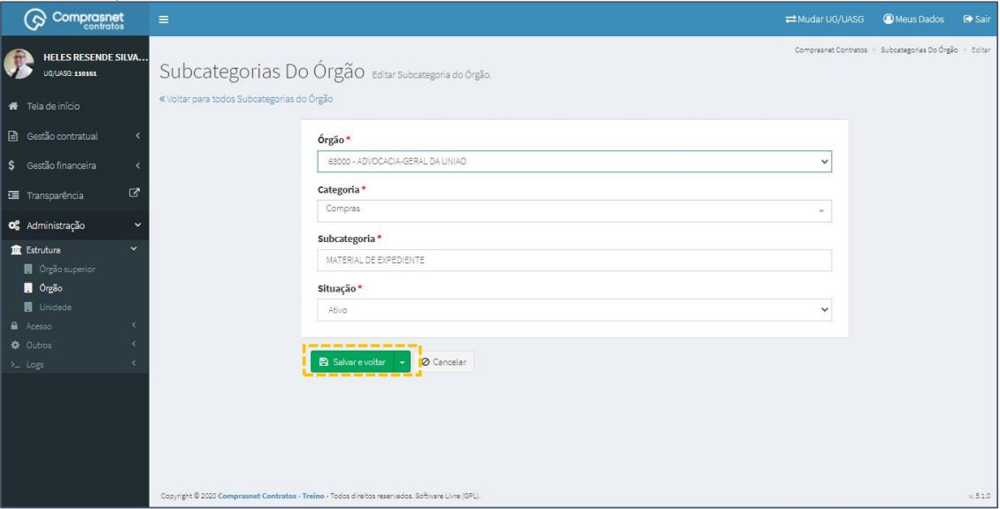

## 15. Detalhar Subcategoria

Para detalhar a subcategoria do órgão, clique no ícone ““.

Será apresentada uma tela com os detalhes da subcategria do órgão
selecionado.

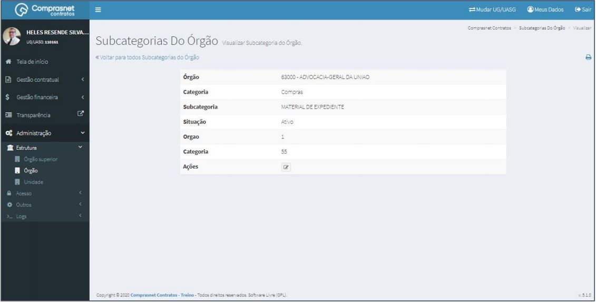
