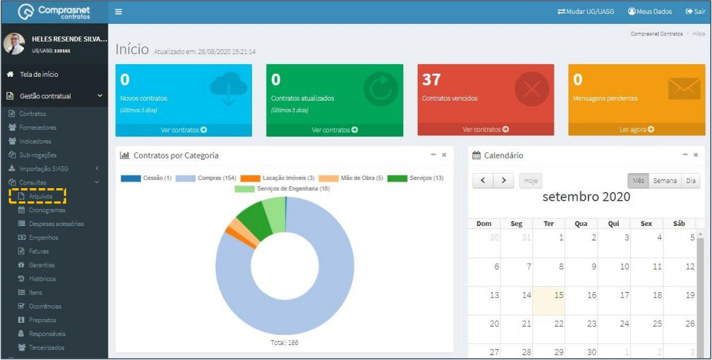
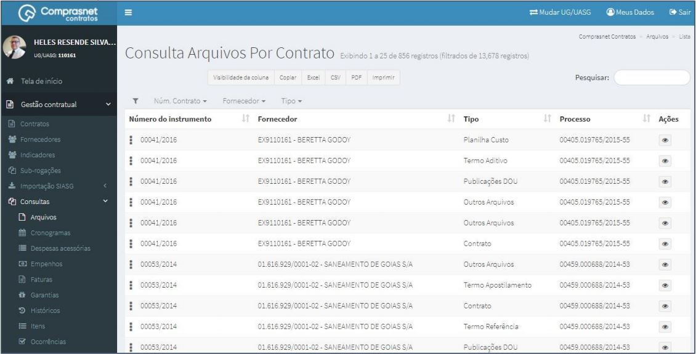
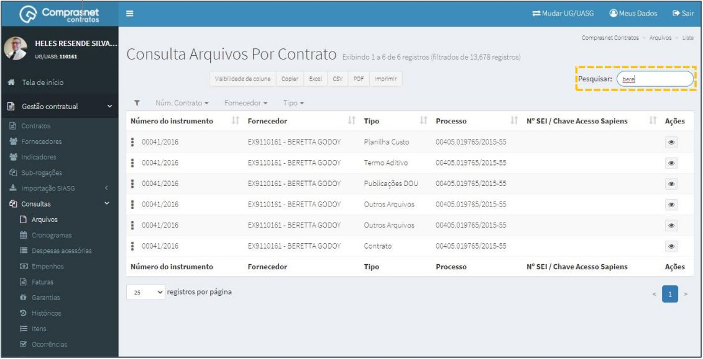
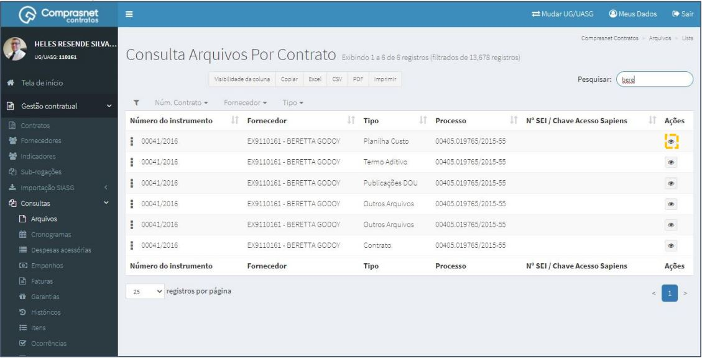
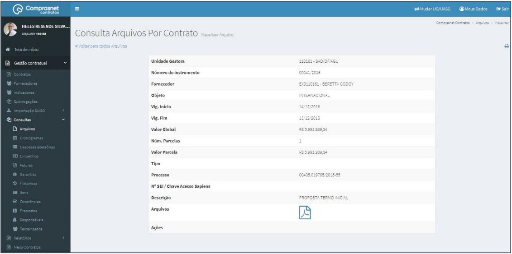

[TOC]

# Consultas - Arquivos

## 1. Consulta de Arquivos

Para consultar um Arquivo, clique no menu

Gestão Contratual >> Consultas >> Arquivos

Será apresentada a tela de consulta dos arquivos de contratos.

## 2. Pesquisa de Arquivos

Para pesquisar o contrato, clique no campo “Pesquisar” e informe os dados
(Tipo Arquivo,CPF/CNPJ/UG/ID GÉNÉRICO ou NOME/RAZÃO SOCIAL).

Na tabela de arquivos serão apresentados os resultados da pesquisa.

## 3. Detalhar Arquivos

Para detalhar o arquivo do contrato, clique no ícone ““.

Será apresentada uma tela com os detalhes de arquivo do contrato
selecionado.

