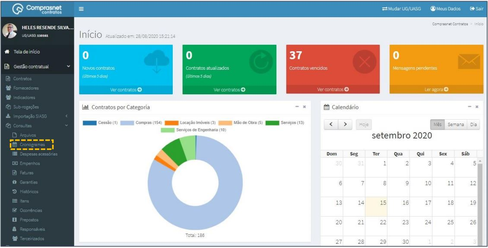
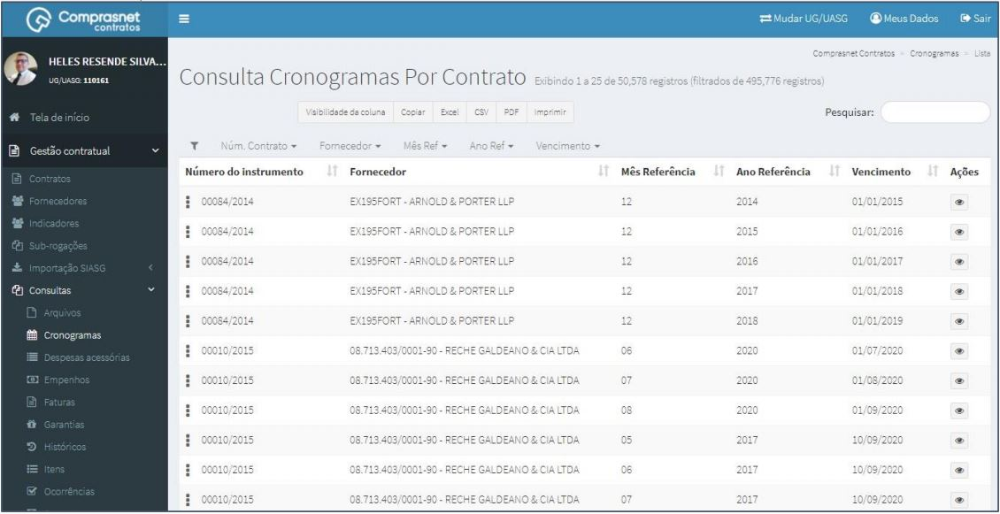
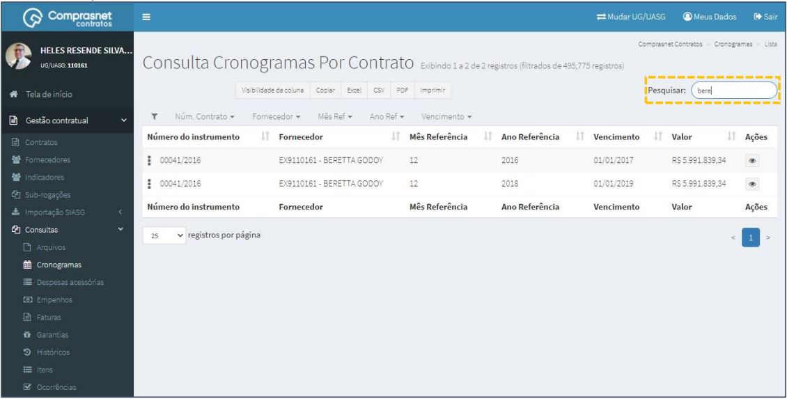
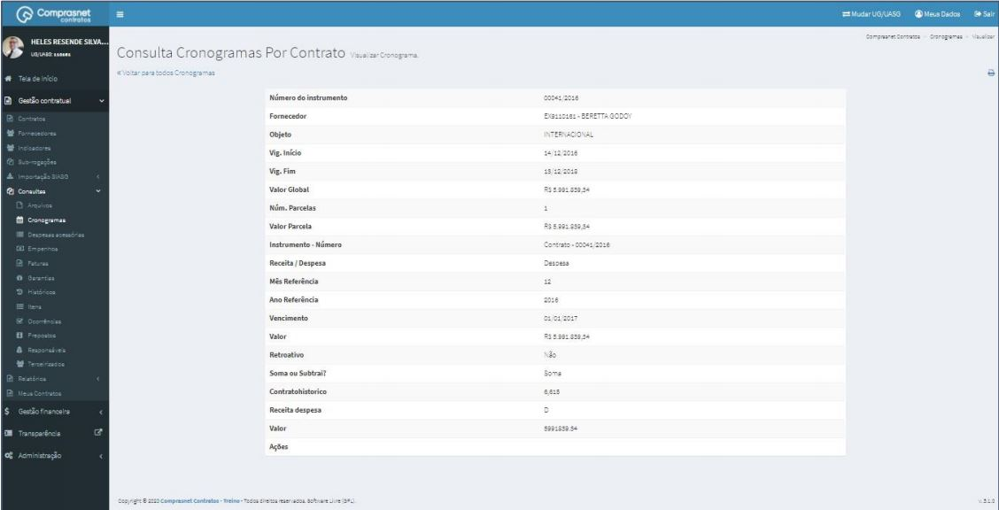

[TOC]

# Consultas - Cronogramas

## 1. Consulta de Cronogramas

Para consultar um Cronograma, clique no menu

Gestão Contratual >> Consultas >> Cronogramas

Será apresentada a tela de consulta dos cronogramas de contratos.

## 2. Pesquisa de Cronogramas

Para pesquisar o cronograma, clique no campo “Pesquisar” e informe os
dados (Tipo Cronograma,CPF/CNPJ/UG/ID GÉNÉRICO ou NOME/RAZÃO
SOCIAL).

Na tabela de cronogramas serão apresentados os resultados da pesquisa.

## 3. Detalhar Cronogramas

Para detalhar o cronograma do contrato, clique no ícone ““.

Será apresentada uma tela com os detalhes do cronograma do contrato
selecionado.

