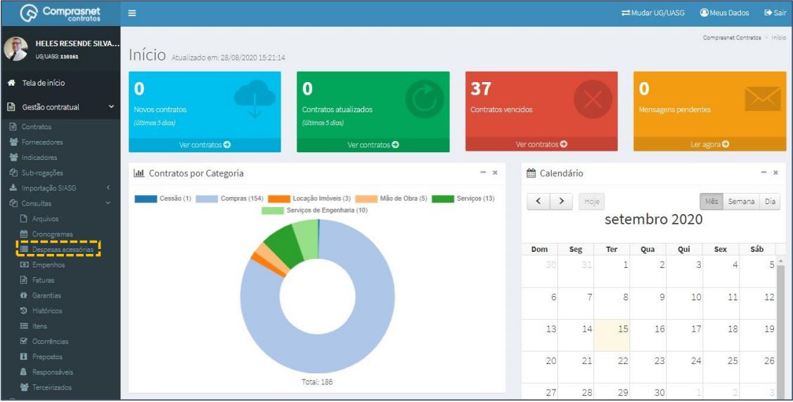
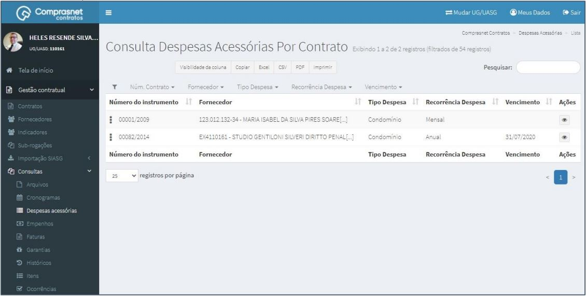
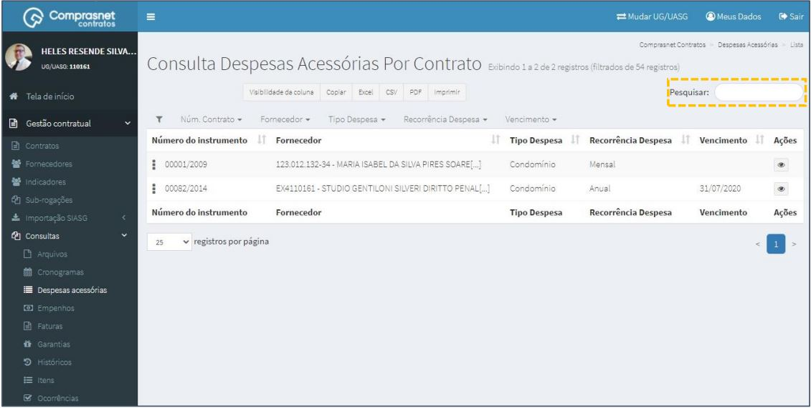
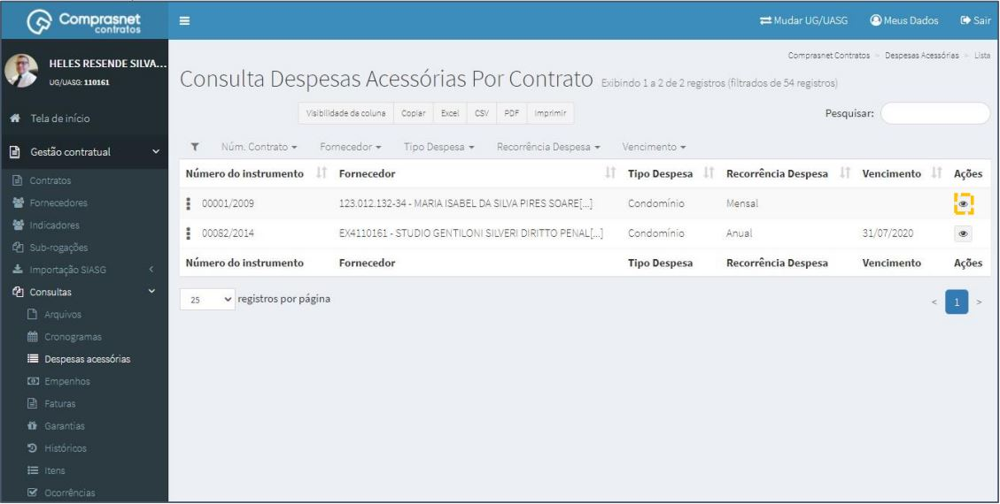
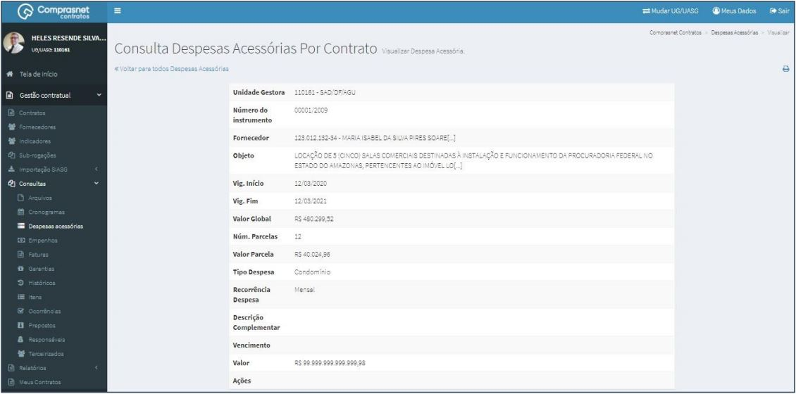

[TOC]

# Consultas – Despesas acessórias

## 1. Consulta de Despesas Acessórias

Para consultar uma despesa, clique no menu

Gestão Contratual >> Consultas >> Despesas Acessórias

Será apresentada a tela de consulta de despesas acessórias por contrato

## 2. Pesquisa de Despesas Acessórias

Para pesquisar uma despesa, clique no campo “Pesquisar” e informe os dados
(Tipo Despesa Acessória,CPF/CNPJ/UG/ID GÉNÉRICO ou NOME/RAZÃO
SOCIAL).

Na tabela de despesas serão apresentados os resultados da pesquisa.

## 3. Detalhar Despesas Acessórias

Para detalhar uma despesa acessória, clique no ícone ““.

Será apresentada uma tela com os detalhes das despesas do contrato
selecionado.

