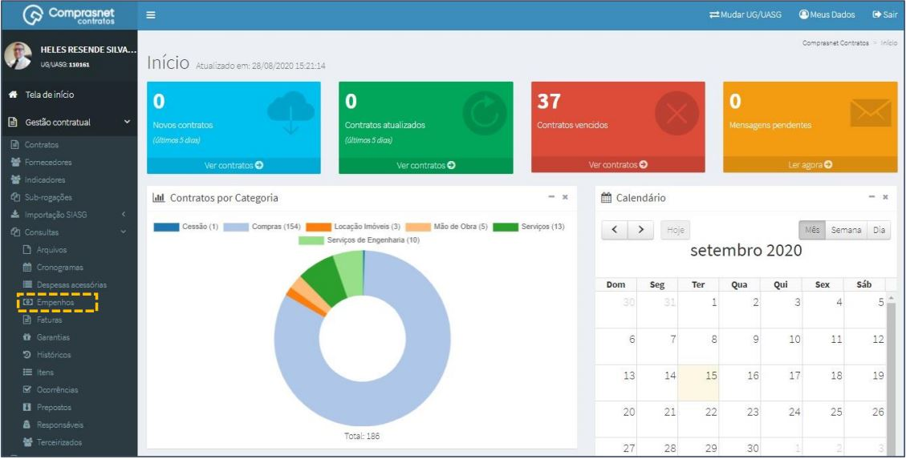

[TOC]

# Consultas - Empenhos

## 1. Consulta de Empenhos

Para consultar um Empenho, clique no menu

Gestão Contratual >> Consultas >> Empenhos

Será apresentada a tela de consulta dos empenhos de contratos.

## 2. Pesquisa de Empenhos

Para pesquisar um empenho, clique no campo “Pesquisar” e informe os
dados (Tipo Empenhos,CPF/CNPJ/UG/ID GÉNÉRICO ou NOME/RAZÃO
SOCIAL).

Na tabela de empenhos serão apresentados os resultados da pesquisa.

## 3. Detalhar Empenhos

Para detalhar o empenho do contrato, clique no ícone ““.

Será apresentada uma tela com os detalhes do empenho do contrato
selecionado.

