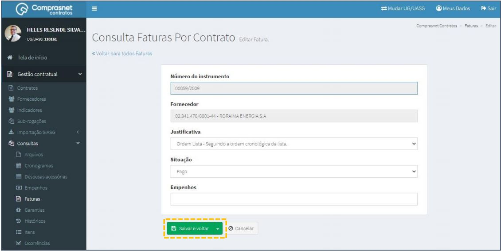

[TOC]

# Consultas - Faturas

## 1. Cadastramento de Faturas

Para cadastrar uma fatura, clique no menu

Gestão Contratual >> Consultas >> Faturas

Será apresentada a tela de consulta das faturas por contratos.

## 2. Pesquisa de Faturas

Para pesquisar uma fatura, clique no campo “Pesquisar” e informe os dados
(Tipo Fatura,CPF/CNPJ/UG/ID GÉNÉRICO ou NOME/RAZÃO SOCIAL).

Na tabela de faturas serão apresentados os resultados da pesquisa.

## 3. Editar Faturas

Para editar o cadastro de uma fatura, clique no ícone ““.

Será apresentada uma tela com os dados da fatura para edição.

Após a edição, clique em “Salvar e voltar”

## 4. Detalhar Faturas

Para detalhar uma fatura, clique no ícone ““.

Será apresentada uma tela com os detalhes da fatura do contrato
selecionado.

