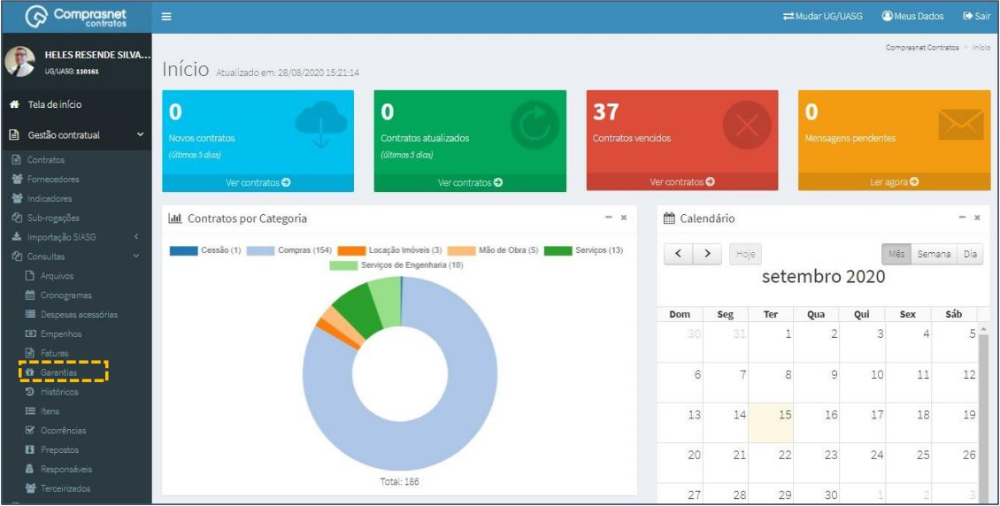
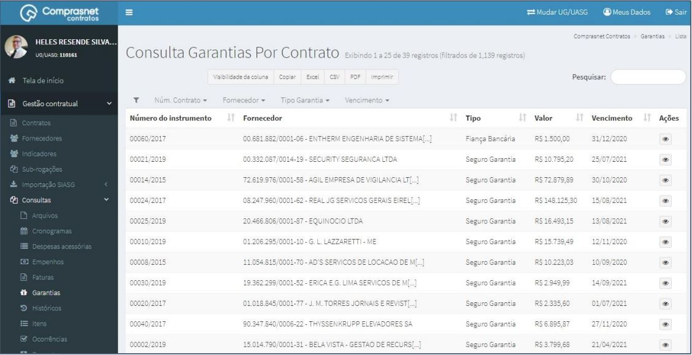
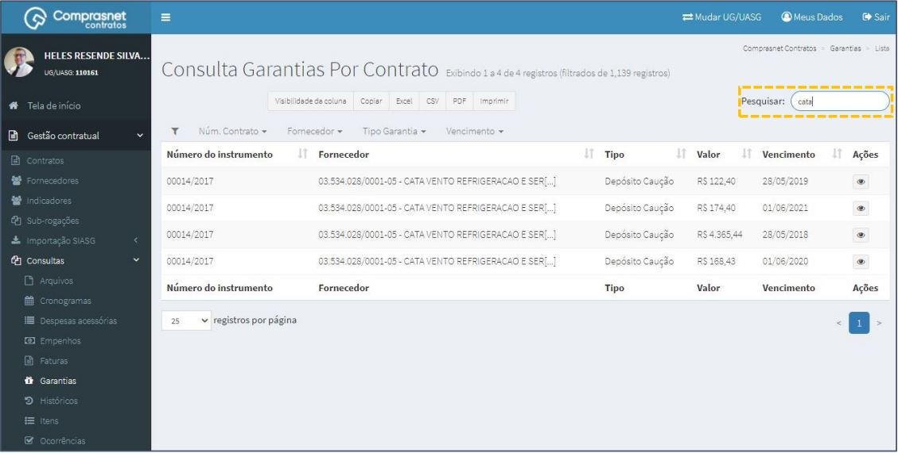
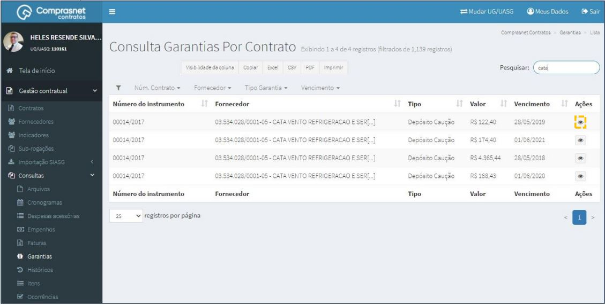
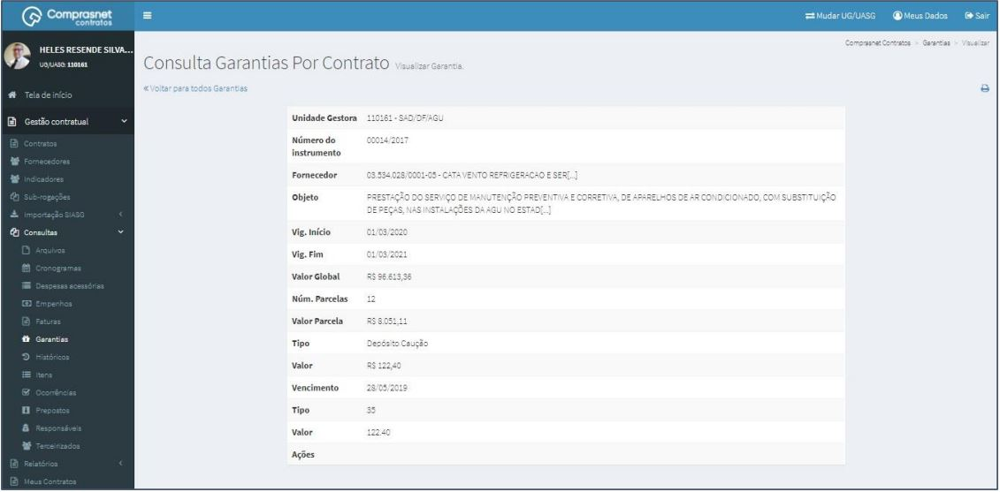

[TOC]

# Consultas - Garantias

## 1. Consulta de Garantias

Para consultar uma garantia, clique no menu

Gestão Contratual >> Consultas >> Garantias

Será apresentada a tela de consulta de garantias dos contratos.

## 2. Pesquisa de Garantias

Para pesquisar uma garantia, clique no campo “Pesquisar” e informe os dados
(Tipo Garantias,CPF/CNPJ/UG/ID GÉNÉRICO ou NOME/RAZÃO SOCIAL).

Na tabela de garantias serão apresentados os resultados da pesquisa.

## 3. Detalhar Garantias

Para detalhar garantia do contrato, clique no ícone ““.

Será apresentada uma tela com os detalhes da garantia do contrato
selecionado.

