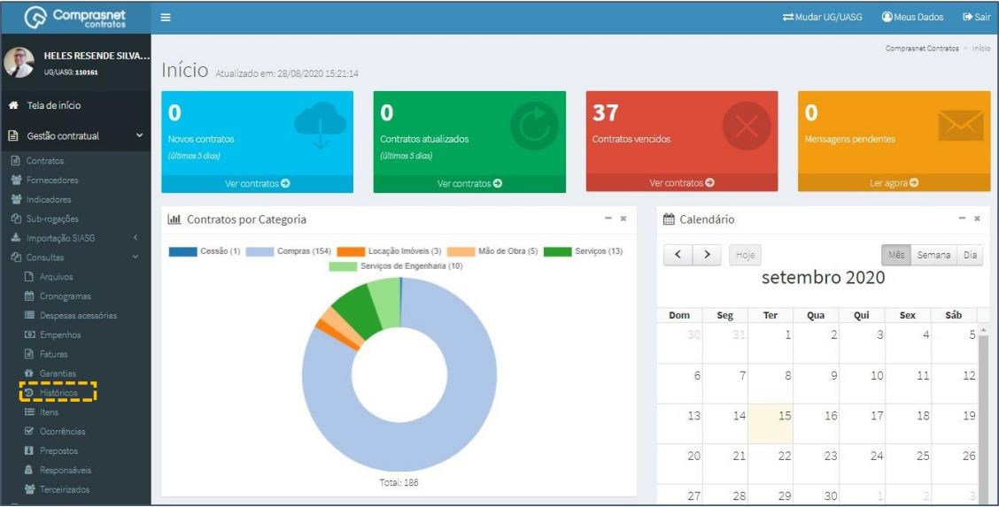
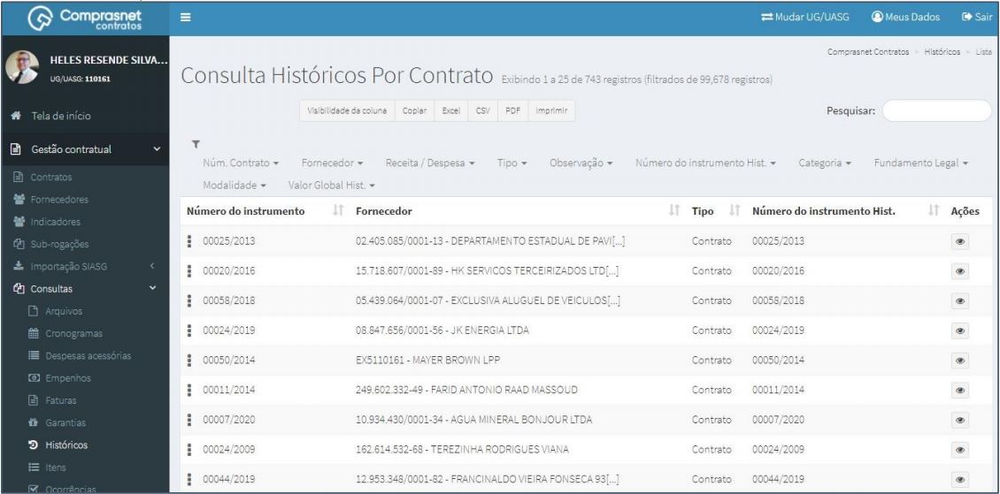
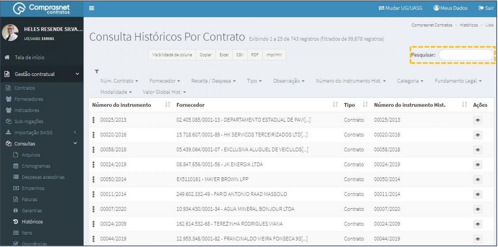
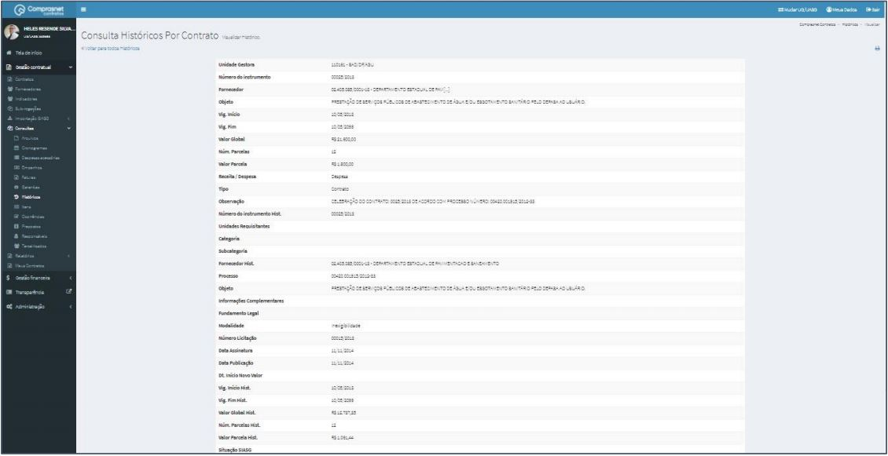

[TOC]

# Consultas – Históricos

## 1. Consulta de Históricos

Para consultar um histórico, clique no menu

Gestão Contratual >> Consultas >> Históricos

Será apresentada a tela de consulta de históricos por contrato.

## 2. Pesquisa de Históricos

Para pesquisar um histórico, clique no campo “Pesquisar” e informe os dados
(Tipo Histórico,CPF/CNPJ/UG/ID GÉNÉRICO ou NOME/RAZÃO SOCIAL).

Na tabela de históricos serão apresentados os resultados da pesquisa.

## 3. Detalhar Históricos

Para detalhar um histórico do contrato, clique no ícone ““.

Será apresentada uma tela com os detalhes dos históricos do contrato
selecionado.

