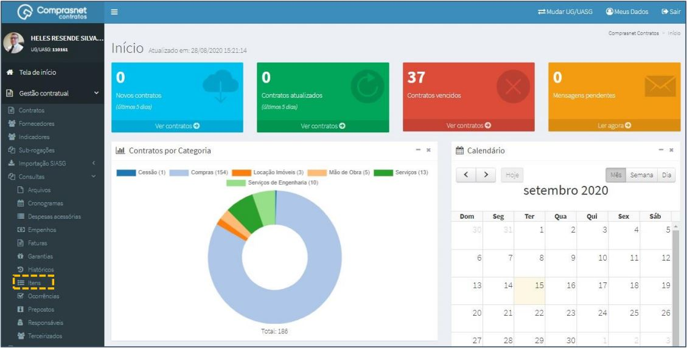
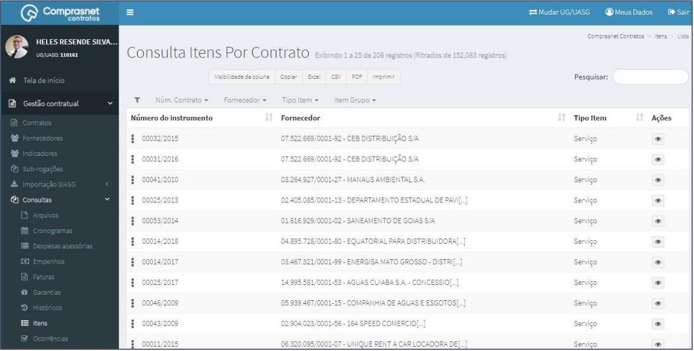
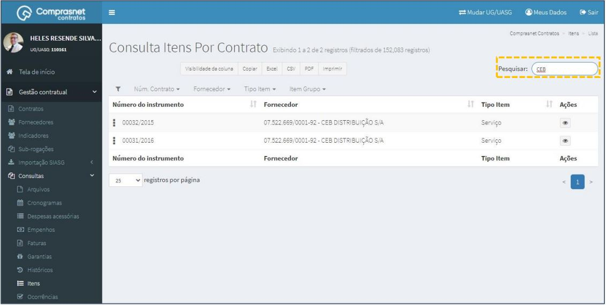
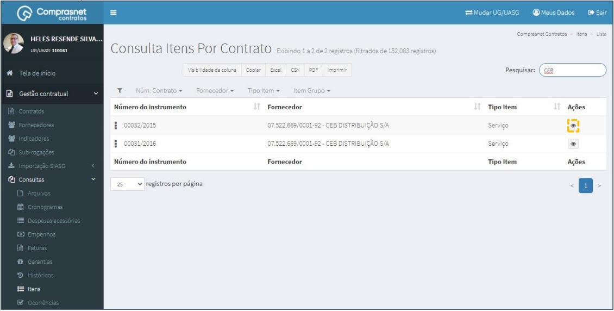
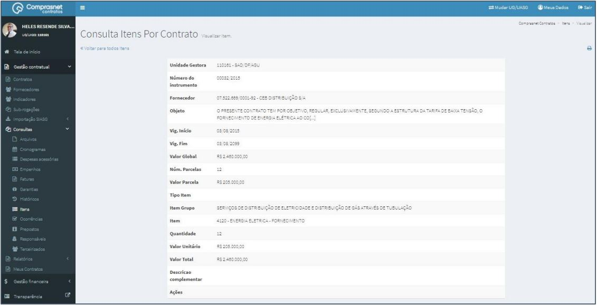

[TOC]

# Consultas - Itens

## 1. Consulta de Itens

Para consultar um Item, clique no menu

Gestão Contratual >> Consultas >> Itens

Será apresentada a tela de consulta dos itens de contratos.

## 2. Pesquisa de Itens

Para pesquisar um item, clique no campo “Pesquisar” e informe os dados
(Tipo Itens,CPF/CNPJ/UG/ID GÉNÉRICO ou NOME/RAZÃO SOCIAL).

Na tabela de itens serão apresentados os resultados da pesquisa.

## 3. Detalhar Itens

Para detalhar um item do contrato, clique no ícone ““.

Será apresentada uma tela com os detalhes dos itens do contrato
selecionado.

