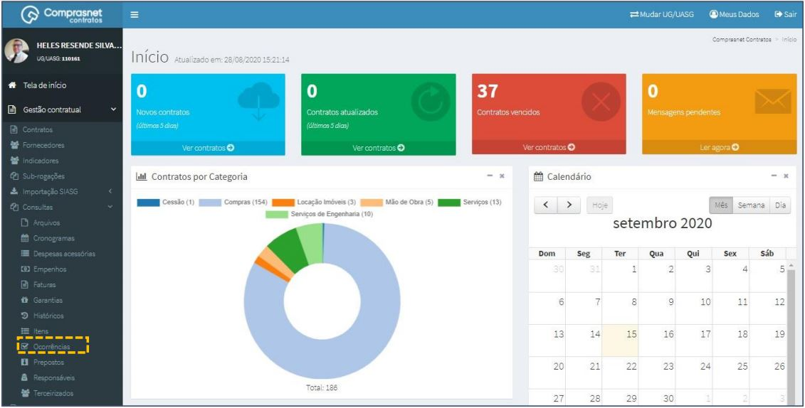
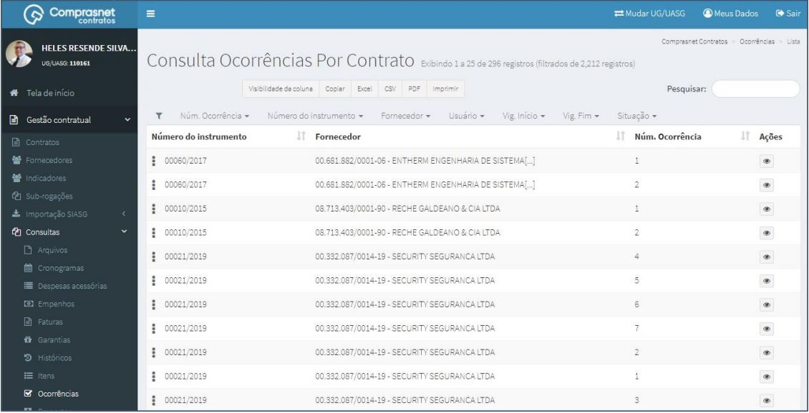
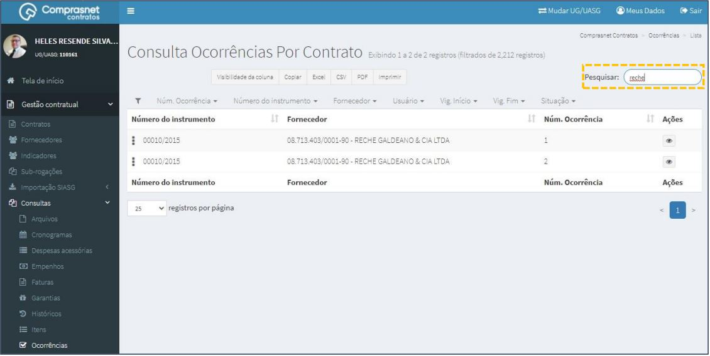
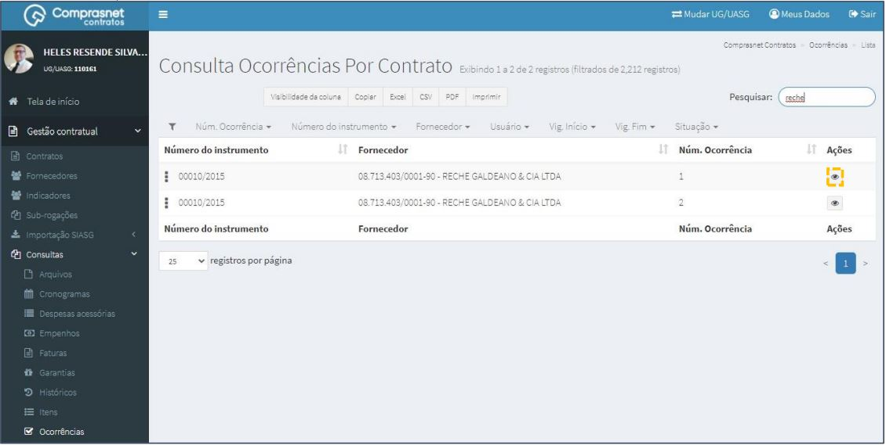
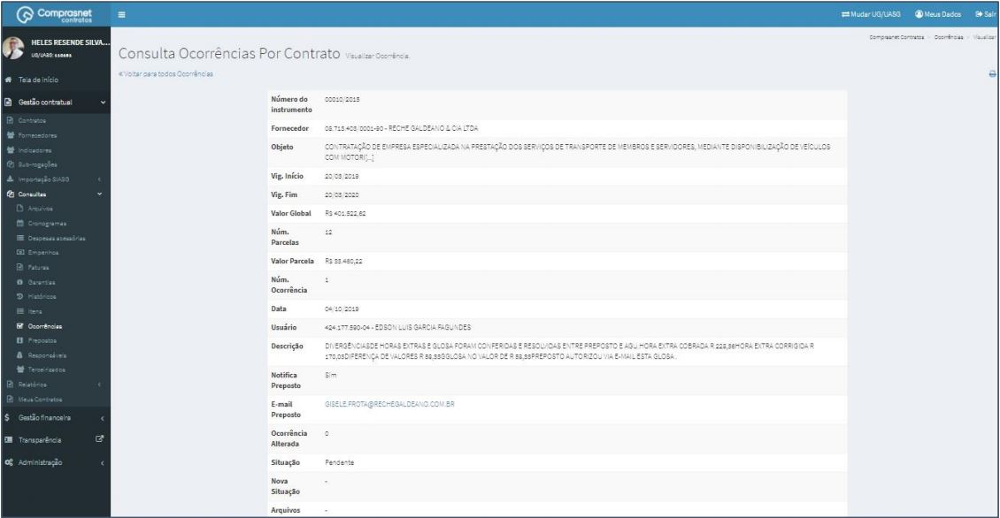

[TOC]

# Consultas - Ocorrências

## 1. Consulta Ocorrências

Para consultar uma ocorrência, clique no menu

Gestão Contratual >> Consultas >> Ocorrências

Será apresentada a tela de consulta das ocorrências de contratos.

## 2. Pesquisa de Ocorrências

Para pesquisar uma ocorrência, clique no campo “Pesquisar” e informe os
dados (Tipo Ocorrência,CPF/CNPJ/UG/ID GÉNÉRICO ou NOME/RAZÃO
SOCIAL).

Na tabela de ocorrências serão apresentados os resultados da pesquisa.

## 3. Detalhar Ocorrências

Para detalhar uma ocorrência do contrato, clique no ícone ““.

Será apresentada uma tela com os detalhes da ocorrência do contrato
selecionado.

