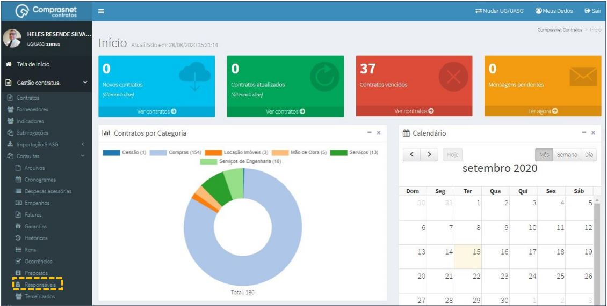
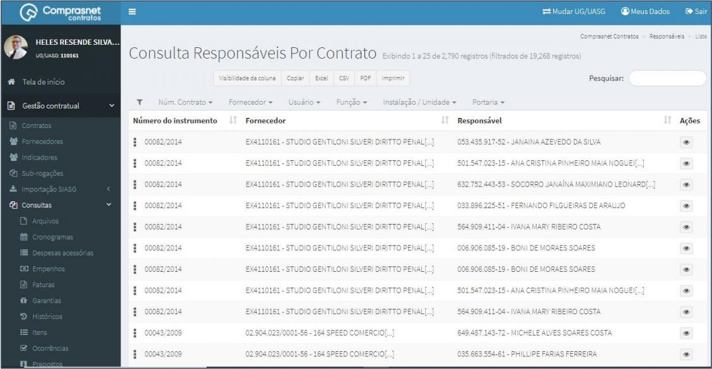
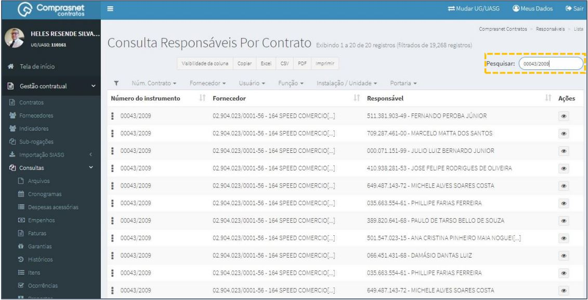
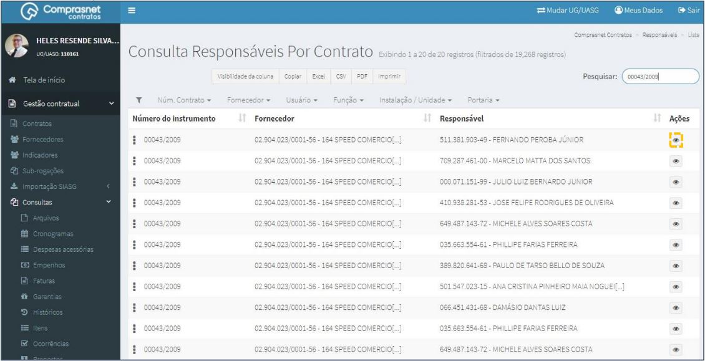
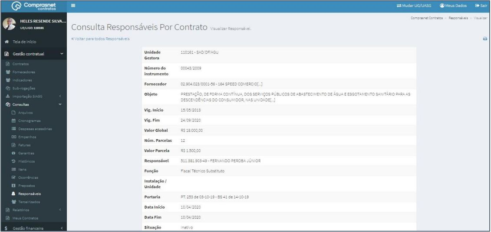

[TOC]

# Consultas - Responsáveis

## 1. Consulta de Responsáveis

Para consultar um responsável, clique no menu

Gestão Contratual >> Consultas >> Responsáveis

Será apresentada a tela de consulta de responsáveis por contratos.

## 2. Pesquisa de Responsáveis

Para pesquisar um responsável, clique no campo “Pesquisar” e informe os
dados (Tipo Responsável,CPF/CNPJ/UG/ID GÉNÉRICO ou NOME/RAZÃO
SOCIAL).

Na tabela de responsáveis serão apresentados os resultados da pesquisa.

## 3. Detalhar Responsáveis

Para detalhar um responsável, clique no ícone ““.

Será apresentada uma tela com os detalhes do responsável do contrato
selecionado.

