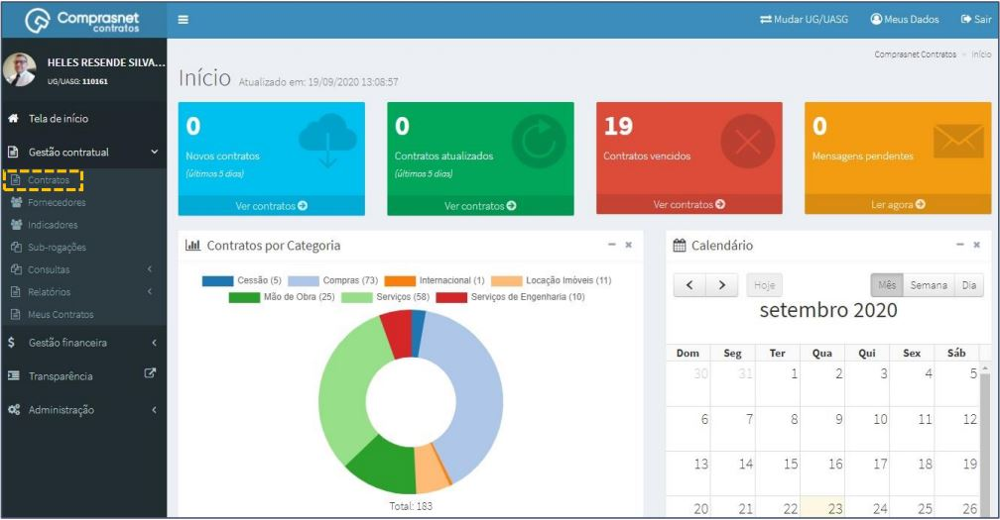
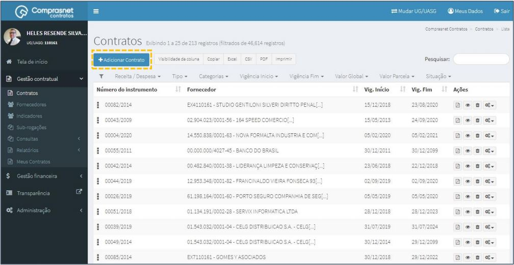
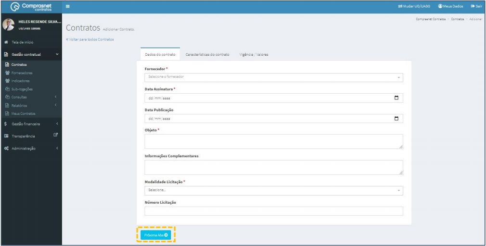
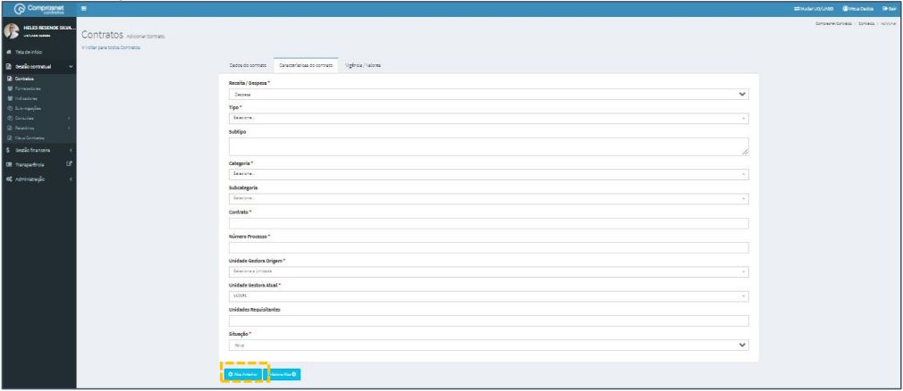
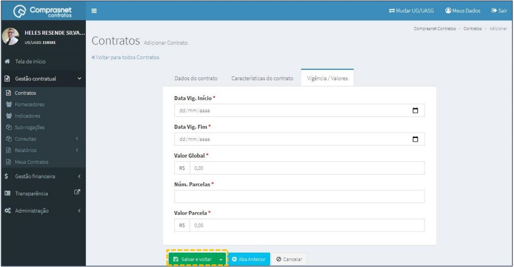
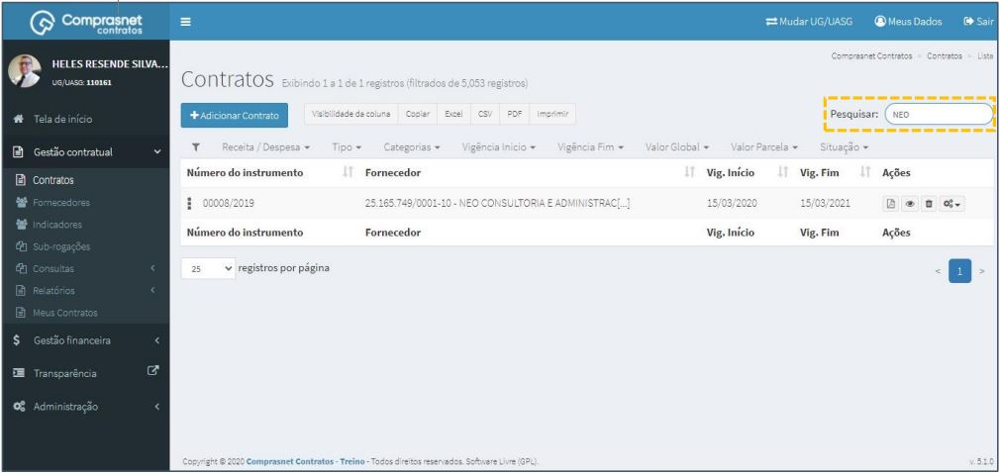
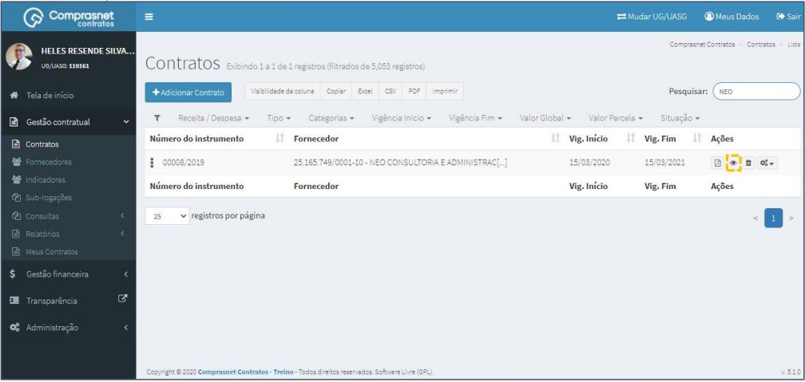
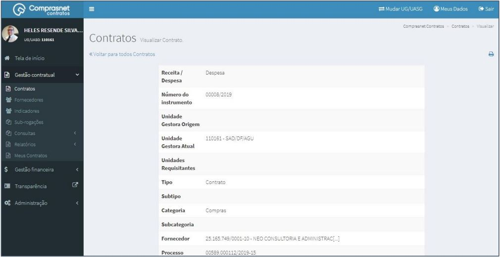
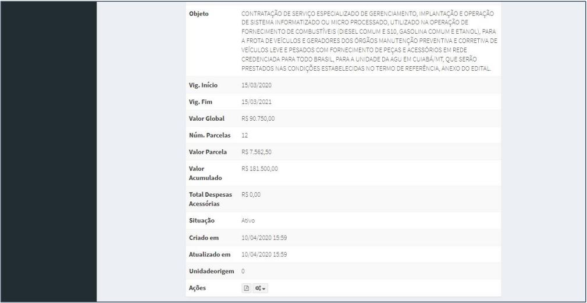
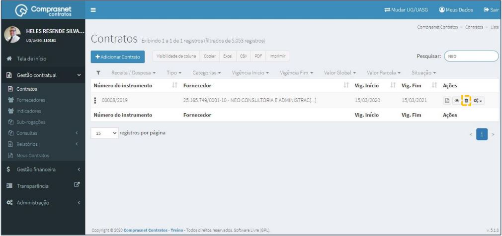

[TOC]

# Contratos

## 1. Cadastramento de Contratos

Para cadastrar um Contrato, clique no menu

Gestão Contratual >> Contratos

Será apresentada a tela para realização do cadastro. Para adicionar um
contrato clique em “Adicionar Contrato”.

Preencha os campos dos dados solicitados. Dados do Contrato.
Após, clique em “Próxima Aba”.

Os campos marcados com “*” são de preenchimento obrigatório.

Preencha os campos dos dados solicitados. Características do Contrato.
Após, clique em “Próxima Aba”.

Os campos marcados com “*” são de preenchimento obrigatório.

Preencha os campos dos dados solicitados. Vigência/Valores.
Após, clique em “Salvar e voltar”.

Os campos marcados com “*” são de preenchimento obrigatório.

## 2. Pesquisa de Contratos

Para pesquisar o contrato, clique no campo “Pesquisar” e informe os dados
(Tipo Contrato,CPF/CNPJ/UG/ID GÉNÉRICO ou NOME/RAZÃO SOCIAL).

Na tabela de contratos serão apresentados os resultados da pesquisa.

## 3. Detalhar Contrato
Para detalhar contrato, clique no ícone ““.

Será apresentada uma tela com os detalhes do contrato selecionado.

Será apresentada uma tela com os detalhes do contrato selecionado.

## 4. Baixar PDF
Para baixar o contrato em PDF, clique no ícone ““.

## 5. Excluir Contrato
Para excluir o contrato, clique no ícone ““.

