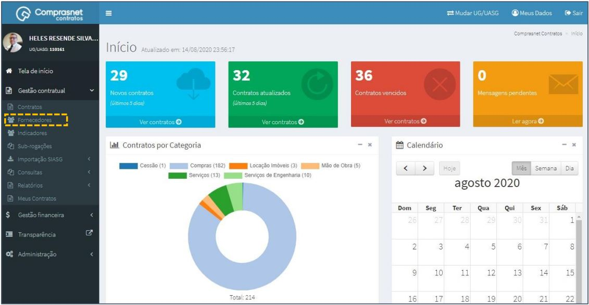
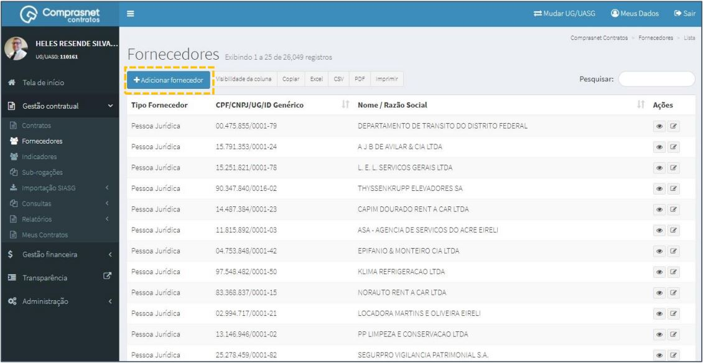
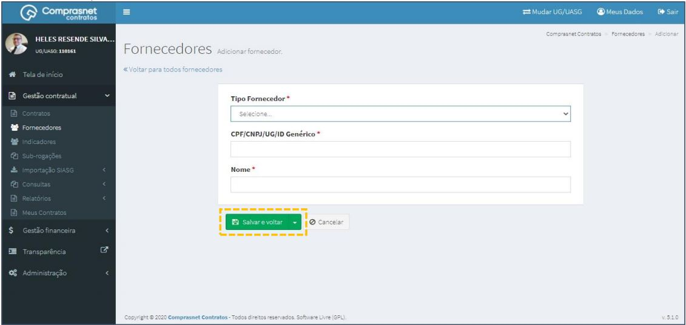
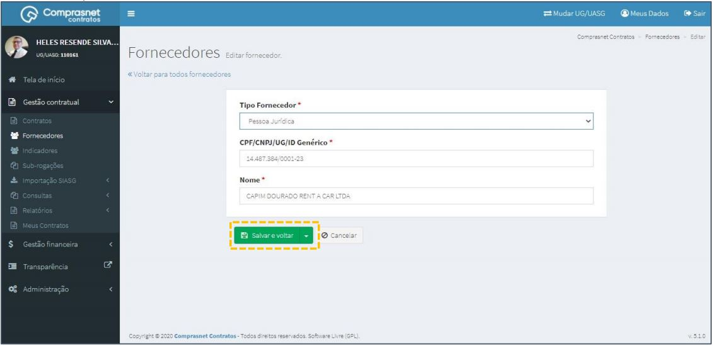
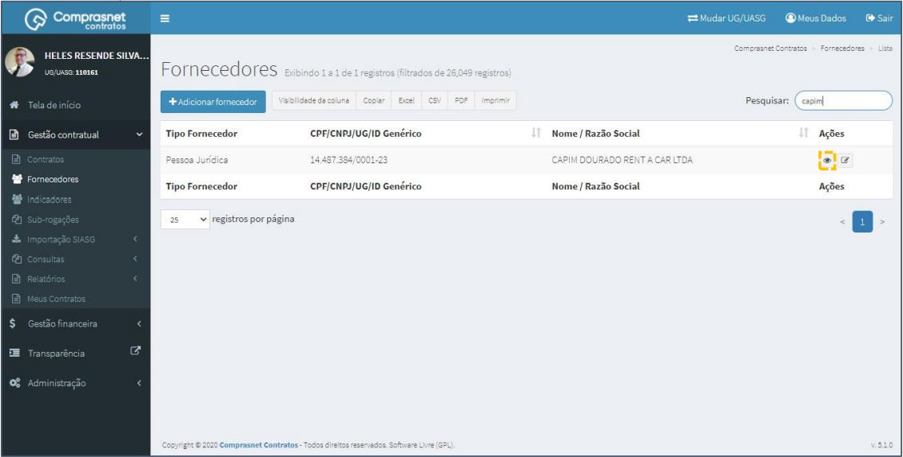
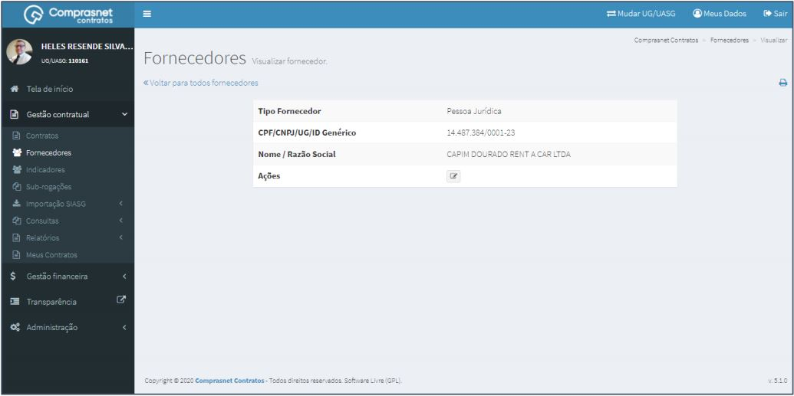

[TOC]

# Fornecedores

## 1. Cadastramento de FORNECEDOR

Para cadastrar um Fornecedor, clique no menu

Gestão Contratual >> Fornecedores

Será apresentada a tela para realização do cadastro. Para adicionar um
fornecedor clique em “Adicionar fornecedor”.

Preencha os campos dos dados solicitados. Após, clique em
“Salvar e voltar”.

Os campos marcados com “*” são de preenchimento obrigatório.

## 2. Pesquisa de Cadastro de FORNECEDOR

Para pesquisar o cadastro do Fornecedor, clique no campo “Pesquisar” e
informe os dados do fornecedor (TIPO Fornecedor,CPF/CNPJ/UG/ID
GÉNÉRICO ou NOME/RAZÃO SOCIAL).

Na tabela de fornecedores serão apresentados os resultados da pesquisa.

## 3. Editar Cadastro de FORNECEDOR

Para editar o cadastro do fornecedor, clique no ícone ““.

Será apresentada uma tela com os dados do fornecedor para edição.

Após a edição, clique em “Salvar e voltar”

## 4. Detalhar Cadastro de FORNECEDOR

Para detalhar o cadastro do fornecedor, clique no ícone ““.

Será apresentada uma tela com os detalhes do cadastro do fornecedor
selecionado.

