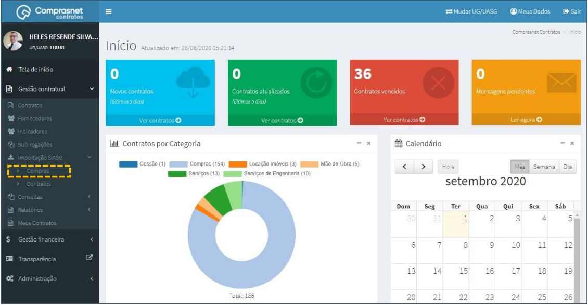
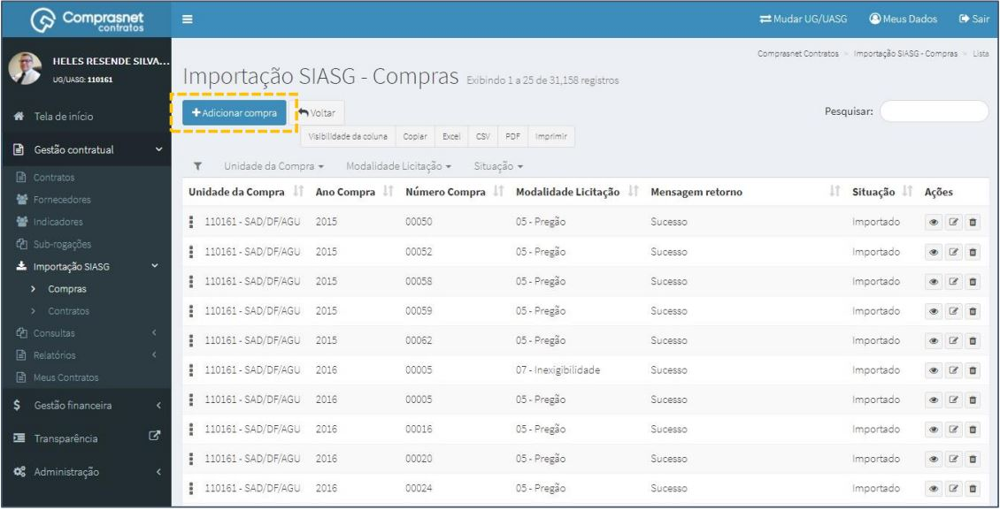
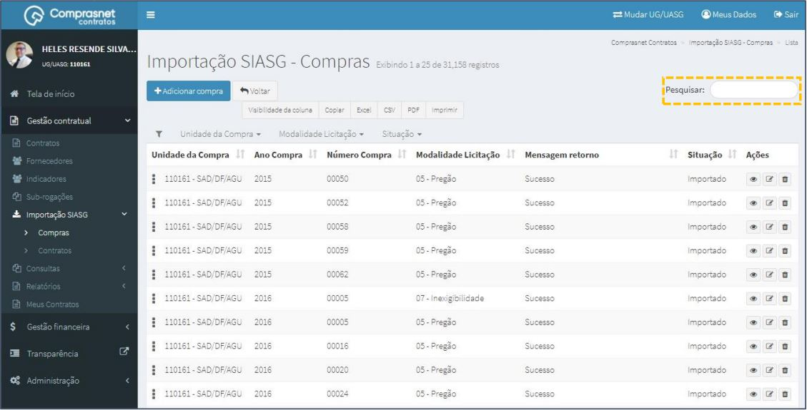
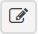
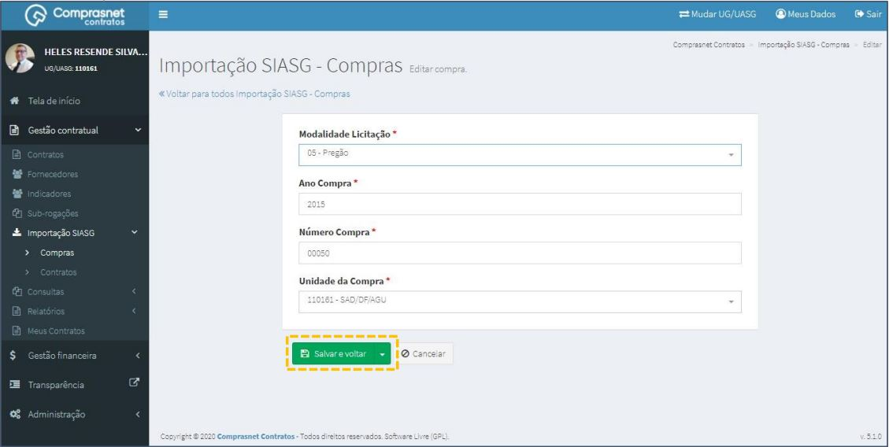
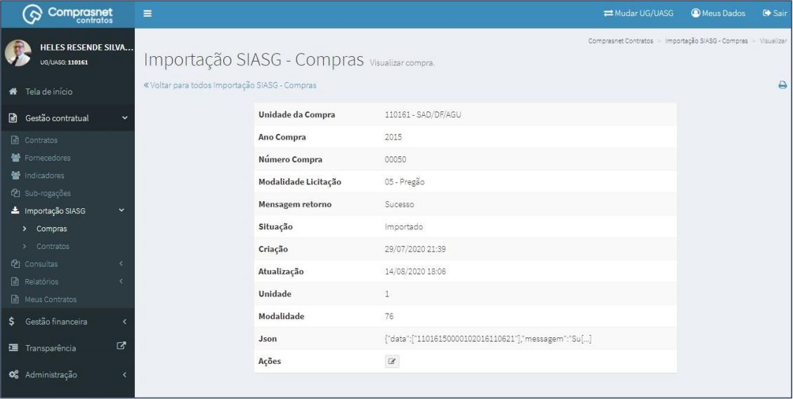
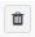
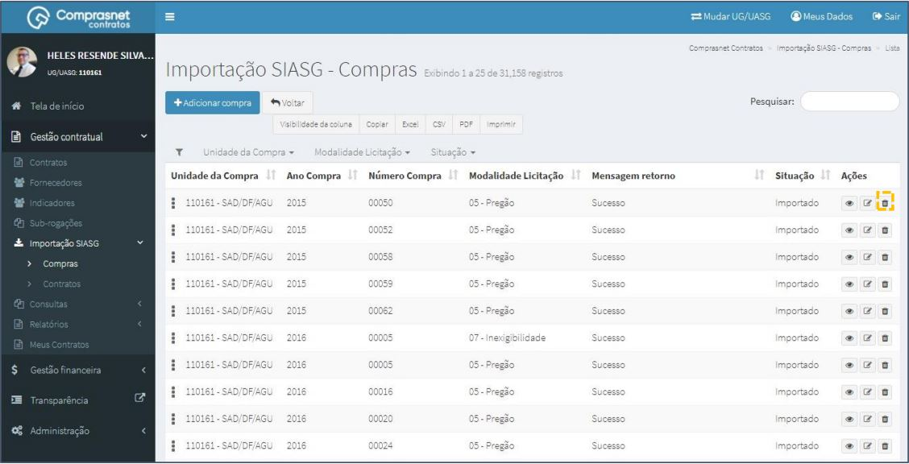

[TOC]

# Importação SIASG - Compras

## 1. Cadastramento de COMPRAS

Para cadastrar uma compra, clique no menu

Gestão Contratual >> Importação SIASG >> Compras

Será apresentada a tela para realização do cadastro. Para adicionar uma
compra clique em “Adicionar Compra”.

Preencha os campos dos dados solicitados. Após, clique em
“Salvar e voltar”.

Os campos marcados com “*” são de preenchimento obrigatório.

## 2. Pesquisa de Cadastro de COMPRAS

Para pesquisar o cadastro da compra, clique no campo “Pesquisar” e informe
os dados (Tipo Indicador,CPF/CNPJ/UG/ID GÉNÉRICO ou NOME/RAZÃO
SOCIAL).

Na tabela de compras serão apresentados os resultados da pesquisa.

## 3. Editar Cadastro de COMPRAS
Para editar o cadastro da compra, clique no ícone ““.

Será apresentada uma tela com os dados da compra para edição.

Após a edição, clique em “Salvar e voltar”

## 4. Detalhar Cadastro de COMPRAS

Para detalhar o cadastro da compra, clique no ícone ““.

Será apresentada uma tela com os detalhes do cadastro da compra
selecionada.

## 5. Exclusão Cadastro de COMPRAS

Para excluir o cadastro da compra, clique no ícone ““.

