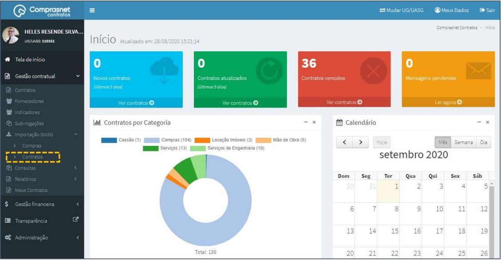
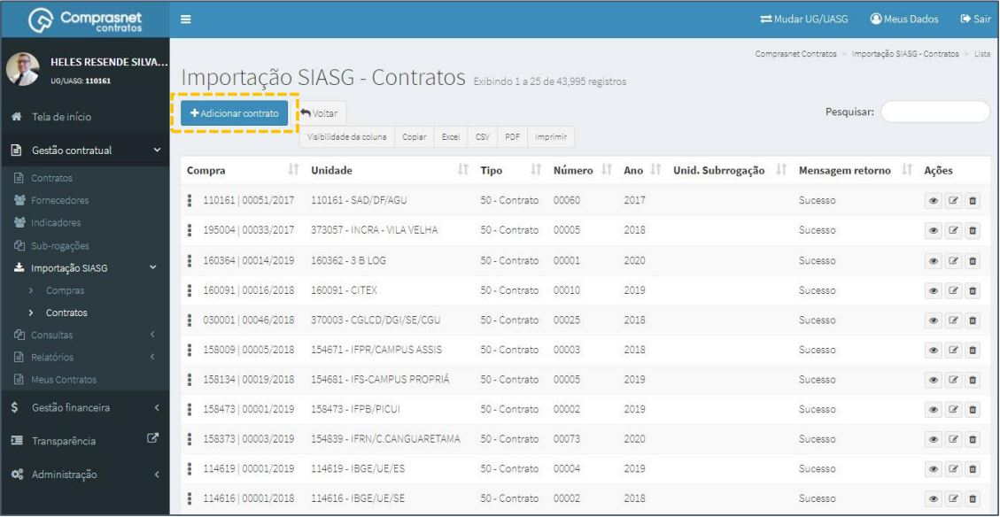
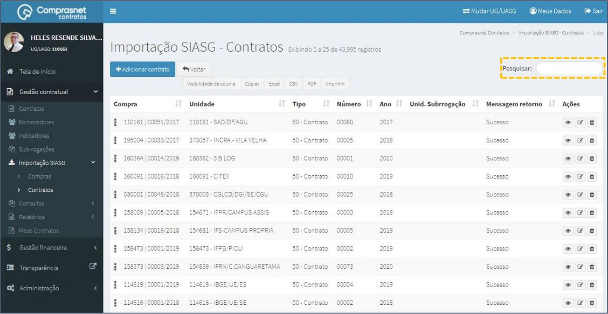
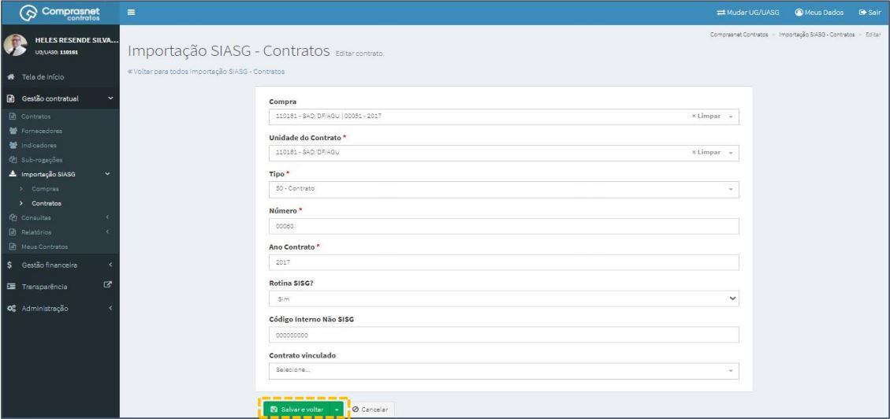
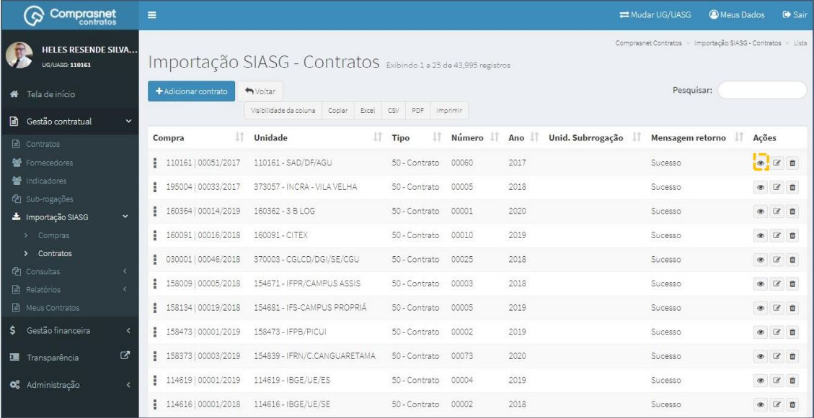
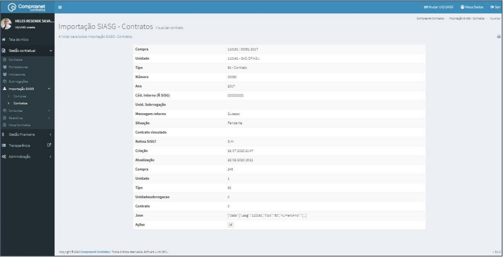

[TOC]

# Importação SIASG - Contratos

## 1. Cadastramento de CONTRATOS

Para cadastrar um contrato, clique no menu

Gestão Contratual >> Importação SIASG >> Contratos

Será apresentada a tela para realização do cadastro. Para adicionar um
contrato clique em “Adicionar Contrato”.

Preencha os campos dos dados solicitados. Após, clique em
“Salvar e voltar”.

Os campos marcados com “*” são de preenchimento obrigatório.

## 2. Pesquisa de Cadastro de CONTRATOS

Para pesquisar o cadastro do contrato, clique no campo “Pesquisar” e
informe os dados (Tipo Indicador,CPF/CNPJ/UG/ID GÉNÉRICO ou
NOME/RAZÃO SOCIAL).

Na tabela de contratos serão apresentados os resultados da pesquisa.

## 3. Editar Cadastro de CONTRATOS

Para editar o cadastro do contrato, clique no ícone ““.

Será apresentada uma tela com os dados do contrato para edição.

Após a edição, clique em “Salvar e voltar”

## 4. Detalhar Cadastro de CONTRATOS

Para detalhar o cadastro do contrato, clique no ícone ““.

Será apresentada uma tela com os detalhes do cadastro do contrato
selecionado.

## 5. Exclusão Cadastro de CONTRATOS

Para excluir o cadastro do contrato, clique no ícone ““.

