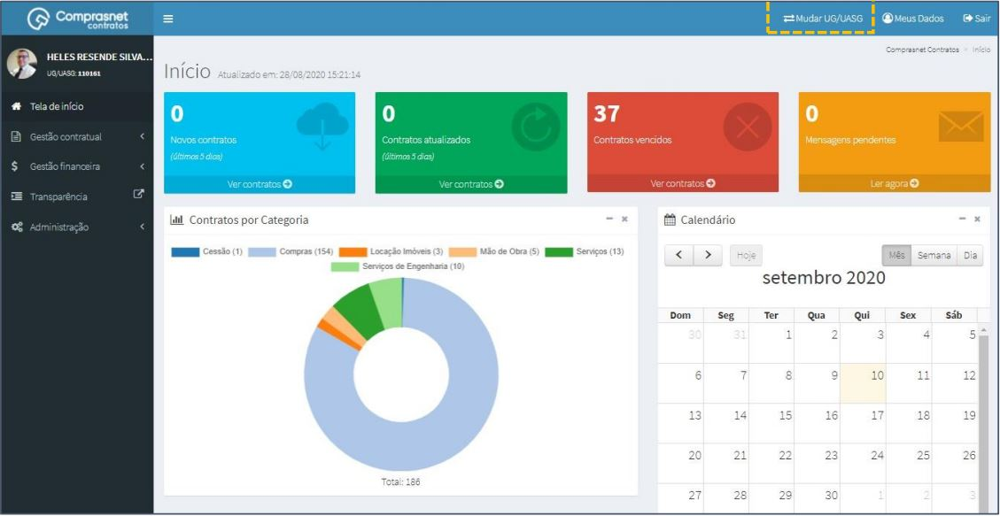

[TOC]

# Inclusão de Termo Aditivo – Prorrogação de Vigência

## 1. Modificação de UG/UASG

Para ter acesso ao contrato, faça a modificação da UG/UASG.

Será apresentada a tela para realização da modificação. Selecione a UG em
que o contrato está cadastrado na lista “Unidade Gestora”.

Após a seleção da UG/UASG, clique em “ Alterar”

## 2. Pesquisa de Cadastro de Contrato

Para pesquisar o contrato desejado clique no menu:

Gestão Contratual >> Contratos >> “Pesquisar” e informe os dados (Tipo
Contrato/UASG,CPF/CNPJ/UG/ID GÉNÉRICO ou NOME/RAZÃO SOCIAL).

Na tabela de contratos serão apresentados os resultados da pesquisa.

## 3. Inclusão de Termo Aditivo ao Contrato

Para adicionar o Termo Aditivo ao cadastro do contrato, clique no ícone
““.

Será apresentada a tela para realização do cadastro. Para adicionar um
Termo Aditivo clique em “Adicionar Termo Aditivo”.

Preencha os campos dos dados solicitados: Dados Gerais

    ✓ Número Termo Aditivo no formato xxxx/20xx.

    ✓ No campo “Observação” inserir o objeto do Termo de
    Apostilamento.

**ATENÇÃO: NÃO** clique em “Salvar e Voltar”, necessário terminar o
preenchimento de todas as abas para a finalização.

Os campos marcados com “*” são de preenchimento obrigatório.

Preencha os campos dos dados solicitados: Dados Aditivo

    ✓ “Informações Complementares” poderá ser preenchido caso haja
    alguma especificidade no documento.

**ATENÇÃO: NÃO** clique em “Salvar e Voltar”, necessário terminar o
preenchimento de todas as abas para a finalização.

Os campos marcados com “*” são de preenchimento obrigatório.

Preencha os campos dos dados solicitados: Vigência/ Valores

    ✓ Alterar as datas de início e final de vigência, de acordo com o
    estabelecido no termo aditivo que esta sendo cadastrado;

    ✓ No caso do termo que está sendo cadastrado utilizou-se a vigência
    “data a data”. Alguns órgãos descartam o dia da assinatura ou
    colocam como data fim a data de assinatura (-) 1;

    ✓ É importante ressaltar que a lógica estabelecida no termo original,
    seja ela qual for, não pode ser alterada no cadastrado das
    prorrogações;

    ✓ Como trata-se de prorrogação, não se deve alterar os campos “Valor
    Global”, “Núm. Parcelas” e “Valor Parcela”.

**ATENÇÃO: NÃO** clique em “Salvar e Voltar”, necessário terminar o
preenchimento de todas as abas para a finalização.

Os campos marcados com “*” são de preenchimento obrigatório.

Como trata-se de prorrogação, não há necessidade de preencher a aba
“Retroativo”, a opção “Não” já está pré-selecionada.

Após, clique em “Salvar e voltar”. 

Para confirmar a inclusão do Termo Aditivo refaça os itens 1 a 3 (Figura 5) e
ele aparecerá entre os termos já cadastrados.

