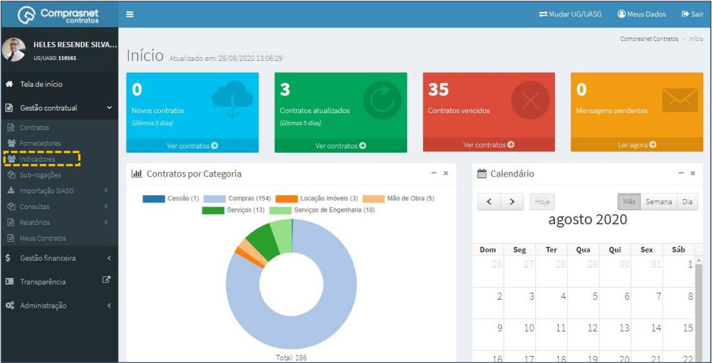
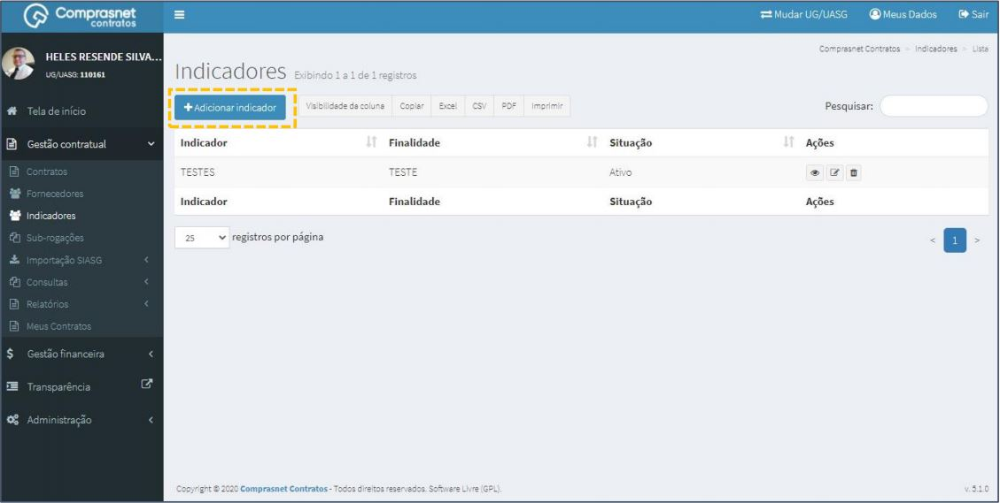
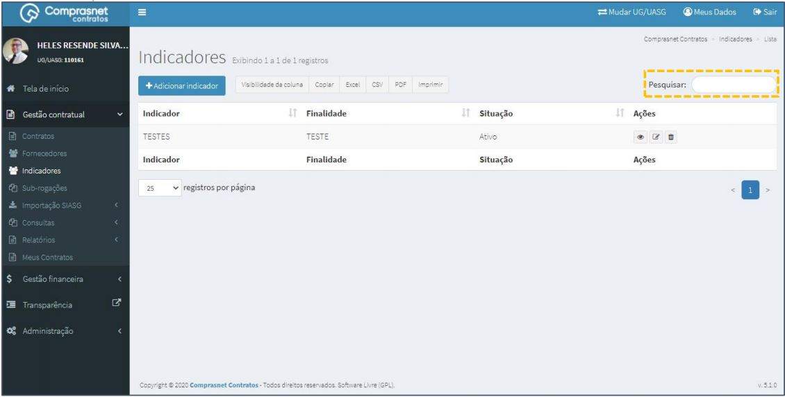
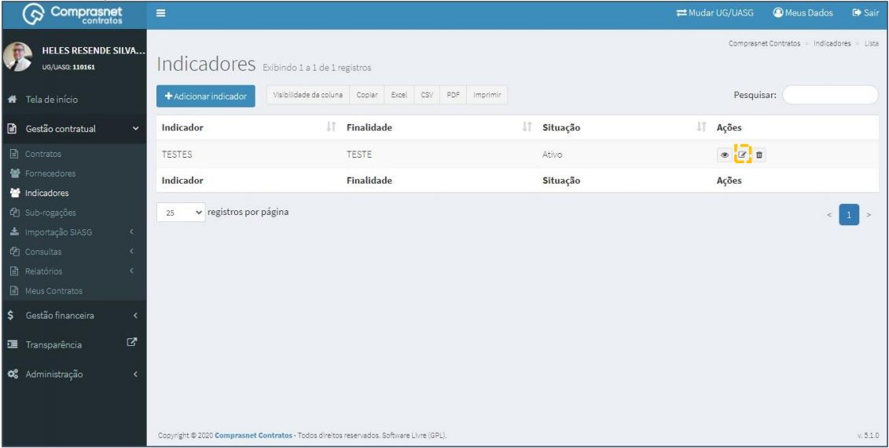
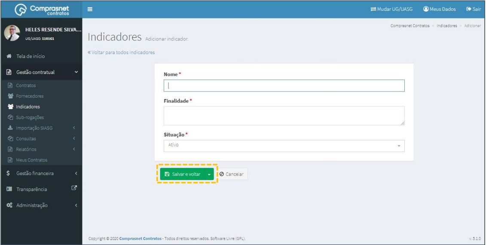
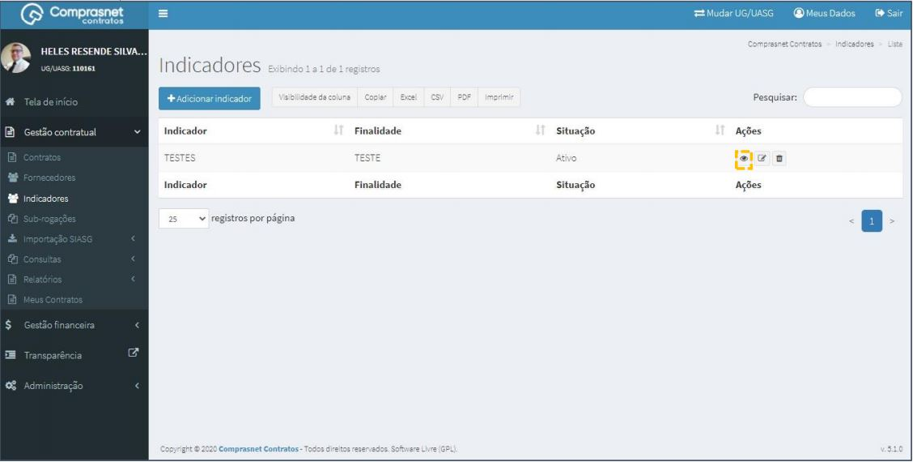
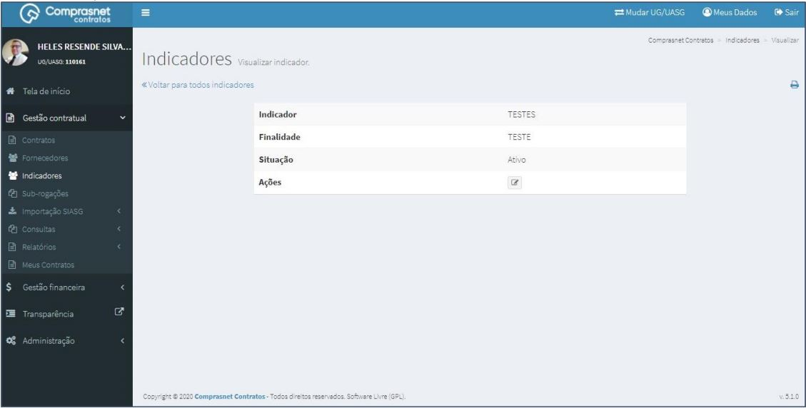
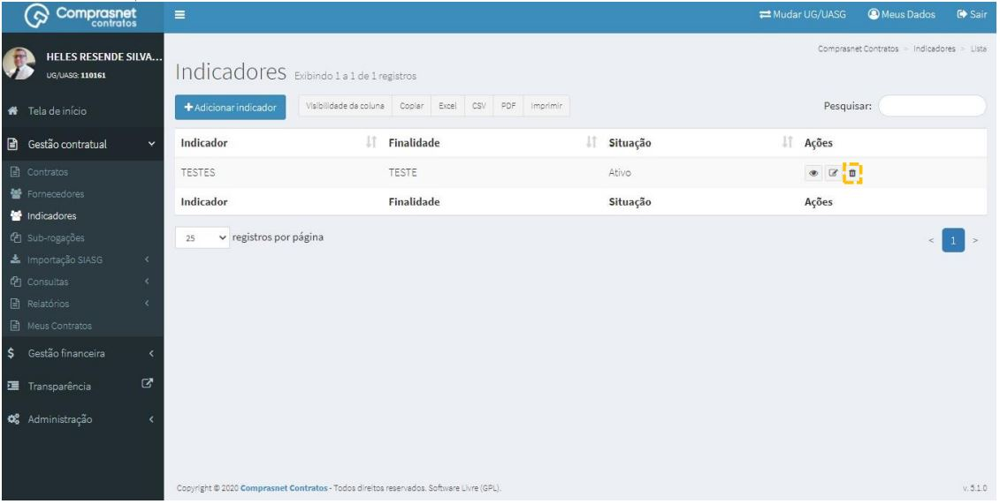
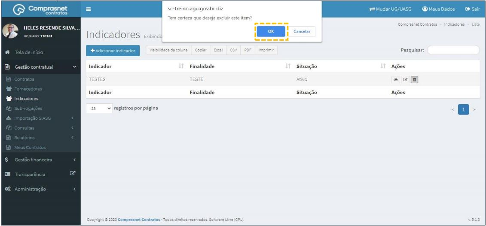

[TOC]

# Indicadores

## 1. Cadastramento de INDICADORES

Para cadastrar um Indicador, clique no menu

Gestão Contratual >> Indicadores

Será apresentada a tela para realização do cadastro. Para adicionar um
indicador clique em “Adicionar Indicador”.

Preencha os campos dos dados solicitados. Após, clique em
“Salvar e voltar”.

Os campos marcados com “*” são de preenchimento obrigatório.

## 2. Pesquisa de Cadastro de INDICADORES

Para pesquisar o cadastro do Indicador, clique no campo “Pesquisar” e
informe os dados (Tipo Indicador,CPF/CNPJ/UG/ID GÉNÉRICO ou
NOME/RAZÃO SOCIAL).

Na tabela de indicadores serão apresentados os resultados da pesquisa.

## 3. Editar Cadastro de INDICADORES

Para editar o cadastro do indicador, clique no ícone ““.

Será apresentada uma tela com os dados do indicador para edição.

Após a edição, clique em “Salvar e voltar”

## 4. Detalhar Cadastro de INDICADORES

Para detalhar o cadastro do indicador, clique no ícone ““.

Será apresentada uma tela com os detalhes do cadastro do indicador
selecionado.

## 5. Exclusão Cadastro de INDICADORES
Para excluir o cadastro do indicador, clique no ícone ““.

Será apresentada uma ”popup”com solicitação de confirmação da exclusão
do indicador selecionado.

Após a confirmação, clique em “OK”

