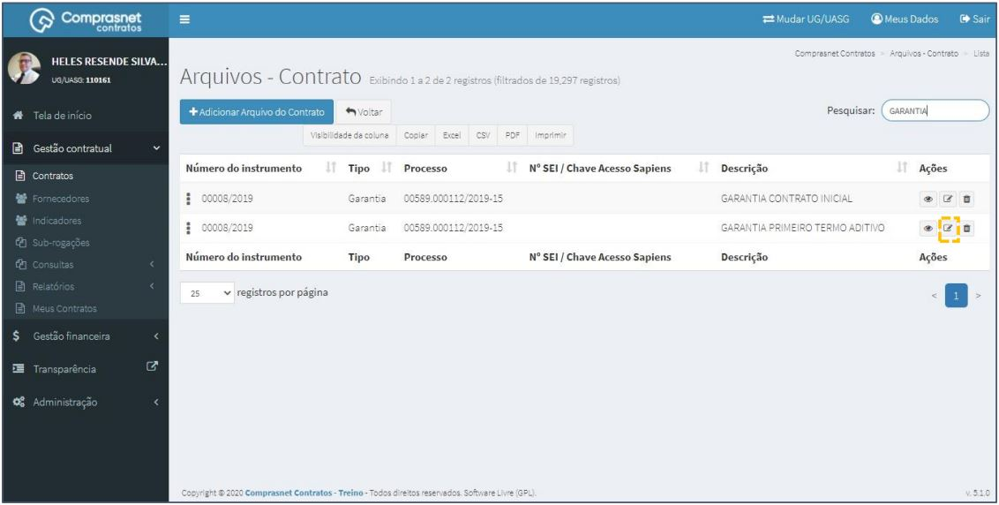

[TOC]

# Contratos - Itens Contrato - Arquivos

## 1. Pesquisa para Inclusão de Arquivo

Para pesquisar o contrato e incluir o arquivo, clique no menu:

Gestão Contratual >> Contratos

No campo Pesquisar, informe os dados do contrato desejado.

Será apresentada uma tela com resultado da pesquisa.
Clique no ícone “  “ e, na lista de itens Contrato, selecione
“Arquivos”.

## 2. Adicionar Arquivo

Para adicionar Arquivo, clique em “Adicionar Arquivo do Contrato”.

Preencha os campos dos dados solicitados. Após, clique em “Salvar e voltar”.

Os campos marcados com “*” são de preenchimento obrigatório.

## 3. Pesquisa de Arquivo

Para pesquisar o cadastro de arquivo, clique no campo “Pesquisar” e informe
os dados (Tipo Arquivo,CPF/CNPJ/UG/ID GÉNÉRICO ou NOME/RAZÃO
SOCIAL).

Na tabela de arquivos serão apresentados os resultados da pesquisa.

## 4. Editar Arquivo
Para editar o cadastro de arquivo, clique no ícone ““.

Será apresentada uma tela com os dados do arquivo para edição.

Após a edição, clique em “Salvar e voltar”

## 5.  Detalhar Arquivo

Para detalhar o cadastro de arquivo, clique no ícone ““.

Será apresentada uma tela com os detalhes do cadastro do arquivo
selecionado.

## 6. Excluir Arquivo

Para excluir o cadastro de arquivo, clique no ícone ““.

