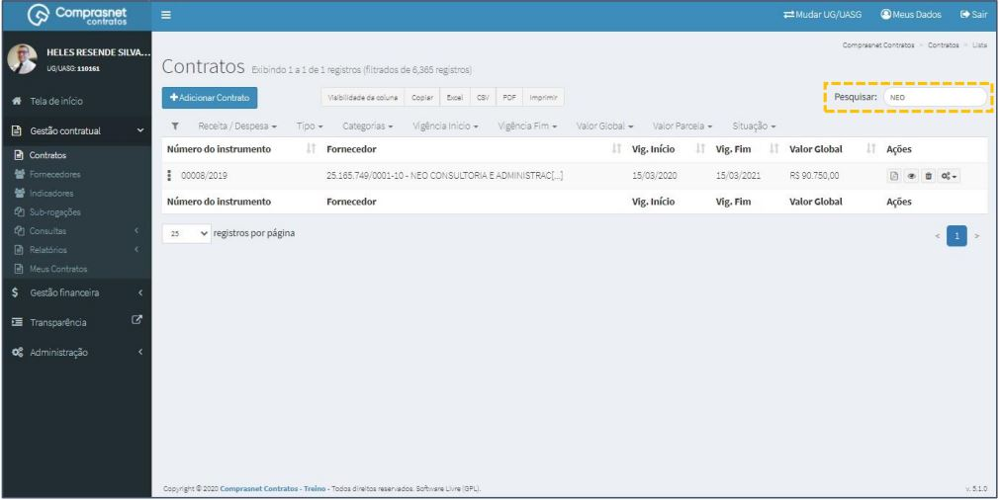
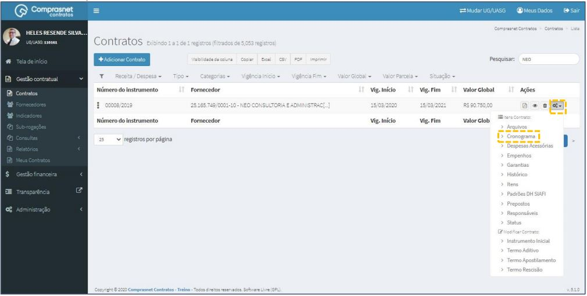
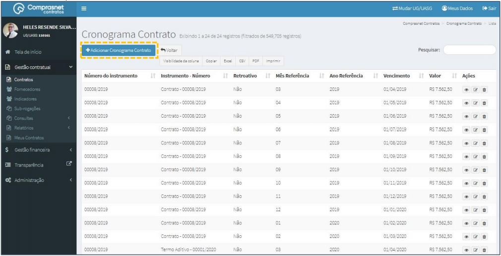
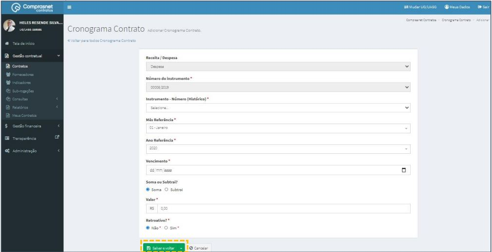
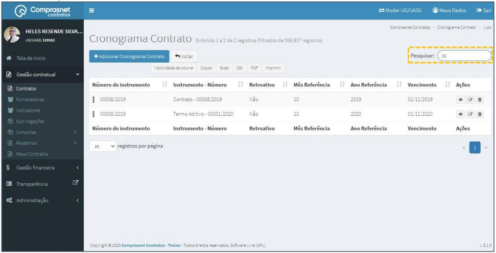
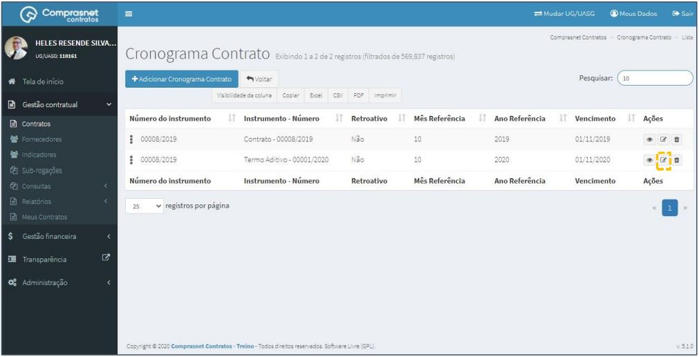
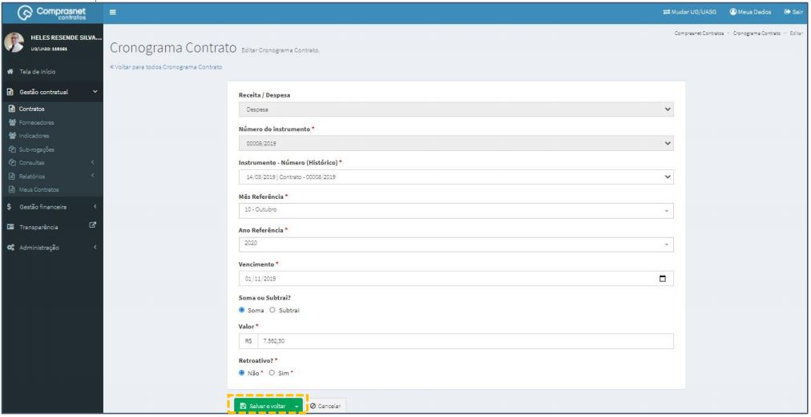
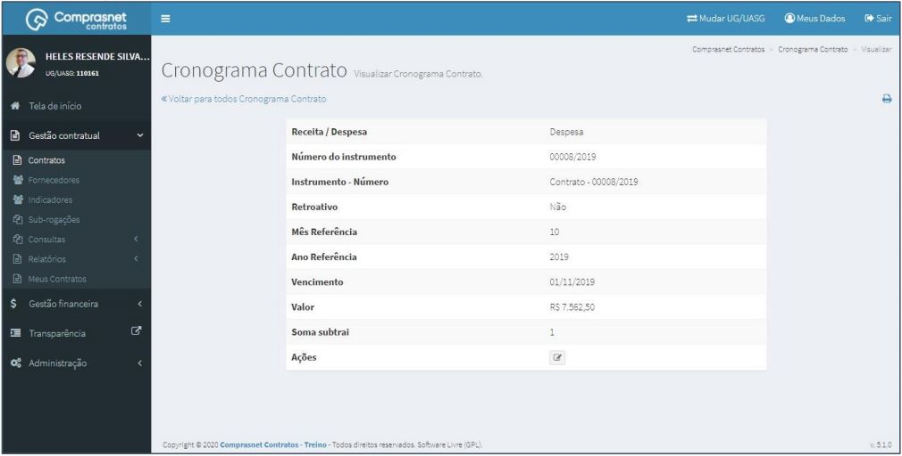
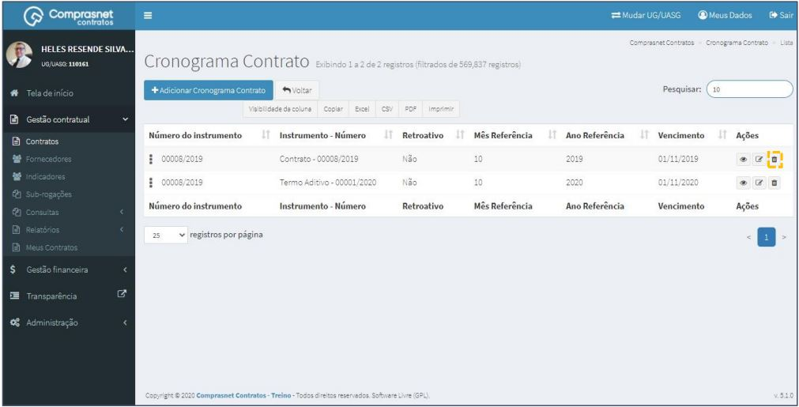

[TOC]

# Contratos - Itens Contrato - Cronograma

## 1. Pesquisa para Inclusão de Cronograma
Para pesquisar o contrato e incluir o cronograma, clique no menu:

Gestão Contratual >> Contratos

No campo Pesquisar, informe os dados do contrato desejado.

Será apresentada uma tela com resultado da pesquisa.
Clique no ícone ““ e, na lista de itens Contrato, selecione
“Cronograma”.

## 2. Adicionar Cronograma

Para adicionar Cronograma, clique em “Adicionar Cronograma do Contrato”.

Preencha os campos dos dados solicitados. Após, clique em
“Salvar e voltar”.

Os campos marcados com “*” são de preenchimento obrigatório.

## 3. Pesquisa de Cronograma
Para pesquisar o cadastro de um cronograma, clique no campo “Pesquisar” e
informe os dados(Tipo Arquivo,CPF/CNPJ/UG/ID GÉNÉRICO ou NOME/RAZÃO
SOCIAL).

Na tabela de cronogramas serão apresentados os resultados da pesquisa.

## 4. Editar Cronograma
Para editar o cadastro de cronograma, clique no ícone ““.

Será apresentada uma tela com os dados do cronograma para edição.

Após a edição, clique em “Salvar e voltar”

## 5. Detalhar Cronograma
Para detalhar o cadastro de arquivo, clique no ícone ““.

Será apresentada uma tela com os detalhes do cadastro do cronograma
selecionado.

## 6. Excluir Cronograma
Para excluir o cadastro de cronograma, clique no ícone ““.

