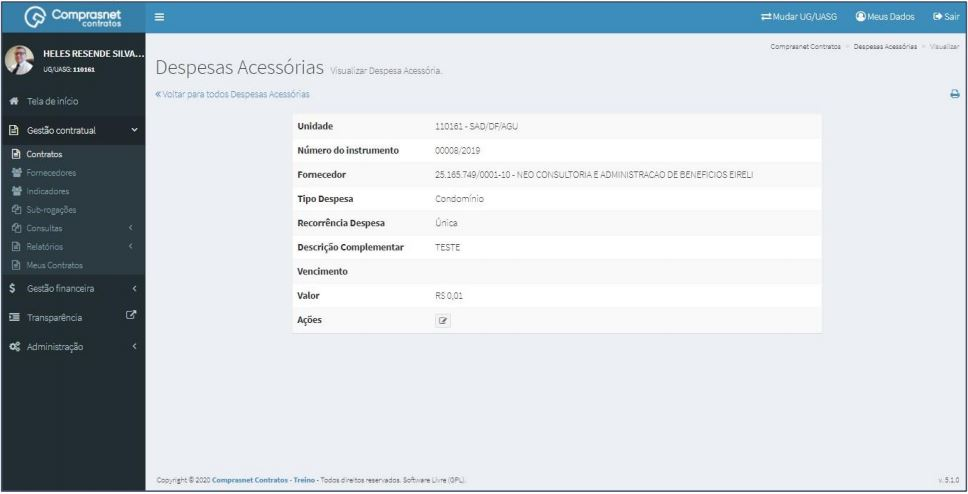

[TOC]

# Contratos - Itens Contrato – Despesas acessórias

## 1. Pesquisa para Inclusão de Despesas Acessórias
Para pesquisar o contrato e incluir uma despesa, clique no menu:

Gestão Contratual >> Contratos

No campo Pesquisar, informe os dados do contrato desejado.

Será apresentada uma tela com resultado da pesquisa.

Clique no ícone ““ e, na lista de itens Contrato, selecione
“Despesas Acessórias”.

## 2. Adicionar Despesas

Para adicionar despesa , clique em “Adicionar Despesas Acessória”.

Preencha os campos dos dados solicitados. Após, clique em
“Salvar e voltar”.

Os campos marcados com “*” são de preenchimento obrigatório.

## 3. Pesquisa de Despesas
Para pesquisar o cadastro de uma despesa, clique no campo “Pesquisar” e
informe os dados (Tipo Despesas Acessórias,CPF/CNPJ/UG/ID GÉNÉRICO ou
NOME/RAZÃO SOCIAL).

Na tabela de despesas serão apresentados os resultados da pesquisa.

## 4. Editar Despesas

Para editar o cadastro de uma despesa, clique no ícone ““.

Será apresentada uma tela com os dados do cronograma para edição.

Após a edição, clique em “Salvar e voltar”

## 5. Detalhar Despesas

Para detalhar o cadastro de despesa, clique no ícone ““.

Será apresentada uma tela com os detalhes do cadastro da despesa
selecionada.

## 6. Excluir Despesas

Para excluir o cadastro de despesas, clique no ícone ““.

