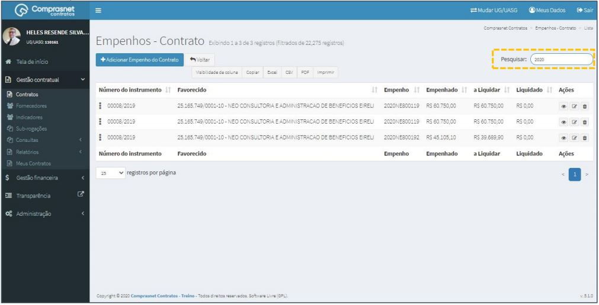

[TOC]

# Contratos - Itens Contrato – Empenhos

## 1. Pesquisa para Inclusão de Empenhos
Para pesquisar o contrato e incluir um empenho, clique no menu:

Gestão Contratual >> Contratos

No campo Pesquisar, informe os dados do contrato desejado.

Será apresentada uma tela com resultado da pesquisa.
Clique no ícone ““ e, na lista de itens Contrato, selecione
“Empenhos”.

## 2. Adicionar Empenhos

Para adicionar empenho , clique em “Adicionar Empenho do Contrato”.

Preencha os campos dos dados solicitados. Após, clique em
“Salvar e voltar”.

Os campos marcados com “*” são de preenchimento obrigatório.

## 3. Pesquisa de Empenhos

Para pesquisar o cadastro de um empenho, clique no campo “Pesquisar” e
informe os dados (Tipo Empenhos,CPF/CNPJ/UG/ID GÉNÉRICO ou
NOME/RAZÃO SOCIAL).

Na tabela de empenho serão apresentados os resultados da pesquisa.

## 4. Editar Empenhos

Para editar o cadastro de um empenho, clique no ícone ““.

Será apresentada uma tela com os dados do empenho para edição.

Após a edição, clique em “Salvar e voltar”

## 5. Detalhar Empenhos

Para detalhar o cadastro de empenho, clique no ícone ““.

Será apresentada uma tela com os detalhes do cadastro do empenho
selecionado.

## 6. Excluir Empenhos

Para excluir o cadastro de empenho, clique no ícone ““.

