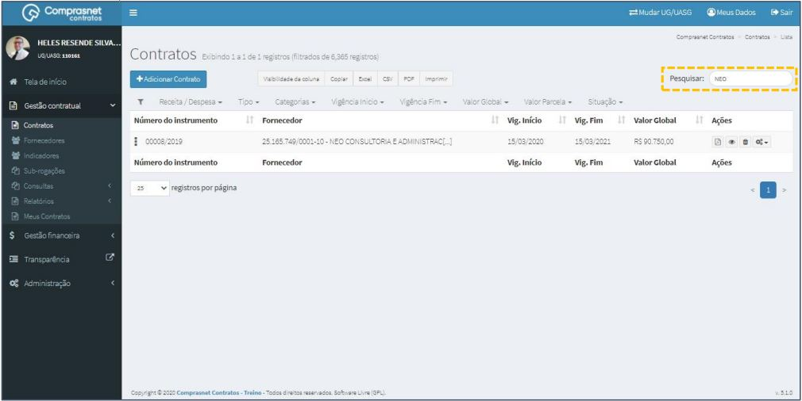
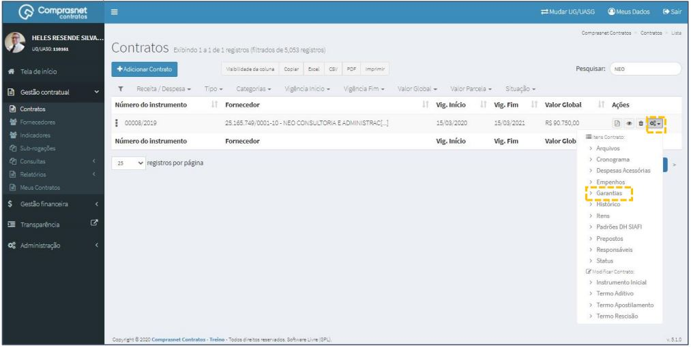
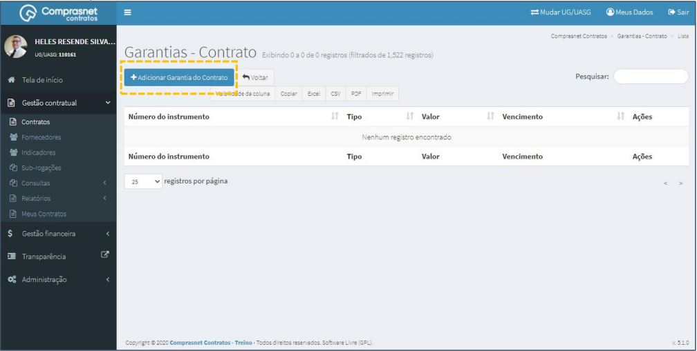
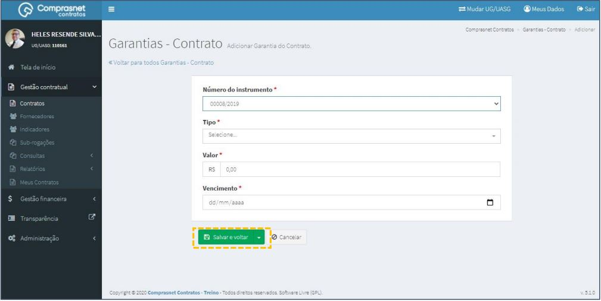

[TOC]

# Contratos - Itens Contrato – Garantias

## 1. Pesquisa para Inclusão de Garantias

Para pesquisar o contrato e incluir uma garantia, clique no menu:

Gestão Contratual >> Contratos

No campo Pesquisar, informe os dados do contrato desejado.

Será apresentada uma tela com resultado da pesquisa.
Clique no ícone ““ e, na lista de itens Contrato, selecione
“Garantias”.

## 2. Adicionar Garantias

Para adicionar garantia , clique em “Adicionar Garantia do Contrato”.

Preencha os campos dos dados solicitados. Após, clique em
“Salvar e voltar”.

Os campos marcados com “*” são de preenchimento obrigatório.

