[TOC]

# Contratos - Itens Contrato – Histórico

## 1. Pesquisa de Contratos

Para pesquisar o contrato e incluir um histórico, clique no menu:

Gestão Contratual >> Contratos

No campo Pesquisar, informe os dados do contrato desejado.

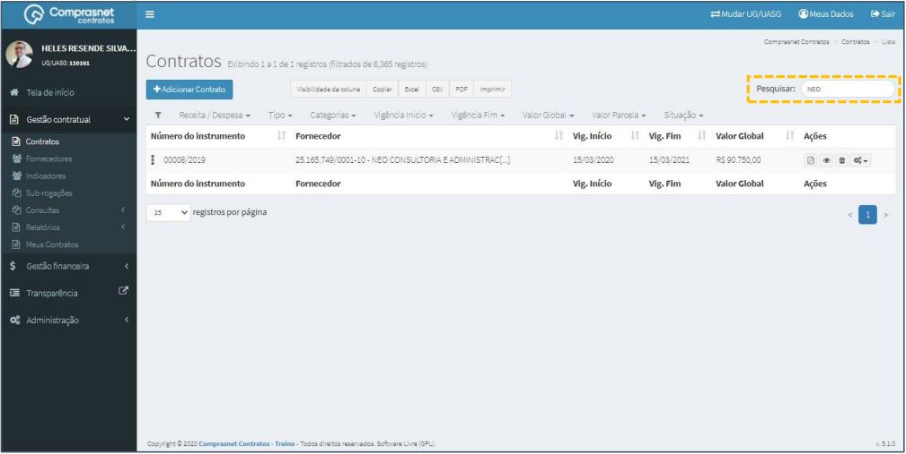

Será apresentada uma tela com resultado da pesquisa.
Clique no ícone ““ e, na lista de itens Contrato, selecione
“Históricos”.

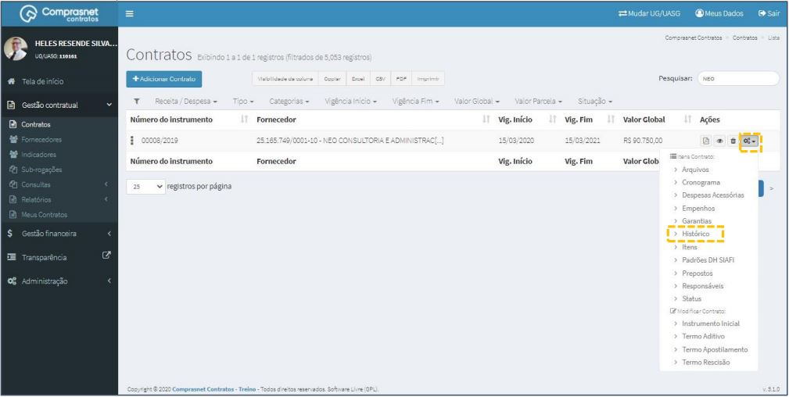

## 2. Pesquisa de Históricos
Para pesquisar o cadastro de um histórico, clique no campo “Pesquisar” e
informe os dados (Tipo Histórico,CPF/CNPJ/UG/ID GÉNÉRICO ou
NOME/RAZÃO SOCIAL).

Na tabela de históricos serão apresentados os resultados da pesquisa

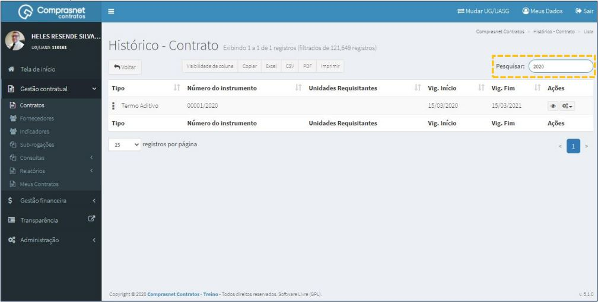

## 3. Detalhar Históricos

Para detalhar o histórico, clique no ícone ““.

Será apresentada uma tela com os detalhes do cadastro dos histórico
selecionado.

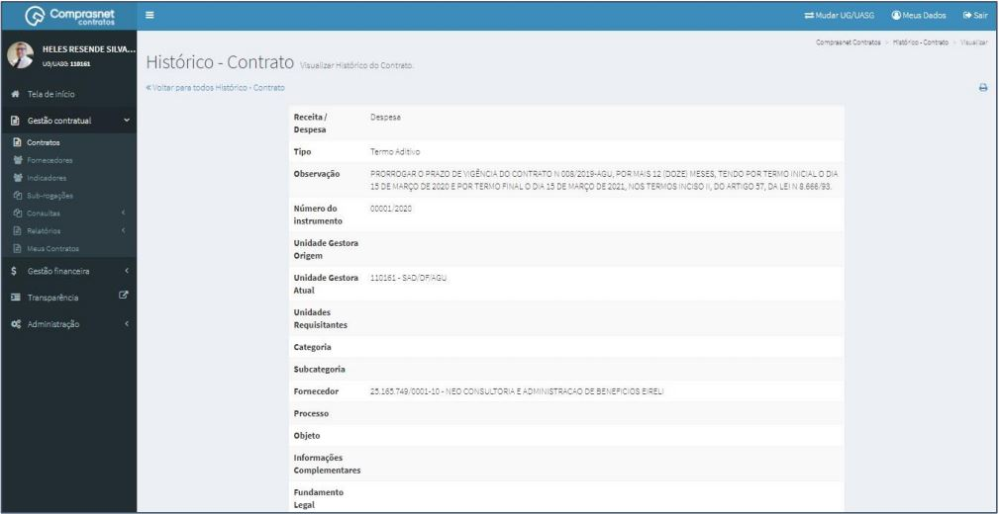

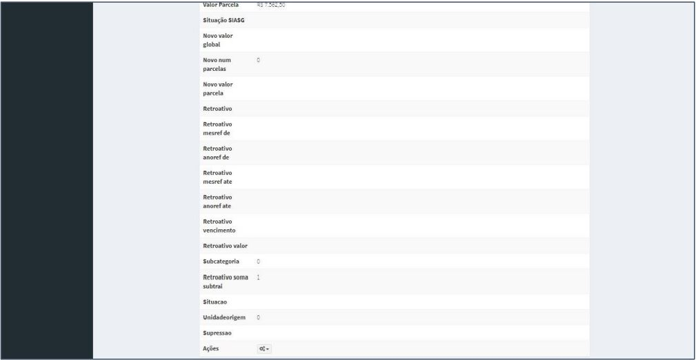

## 4. Adicionar Históricos Item

Para adicionar item ao histórico na tela de pesquisa clique no ícone ““ e, na lista selecione “Itens”.

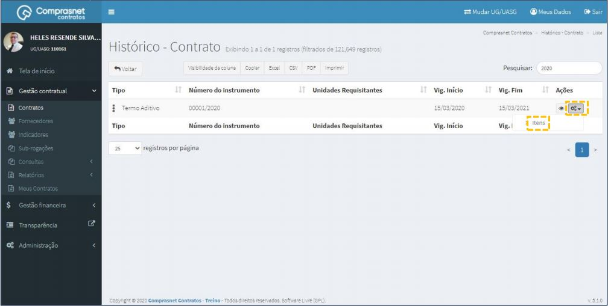

Será apresentada uma tela para adicionar as informações solicitadas. Clique em “Adicionar Contrato Histórico Item”.

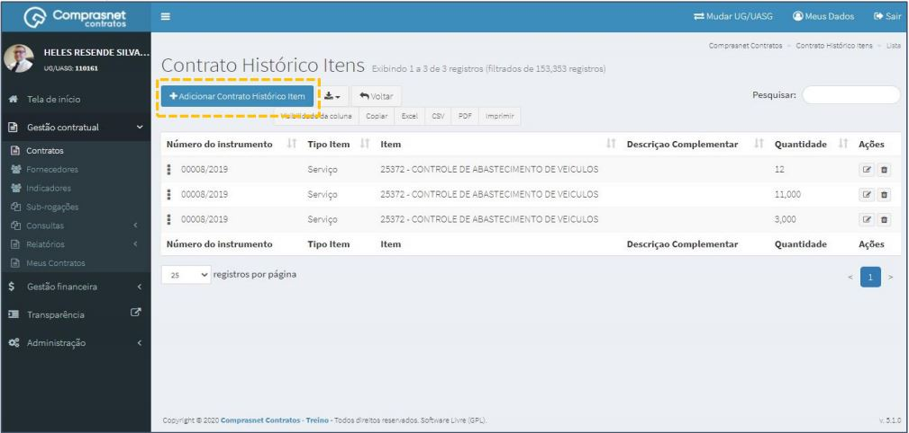

Preencha os campos dos dados solicitados. Após, clique em “Salvar e
voltar”.

Os campos marcados com “*” são de preenchimento obrigatório.

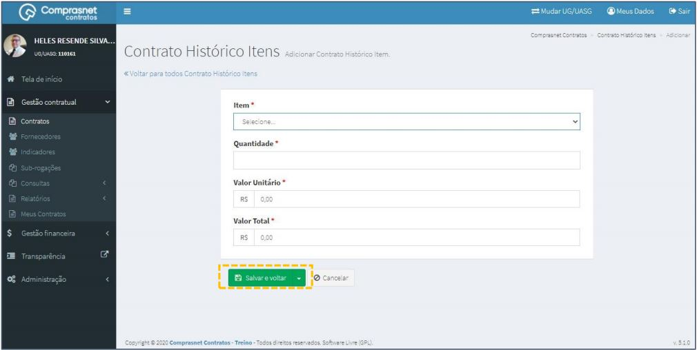

## 5. Pesquisa de Itens

Para pesquisar o cadastro de um item, clique no campo “Pesquisar” e informe
os dados (Tipo Histórico Item,CPF/CNPJ/UG/ID GÉNÉRICO ou NOME/RAZÃO
SOCIAL).

Na tabela de itens serão apresentados os resultados da pesquisa.

## 6. Editar Itens

Para editar o cadastro de um item, clique no ícone ““.

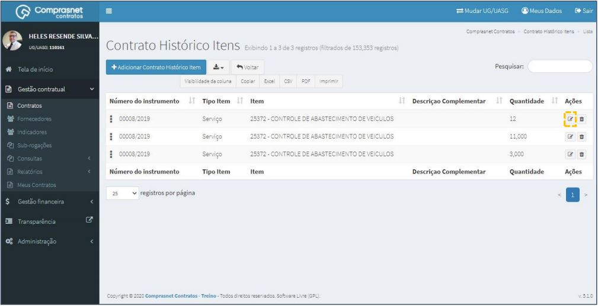

Será apresentada uma tela com os dados do histórico para edição.

Após a edição, clique em “Salvar e voltar”

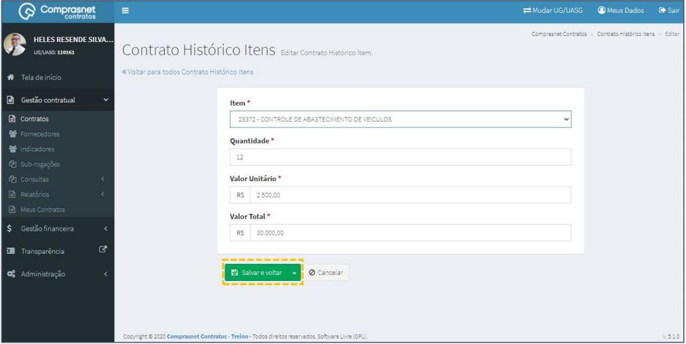

## 7. Excluir Itens

Para excluir o cadastro de itens, clique no ícone ““.

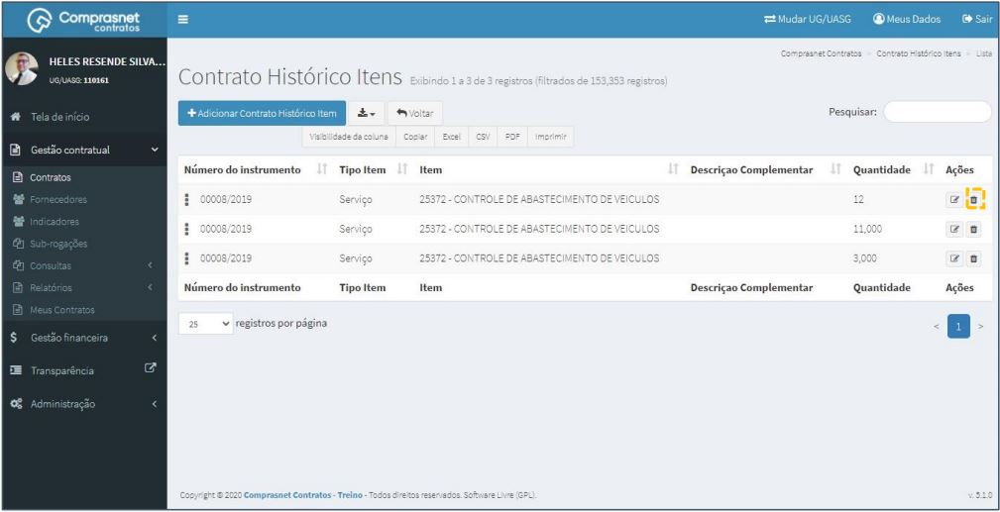