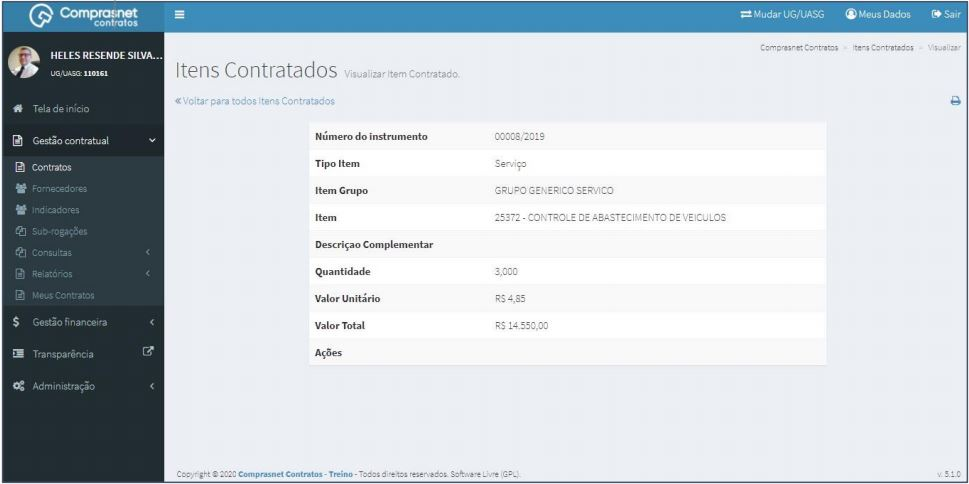

[TOC]

# Contratos - Itens Contrato – Itens

## 1. Pesquisa para Inclusão de Itens

Para pesquisar o contrato e incluir um item, clique no menu:

Gestão Contratual >> Contratos

No campo Pesquisar, informe os dados do contrato desejado.

Será apresentada uma tela com resultado da pesquisa.
Clique no ícone ““ e, na lista de itens Contrato, selecione
“Itens”.

## 2. Adicionar Item Contrato

Para adicionar item , clique em “Adicionar Item Contrato”.

Preencha os campos dos dados solicitados. Após, clique em
“Salvar e voltar”.

Os campos marcados com “*” são de preenchimento obrigatório.

## 3. Pesquisa de Item Contratado
Para pesquisar o cadastro de um item, clique no campo “Pesquisar” e informe
os dados (Tipo Item,CPF/CNPJ/UG/ID GÉNÉRICO ou NOME/RAZÃO SOCIAL).

Na tabela de itens serão apresentados os resultados da pesquisa.

## 4. Detalhar Item Contratado

Para detalhar o cadastro de item, clique no ícone ““.

Será apresentada uma tela com os detalhes do cadastro do item selecionado.

## 5.  Excluir Item Contratado

Para excluir o cadastro de empenho, clique no ícone ““.

