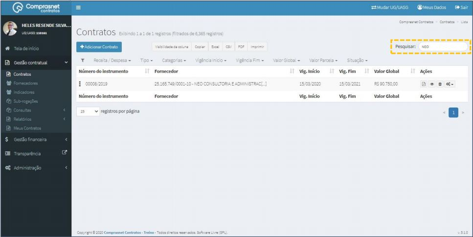
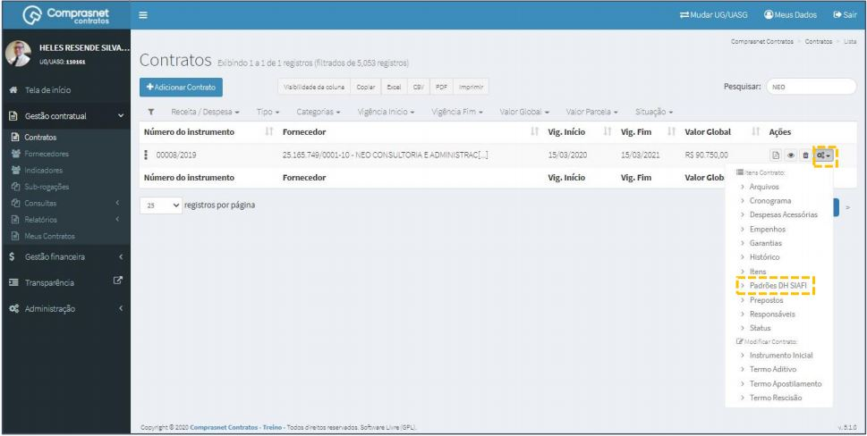
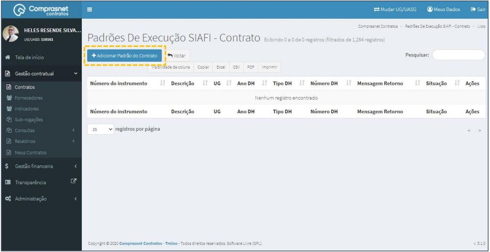
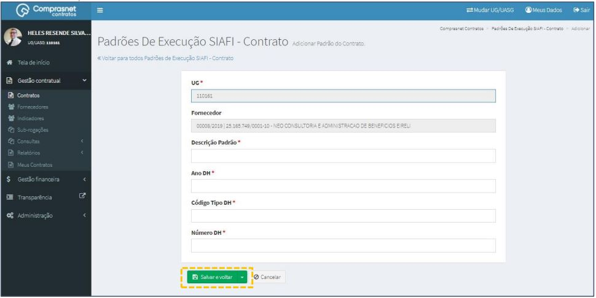

[TOC]

# Contratos - Itens Contrato – Padrões DH SIAFI

## 1. Pesquisa para Inclusão de Padrões DH SIAFI

Para pesquisar o contrato e incluir um padrão, clique no menu:

Gestão Contratual >> Contratos

No campo Pesquisar, informe os dados do contrato desejado.

Será apresentada uma tela com resultado da pesquisa.
Clique no ícone ““ e, na lista de itens Contrato, selecione
“Padrões DH SIAFI”.

## 2. Adicionar Padrões

Para adicionar padrões , clique em “Adicionar Padrão do Contrato”.

Preencha os campos dos dados solicitados. Após, clique em
“Salvar e voltar”.

Os campos marcados com “*” são de preenchimento obrigatório.

