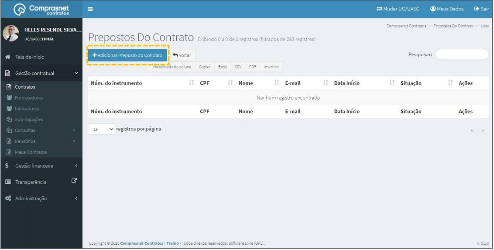

[TOC]

# Contratos - Itens Contrato – Prepostos

## 1. Pesquisa para Inclusão de Preposto

Para pesquisar o contrato e incluir um preposto, clique no menu:

Gestão Contratual >> Contratos

No campo Pesquisar, informe os dados do contrato desejado.

Será apresentada uma tela com resultado da pesquisa.
Clique no ícone ““ e, na lista de itens Contrato, selecione
“Preposto”.

## 2. Adicionar Preposto

Para adicionar preposto , clique em “Adicionar Preposto do Contrato”.

Preencha os campos dos dados solicitados. Não clique em
“Salvar e voltar” nesse momento.

Os campos marcados com “*” são de preenchimento obrigatório.

Preencha os campos dos dados solicitados. Após, clique em
“Salvar e voltar”.

Os campos marcados com “*” são de preenchimento obrigatório.

