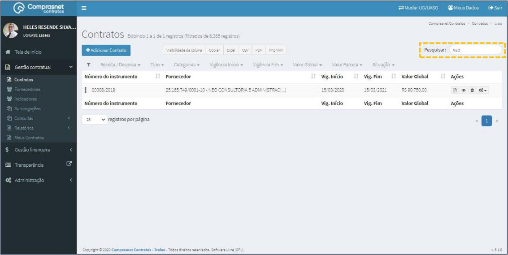
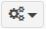
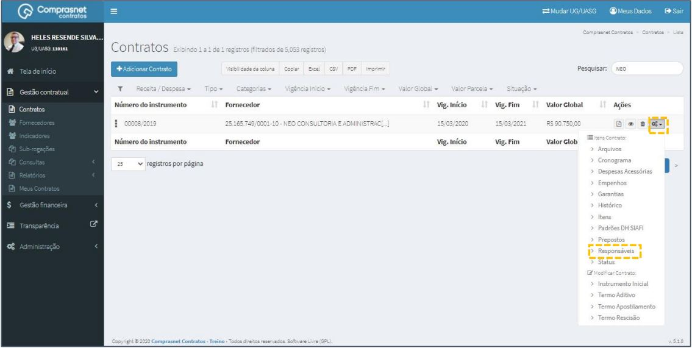
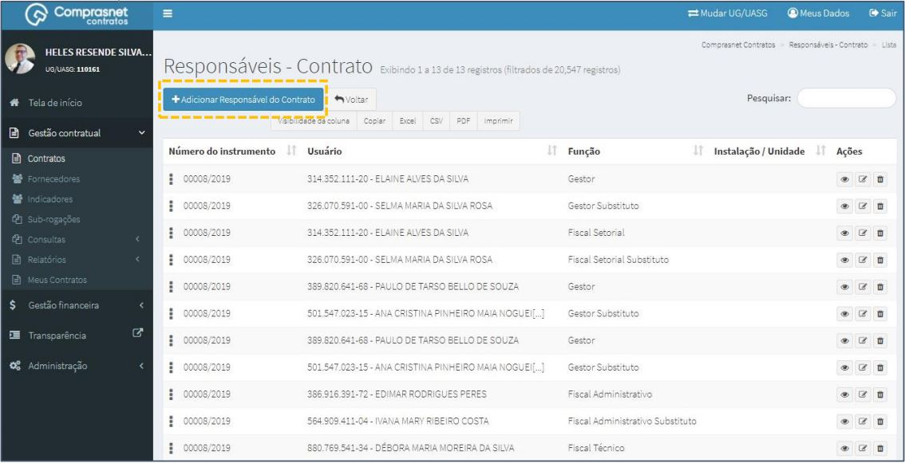
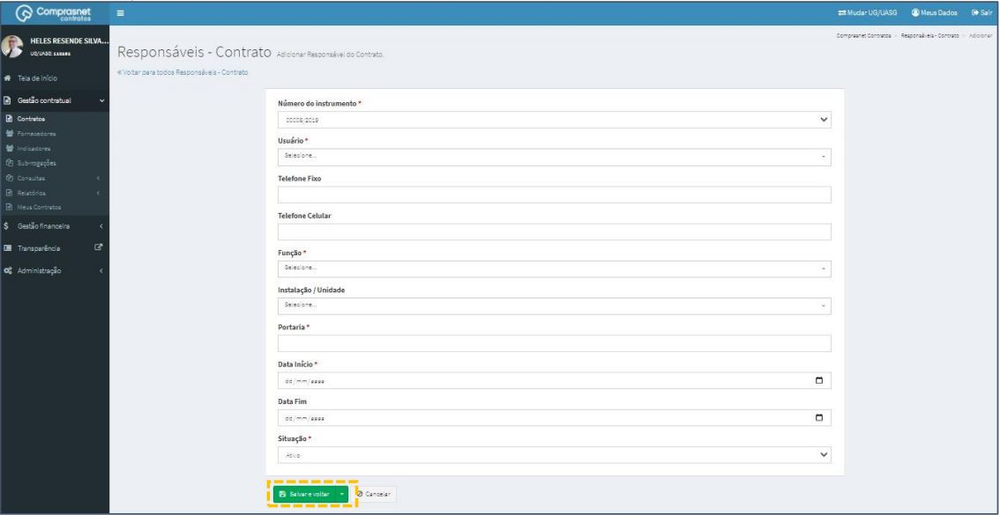
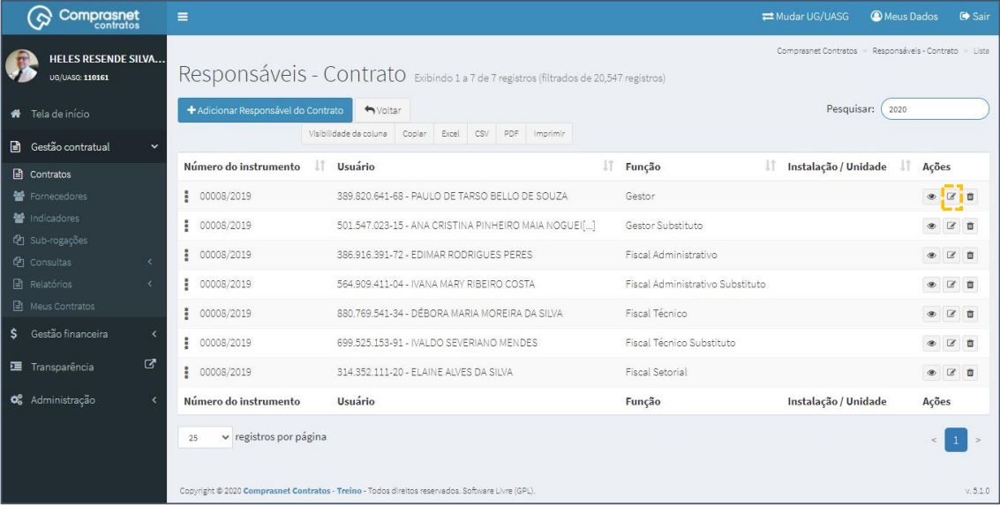
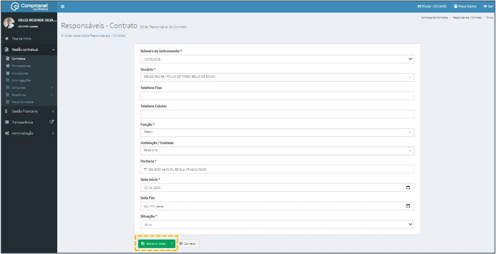
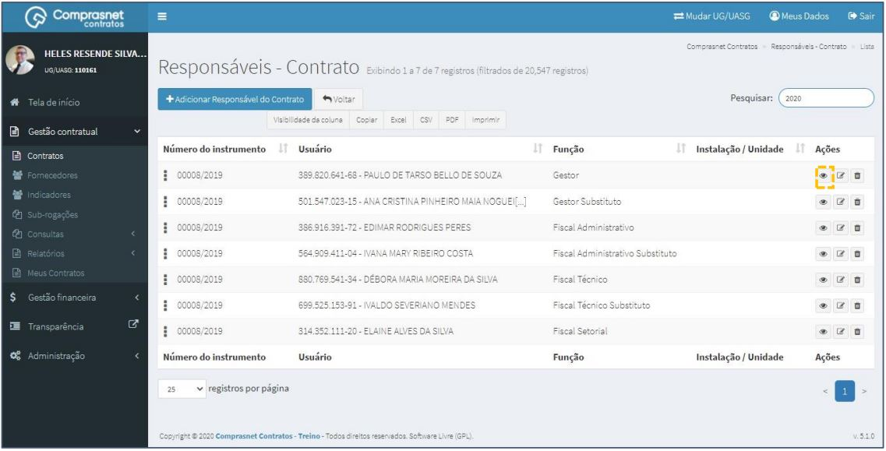
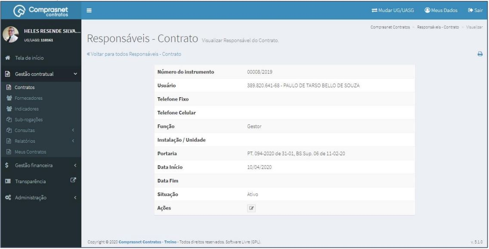
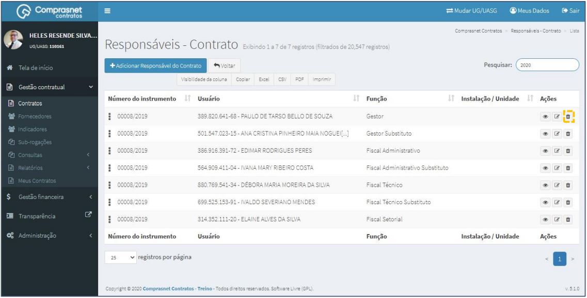

[TOC]

# Contratos - Itens Contrato – Responsáveis

## 1. Pesquisa para Inclusão de Responsáveis

Para pesquisar o contrato e incluir um responsável, clique no menu:

Gestão Contratual >> Contratos

No campo Pesquisar, informe os dados do contrato desejado.

Será apresentada uma tela com resultado da pesquisa.

Clique no ícone ““ e, na lista de itens Contrato, selecione
“Responsáveis”.

## 2. Adicionar Responsáveis

Para adicionar responsável , clique em “Adicionar Responsável do Contrato”.

Preencha os campos dos dados solicitados. Após, clique em
“Salvar e voltar”.

Os campos marcados com “*” são de preenchimento obrigatório.

## 3. Pesquisa de Responsáveis
Para pesquisar o cadastro de um responsável, clique no campo “Pesquisar” e
informe os dados (Tipo Responsável,CPF/CNPJ/UG/ID GÉNÉRICO ou
NOME/RAZÃO SOCIAL).

Na tabela de responsáveis serão apresentados os resultados da pesquisa.

## 4. Editar Responsável

Para editar o cadastro de um responsável, clique no ícone ““.

Será apresentada uma tela com os dados do responsável para edição.

Após a edição, clique em “Salvar e voltar”

## 5. Detalhar Responsável
Para detalhar o cadastro de responsável, clique no ícone ““.

Será apresentada uma tela com os detalhes do cadastro do responsável
selecionado.

## 6. Excluir Responsáveis

Para excluir o cadastro de responsável, clique no ícone ““.

