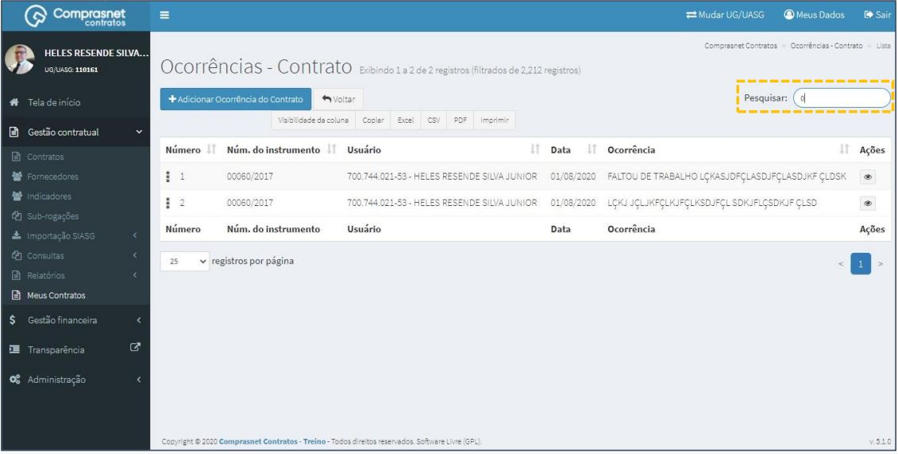

[TOC]

# Meus Contratos

## 1. Consulta de Contratos

Para consultar seus contratos, clique no menu

Gestão Contratual >> Meus Contratos

Será apresentada a tela para a consulta de seus contratos.

## 2. Pesquisa de Contratos

Para pesquisar um contrato , clique no campo “Pesquisar” e informe os dados
(Tipo Meus Contratos,CPF/CNPJ/UG/ID GÉNÉRICO ou NOME/RAZÃO SOCIAL).

Na tabela de contratos serão apresentados os resultados da pesquisa.

## 3. Detalhar Contrato

 Para detalhar o contrato, clique no ícone ““.

Será apresentada uma tela com os detalhes do cadastro de empenho
selecionado.

## 4. Detalhamento de Itens do Contrato

Para cadastrar outros itens no contrato, clique no ícone ““.

## 5. Cadastramento de Faturas

Para cadastrar uma fatura ao contrato, clique em: >> Faturas

Será apresentada a tela para realização do cadastro. Para adicionar uma
fatura clique em “Adicionar Fatura do Contrato”.

Preencha os campos dos dados solicitados para as abas: Dados Fatura
Após, clique em “Salvar e voltar”.

Os campos marcados com “*” são de preenchimento obrigatório.

Preencha os campos dos dados solicitados: Outras Informações

Após, clique em “Salvar e voltar”.

Os campos marcados com “*” são de preenchimento obrigatório.

## 6. Pesquisa de Cadastro de Faturas

Para pesquisar uma fatura , clique no campo “Pesquisar” e informe os dados
(Tipo Faturas,CPF/CNPJ/UG/ID GÉNÉRICO ou NOME/RAZÃO SOCIAL).

Na tabela de faturas serão apresentados os resultados da pesquisa.

## 7. Editar Cadastro de Faturas

Para editar o cadastro de uma fatura, clique no ícone ““.

Será apresentada uma tela com os dados da fatura para edição: Dados Fatura

Após a edição, clique em “Salvar e voltar”

 Os campos marcados com “*” são de preenchimento obrigatório.

Será apresentada uma tela com os dados da fatura para edição:
Outras Informações

Após a edição, clique em “Salvar e voltar”

 Os campos marcados com “*” são de preenchimento obrigatório.

## 8. Detalhar Cadastro de Faturas

Para detalhar o cadastro da fatura, clique no ícone ““

Será apresentada uma tela com os detalhes do cadastro da fatura
selecionada.

## 9. Exclusão de Cadastro de Faturas

Para excluir o cadastro de uma fatura, clique no ícone ““.

## 10. Cadastramento de Ocorrências

Para cadastrar uma ocorrência ao contrato, clique em >> Ocorrências.

Será apresentada a tela para realização do cadastro. Para adicionar uma
ocorrência clique em “Adicionar Ocorrência do Contrato”.

Será apresentado a tela para o cadastro. Preencha os campos dos dados
solicitados.

Após, clique em “Salvar e voltar”.

Os campos marcados com “*” são de preenchimento obrigatório.

## 11. Pesquisa de Cadastro de Ocorrências

Para pesquisar uma ocorrência, clique no campo “Pesquisar” e informe os
dados (Tipo Ocorrência,CPF/CNPJ/UG/ID GÉNÉRICO ou NOME/RAZÃO
SOCIAL).

Na tabela de ocorrências serão apresentados os resultados da pesquisa.

## 12. Detalhar Cadastro de Ocorrências

Para detalhar o cadastro de ocorrência, clique no ícone ““.

Será apresentada uma tela com os detalhes da ocorrência do contrato
selecionado.

## 13. Cadastramento de Terceirizados

Para cadastrar um terceirizado ao contrato, clique em: >> Terceirizados

Será apresentada a tela para realização do cadastro. Para adicionar um
terceirizado clique em “Adicionar Terceirizado do Contrato”.

Preencha os campos dos dados solicitados para as abas: Dados Pessoais

Após, clique em “Salvar e voltar”.

Os campos marcados com “*” são de preenchimento obrigatório.

Preencha os campos dos dados solicitados: Dados Funcionais

Após, clique em “Salvar e voltar”.

Os campos marcados com “*” são de preenchimento obrigatório.

## 14. Pesquisa de Cadastro de Terceirizados

Para pesquisar um terceirizado , clique no campo “Pesquisar” e informe os
dados (Tipo Terceirizado,CPF/CNPJ/UG/ID GÉNÉRICO ou NOME/RAZÃO
SOCIAL).

Na tabela de terceirizados serão apresentados os resultados da pesquisa.

## 15. Editar Cadastro de Terceirizados

Para editar o cadastro de terceirizado, clique no ícone ““.

Será apresentada uma tela com os dados da fatura para edição:
Dados Pessoais

Após a edição, clique em “Salvar e voltar”

 Os campos marcados com “*” são de preenchimento obrigatório.

Será apresentada uma tela com os dados da fatura para edição:
Dados Funcionais

Após a edição, clique em “Salvar e voltar”

 Os campos marcados com “*” são de preenchimento obrigatório.

## 16. Detalhar Cadastro de Terceirizados

Para detalhar o cadastro do terceirizado, clique no ícone ““.

Será apresentada uma tela com os detalhes do cadastro do terceirizado
selecionada.

## 17. Exclusão Cadastro de Terceirizados

Para excluir o cadastro de terceirizado, clique no ícone ““.

