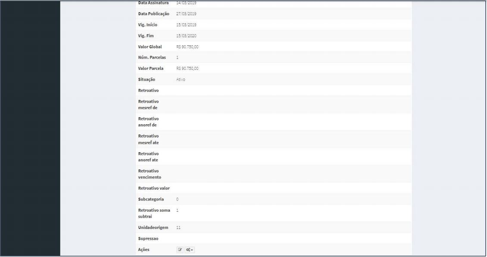
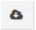

[TOC]

# Contratos - Modificar Contrato - Instrumento Inicial

## 1. Pesquisa de Contratos

Para pesquisar o contrato e incluir um instrumento, clique no menu:

Gestão Contratual >> Contratos

No campo Pesquisar, informe os dados do contrato desejado.

Será apresentada uma tela com resultado da pesquisa.
Clique no ícone ““ e, na lista de itens Contrato, selecione
“Instrumento Inicial”.

## 2. Pesquisa de Instrumento Inicial

Para pesquisar o cadastro de um instrumento, clique no campo “Pesquisar”
e informe os dados (Tipo Instrumento Inicial,CPF/CNPJ/UG/ID GÉNÉRICO ou
NOME/RAZÃO SOCIAL).

Na tabela de instrumentos serão apresentados os resultados da pesquisa.

## 3. Editar Instrumento
Para editar o cadastro de um instrumento, clique no ícone ““.

Será apresentada uma tela com os dados do instrumento para edição. Dados Gerais

Os campos marcados com “*” são de preenchimento obrigatório.

Não clicar em “Salvar e Voltar”, terminar de preencher todas as abas.

Será apresentada uma tela com os dados do instrumento para edição. Dados
Contratos

Os campos marcados com “*” são de preenchimento obrigatório.

Não clicar em “Salvar e Voltar”, terminar de preencher todas as abas.

Será apresentada uma tela com os dados do instrumento para edição.
Vigência/Valores

Os campos marcados com “*” são de preenchimento obrigatório.

Após adicionar em “Salvar e Voltar”.

## 4. Detalhar Instrumento
Para detalhar um instrumento, clique no ícone ““.

Será apresentada uma tela com os detalhes do cadastro do instrumento
selecionado.

## 5. Adicionar Instrumento Item

Para adicionar item ao instrumento na tela de pesquisa clique no ícone
““ e, na lista selecione “Itens”.

Será apresentada uma tela para adicionar as informações solicitadas. Clique
em “Adicionar Contrato Histórico Item”.

Preencha os campos dos dados solicitados. Após, clique em “Salvar e
voltar”.

Os campos marcados com “*” são de preenchimento obrigatório.

## 6. Pesquisa de Itens

Para pesquisar o cadastro de um item, clique no campo “Pesquisar” e informe
os dados (Tipo Histórico Item,CPF/CNPJ/UG/ID GÉNÉRICO ou NOME/RAZÃO
SOCIAL).

Na tabela de itens serão apresentados os resultados da pesquisa.

## 7. Editar Itens
Para editar o cadastro de um item, clique no ícone ““.

Será apresentada uma tela com os dados do histórico para edição.

Após a edição, clique em “Salvar e voltar”

## 8. Excluir Itens
Para excluir o cadastro de itens, clique no ícone ““.

## 9. Baixar Itens
Para baixar o cadastro de itens, clique no ícone ““.

