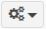

[TOC]

# Contratos – Modificar Contrato -Termo Aditivo

## 1. Modificação de UG/UASG

Para ter acesso ao contrato, faça a modificação da UG/UASG.

Será apresentada a tela para realização da modificação. Selecione a UG em
que o contrato está cadastrado na lista “Unidade Gestora”.

Após a seleção da UG/UASG, clique em “ Alterar”

## 2. Pesquisa de Cadastro de Contrato
Para pesquisar o contrato desejado clique no menu:

Gestão Contratual >> Contratos >> “Pesquisar” e informe os dados (Tipo
Termo Aditivo/UASG,CPF/CNPJ/UG/ID GÉNÉRICO ou NOME/RAZÃO SOCIAL).

Na tabela de contratos serão apresentados os resultados da pesquisa.

## 3. Inclusão de Termo Aditivo ao Contrato
Para adicionar o Termo Aditivo ao cadastro do contrato, clique no ícone
““.

Será apresentada a tela para realização do cadastro. Para adicionar um
Termo Aditivo clique em “Adicionar Termo Aditivo”.

Preencha os campos dos dados solicitados: Dados Gerais

    ✓ Número Termo Aditivo no formato xxxx/20xx.

    ✓ No campo “Observação” inserir o objeto do Termo de Apostilamento.

**ATENÇÃO**: NÃO clique em “Salvar e Voltar”, necessário terminar o
preenchimento de todas as abas para a finalização.

Os campos marcados com “*” são de preenchimento obrigatório.

Preencha os campos dos dados solicitados: Dados Aditivo

    ✓ “Informações Complementares” poderá ser preenchido caso haja
    alguma especificidade no documento.

**ATENÇÃO**: NÃO clique em “Salvar e Voltar”, necessário terminar o
preenchimento de todas as abas para a finalização.

Os campos marcados com “*” são de preenchimento obrigatório.

Preencha os campos dos dados solicitados: Vigência/Valor

    ✓ Como se trata de um Termo de Aditivo de Acréscimo/Supressão (no
    caso supressão), deverá ser feito a alteração apenas da data de inicio
    de vigência, inserindo no campo “Data Vig. Início” a data de
    assinatura do Termo Aditivo;

    ✓ O campo “Data Vig. Fim” não será alterado.

    ✓ “Valor Global” NÃO se confunde com valor anual. Para identificarmos
    o valor global precisamos somar o valor inicial contratado ao valor da
    diferença encontrada até o final da vigência do contrato.

    ✓ Inserir o novo valor da parcela. Esse sim, consideramos o novo valor
    anual, já com a supressão em questão, dividido pelo número de
    parcelas, que também não foi alterado.

**ATENÇÃO**: NÃO clique em “Salvar e Voltar”, necessário terminar o
preenchimento de todas as abas para a finalização.

Os campos marcados com “*” são de preenchimento obrigatório.

Preencha os campos dos dados solicitados: Retroativo

Como trata-se de supressão e acréscimo, não há efeito retroativo. A opção
“Não” já está pré-selecionada.

Após, clique em “Salvar e voltar”. 

Para confirmar a inclusão da Supressão/Acréscimo do Termo Aditivo refaça
os itens 1 a 3 (Figura 5) e ele aparecerá entre os termos já cadastrados.

