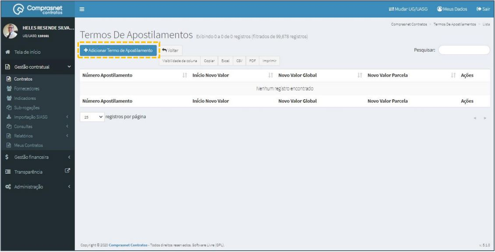

[TOC]

# Contratos – Modificar Contrato -Termo de Apostilamento

## 1. Modificação de UG/UASG
Para inclusão de Apostilamento, selecione a UG (Unidade Gestora) na qual
o contrato está cadastrado. Para pesquisar outra UG, clique no botão
“Mudar UG”.

Será apresentada a tela mudar UG, então selecione a Unidade Gestora na
qual o contrato está cadastrado, e clique no botão “Alterar”.

## 2. Pesquisa para Inclusão de Apostilamento

Para pesquisar o contrato e incluir o apostilamento, clique no menu:

Gestão Contratual >> Contratos

No campo Pesquisar, informe os dados do contrato desejado.

Será apresentada uma tela com resultado da pesquisa.
Clique no ícone ““ e, na lista de itens Contrato, selecione
“Termo Apostilamento”.

## 3. Adicionar Termo de Apostilamento

Para adicionar Termos de Apostilamento, clique em “Adicionar Termo de
Apostilamento”.

Preencha os campos solicitados: Dados Gerais

    ✓ No campo “Número Termo Apostilamento” deverá ter o
    formato (mês/Ano);

    ✓ No campo “Observação” deverá inserir o objeto do termo de
    apostilamento.

Atenção: **NÃO** clicar em “Salvar e Voltar” neste momento, pois faz-se
necessário preencher as 3 abas de cadastro de apostilamento.

Os campos marcados com “*” são de preenchimento obrigatório.

Preencha os campos solicitados: Dados Apostilamento

    ✓ No campo “Data Assinatura Apostilamento” e
    “Data Início Novo Apostilamento” deve-se inserir a mesma
    data respectivamente;

    ✓ No campo “Novo Valor Global”, é necessário identificar
    primeiro o novo valor global, somando o valor inicial
    contratado ao valor da diferença encontrada até o final da
    vigência do contrato;

    ✓ No campo “Novo Núm. Parcelas”, caso não houver
    alteração de vigência, manter o mesmo número de parcelas;

    ✓ No campo “Novo Valor da Parcela”, será considerado o valor
    anual repactuado dividido pelo número de parcelas.
    Exemplo: Tabela 1, para identificar o novo valor global.

Atenção: **NÃO** clicar em “Salvar e Voltar” neste momento,
pois faz-se necessário preencher as 3 abas de cadastro de
apostilamento.

Os campos marcados com “*” são de preenchimento obrigatório.

A *tabela 1* traz informações para identificar o novo valor global,
como exemplo.

- **Valor Anual Original: R$ 2.174.260,79**
- **Valor Anual Repactuado: R$ 2.174.260,79**

<table>
    <thead>
        <tr>
            <th colspan="2">DATA</th>
            <th>DIAS</th>
            <th>VALOR MENSAL ORIGINAL</th>
            <th>VALOR MENSAL REPACTUADO</th>
            <th>DIFERENÇA</th>
        </tr>
    </thead>
    <tbody>
        <tr>
            <td>22/01/2018</td>
            <td>31/01/2018</td> 
            <td>8</td>
            <td>R$48.316,91</td>
            <td>-</td>
            <td>-</td>
        </tr>
        <tr>
            <td>01/02/2018</td>
            <td>28/02/2018</td> 
            <td>30</td>
            <td>R$181.188,40</td>
            <td>-</td>
            <td>-</td>
        </tr>
        <tr>
            <td>01/03/2018</td>
            <td>31/03/2018</td> 
            <td>30</td>
            <td>R$181.188,40</td>
            <td>-</td>
            <td>-</td>
        </tr>
        <tr>
            <td>01/04/2018</td>
            <td>30/04/2018</td> 
            <td>30</td>
            <td>R$181.188,40</td>
            <td>-</td>
            <td>-</td>
        </tr>
        <tr>
            <td>01/05/2018</td>
            <td>31/05/2018</td> 
            <td>30</td>
            <td>R$181.188,40</td>
            <td>R$183.321,95</td>
            <td>R$2.133,55</td>
        </tr>
        <tr>
            <td>01/06/2018</td>
            <td>30/06/2018</td> 
            <td>30</td>
            <td>R$181.188,40</td>
            <td>R$183.321,95</td>
            <td>R$2.133,55</td>
        </tr>
        <tr>
            <td>01/07/2018</td>
            <td>31/07/2018</td> 
            <td>30</td>
            <td>R$181.188,40</td>
            <td>R$183.321,95</td>
            <td>R$2.133,55</td>
        </tr>
        <tr>
            <td>01/08/2018</td>
            <td>31/08/2018</td> 
            <td>30</td>
            <td>R$181.188,40</td>
            <td>R$183.321,95</td>
            <td>R$2.133,55</td>
        </tr>
        <tr>
            <td>01/09/2018</td>
            <td>30/09/2018</td> 
            <td>30</td>
            <td>R$181.188,40</td>
            <td>R$183.321,95</td>
            <td>R$2.133,55</td>
        </tr>
        <tr>
            <td>01/10/2018</td>
            <td>31/10/2018</td> 
            <td>30</td>
            <td>R$181.188,40</td>
            <td>R$183.321,95</td>
            <td>R$2.133,55</td>
        </tr>
        <tr>
            <td>01/11/2018</td>
            <td>30/11/2018</td> 
            <td>30</td>
            <td>R$181.188,40</td>
            <td>R$183.321,95</td>
            <td>R$2.133,55</td>
        </tr>
        <tr>
            <td>01/12/2018</td>
            <td>31/12/2018</td> 
            <td>30</td>
            <td>R$181.188,40</td>
            <td>R$183.321,95</td>
            <td>R$2.133,55</td>
        </tr>
        <tr>
            <td>01/01/2019</td>
            <td>22/01/2019</td> 
            <td>22</td>
            <td>R$132.871,49</td>
            <td>R$134.436,10</td>
            <td>R$1.564,61</td>
        </tr>
    </tbody>
    <thead>
        <tr>
            <th colspan="5">EFEITOS FINANCEIRO</th>
            <th>R$18.633,03</th>
        </tr>
        <tr>
            <th colspan="5">Novo Valor Global (Valor Anual Original + Diferença até Final da Vigência)</th>
            <th>R$2.192.893,82</th>
        </tr>
    </thead>
</table>

Preencha os campos solicitados: Retroativo

    ✓ No campo “Retroativo” selecione a opção“Sim”, caso seu
    apostilamento não possua valores retroativos, deixe selecionada
    a opção “Não”;

    ✓ No campo “Mês Referência”, selecione o mês em que os valores
    foram alterados (neste caso a data base da CCT é 1º/05/2018);

    ✓ No campo “Ano de Referência”, selecione o ano que os valores
    foram alterados (neste caso a data base da CCT é 1º/05/2018);

    ✓ No campo “Mês de Referência Até”, selecione o mês em que se
    encerra o retroativo. Considera-se o mês de encerramento aquele
    da assinatura do termo.

    ✓ No campo “Ano de Referência Até”, selecione o ano em que se
    encerra o retroativo. Considera-se o ano de encerramento aquele
    da assinatura do termo.

    ✓ No campo “Vencimento Retroativo”, preencha a data de
    vencimento do retroativo. Como padrão, adotamos o último dia do
    mês da assinatura do termo de apostilamento;

    ✓ No campo “Soma ou Subtrai”, selecione “Soma” caso o novo valor
    seja maior que o valor anterior ou “Subtrai” caso o valor seja menor
    queo valor anterior. No caso de um índice apurado der um valor
    negativo (deflação, será, selecionado a opção “Subtrai”;

    ✓ No campo “Valor Retroativo”, preencha o campo com o valor
    retroativo. É a soma das diferenças dos valores atual e atualizado,
    desde o início da vigência do novo valor até o último dia do mês da
    assinatura do termo de apostilamento.(Exemplo: Tabela 2, do
    cálculo retroativo).

Após preenchimento de todas as abas, clique em “Salvar e voltar”.

A tabela 2 traz informações para ilustrar o cálculo retroativo,
como exemplo.

<table>
    <thead>
        <tr>
            <th colspan="2">DATA</th>
            <th>DIAS</th>
            <th>VALOR MENSAL</th>
            <th>VALOR MENSAL REPACTUADO</th>
            <th>DIFERENÇA</th>
        </tr>
    </thead>
    <tbody>
        <tr>
            <td>01/05/2018</td>
            <td>31/05/2018</td> 
            <td>30</td>
            <td>R$181.188,40</td>
            <td>R$183.321,95</td>
            <td>R$2.133,55</td>
        </tr>
        <tr>
            <td>01/06/2018</td>
            <td>30/06/2018</td> 
            <td>30</td>
            <td>R$181.188,40</td>
            <td>R$183.321,95</td>
            <td>R$2.133,55</td>
        </tr>
        <tr>
            <td>01/07/2018</td>
            <td>31/07/2018</td> 
            <td>30</td>
            <td>R$181.188,40</td>
            <td>R$183.321,95</td>
            <td>R$2.133,55</td>
        </tr>
        <tr>
            <td>01/08/2018</td>
            <td>31/08/2018</td> 
            <td>30</td>
            <td>R$181.188,40</td>
            <td>R$183.321,95</td>
            <td>R$2.133,55</td>
        </tr>
        <tr>
            <td>01/09/2018</td>
            <td>30/09/2018</td> 
            <td>30</td>
            <td>R$181.188,40</td>
            <td>R$183.321,95</td>
            <td>R$2.133,55</td>
        </tr>
        <tr>
            <td>01/10/2018</td>
            <td>31/10/2018</td> 
            <td>30</td>
            <td>R$181.188,40</td>
            <td>R$183.321,95</td>
            <td>R$2.133,55</td>
        </tr>
        <tr>
            <td>01/11/2018</td>
            <td>30/11/2018</td> 
            <td>30</td>
            <td>R$181.188,40</td>
            <td>R$183.321,95</td>
            <td>R$2.133,55</td>
        </tr>
        <tr>
            <td>01/12/2018</td>
            <td>31/12/2018</td> 
            <td>30</td>
            <td>R$181.188,40</td>
            <td>R$183.321,95</td>
            <td>R$2.133,55</td>
        </tr>
    </tbody>
    <thead>
        <tr>
            <th colspan="5">Retroativo</th>
            <th>R$17.068,43</th>
        </tr>
    </thead>
</table>
