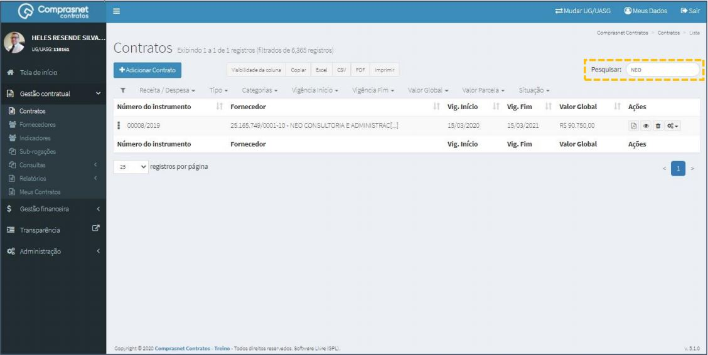
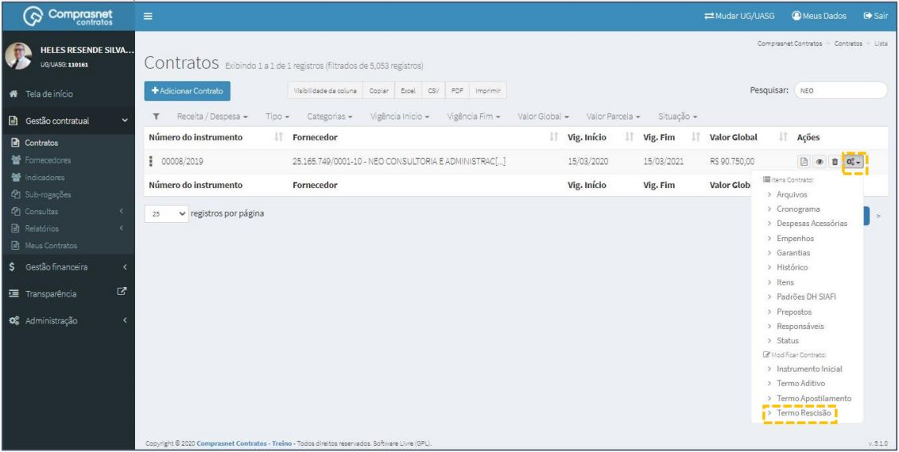
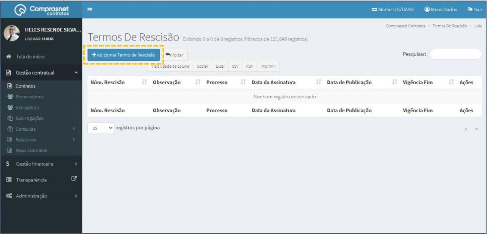
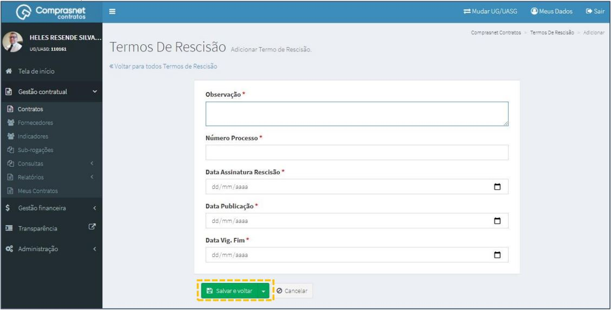

[TOC]

# Contratos - Modificar Contrato – Termo Rescisão

## 1. Pesquisa para Inclusão de Termo Rescisão

Para pesquisar o contrato e incluir um termo, clique no menu:

Gestão Contratual >> Contratos

No campo Pesquisar, informe os dados do contrato desejado.

Será apresentada uma tela com resultado da pesquisa.
Clique no ícone ““ e, na lista de itens Contrato, selecione
“Termo Rescisão”.

## 2. Adicionar Termo

Para adicionar uma rescisão , clique em “Adicionar Termo”.

Preencha os campos dos dados solicitados. Após, clique em
“Salvar e voltar”.

Os campos marcados com “*” são de preenchimento obrigatório.

