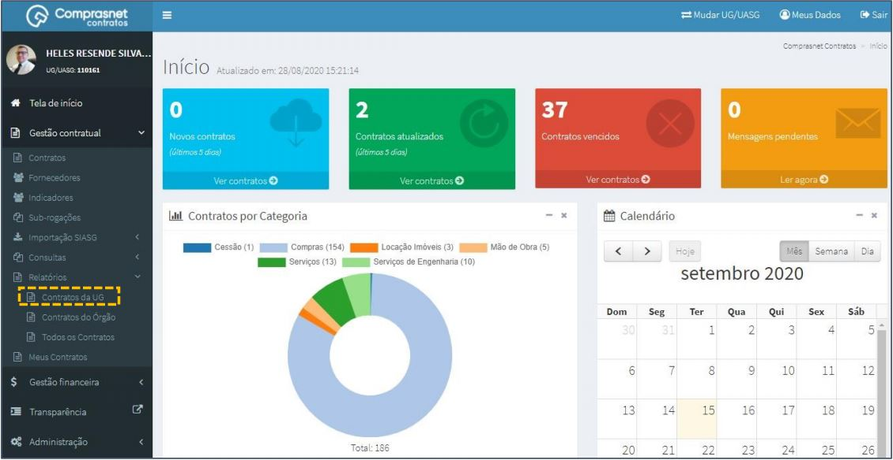
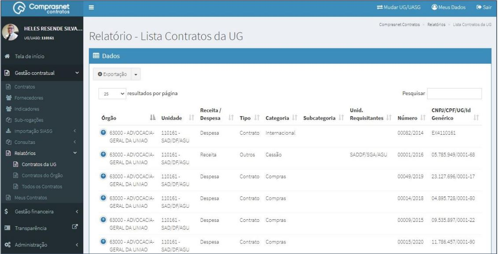
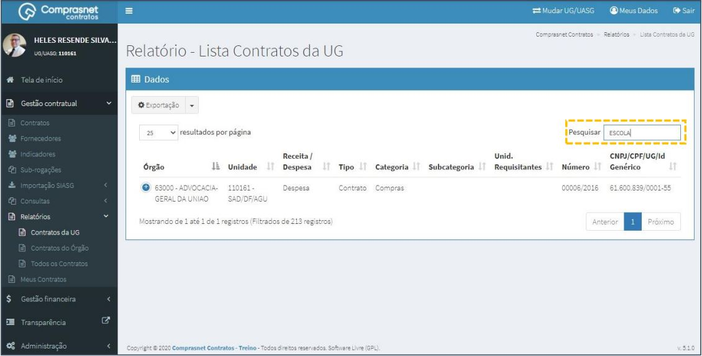
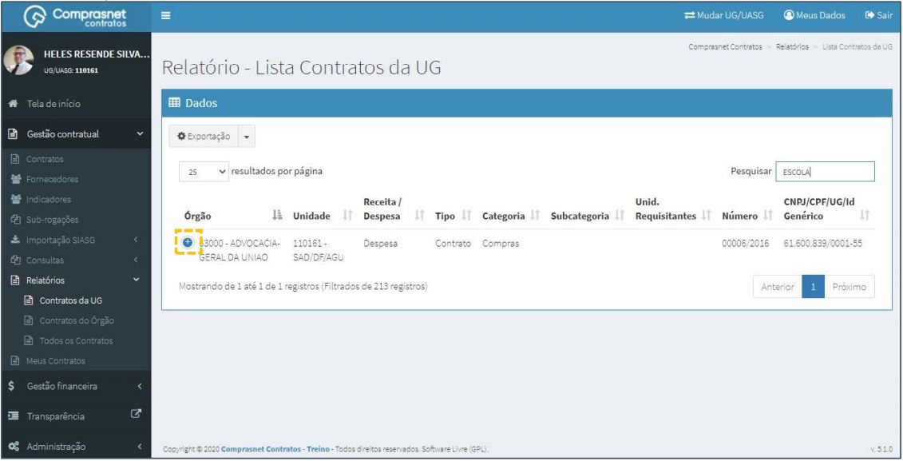
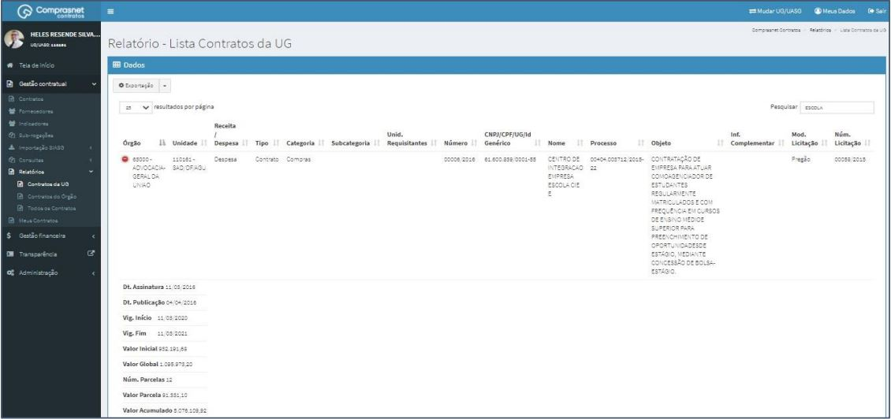
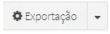
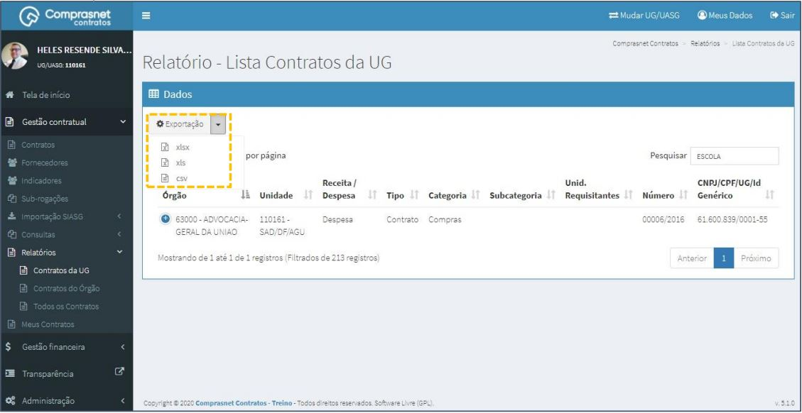

[TOC]

# Relatórios – Contratos da UG

## 1. Consulta de Relatórios

Para consultar um relatório de contrato de UG, clique no menu

Gestão Contratual >> Relatórios >> Contratos da UG

Será apresentada a tela de consulta dos relatórios dos contratos.

## 2. Pesquisa de Relatórios

Para pesquisar o relatório, clique no campo “Pesquisar” e informe os dados
(Tipo Relatório,CPF/CNPJ/UG/ID GÉNÉRICO ou NOME/RAZÃO SOCIAL).

Na tabela de relatórios serão apresentados os resultados da pesquisa.

## 3. Detalhar Relatórios

Para detalhar o relatório do contrato, clique no ícone ““ .

Será apresentada uma tela com os detalhes de arquivo do contrato
selecionado.

## 4. Exportação de Relatórios

Para fazer uma exportação dos relatórios , clique no ícone
“” e escolha o formato do arquivo desejado para a exportação.

