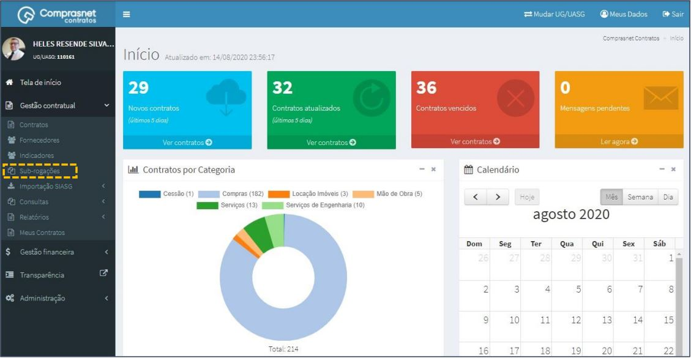

[TOC]

# Sub-Rogações

## 1. Cadastramento de SUB-ROGAÇÕES

Para cadastrar um Sub-Rogações, clique no menu

Gestão Contratual >> Sub-Rogações

Será apresentada a tela para realização do cadastro. Para adicionar uma
sub-rogação clique em “Adicionar Sub-Rogação”.

Preencha os campos dos dados solicitados. Após, clique em
“Salvar e voltar”.

Os campos marcados com “*” são de preenchimento obrigatório.

## 2. Pesquisa de Cadastro de SUB-ROGAÇÕES

Para pesquisar o cadastro de sub-rogação, clique no campo “Pesquisar” e
informe os dados (Tipo Sub-Rogação,CPF/CNPJ/UG/ID GÉNÉRICO ou
NOME/RAZÃO SOCIAL).

Na tabela de sub-rogações serão apresentados os resultados da pesquisa.

## 3. Detalhar Cadastro de SUB-ROGAÇÕES

Para detalhar o cadastro da sub-rogação, clique no ícone ““.

Será apresentada uma tela com os detalhes do cadastro da sub-rogação
selecionada.

## 4. Exclusão Cadastro de SUB-ROGAÇÕES

Para excluir o cadastro de sub-rogação, clique no ícone ““.

