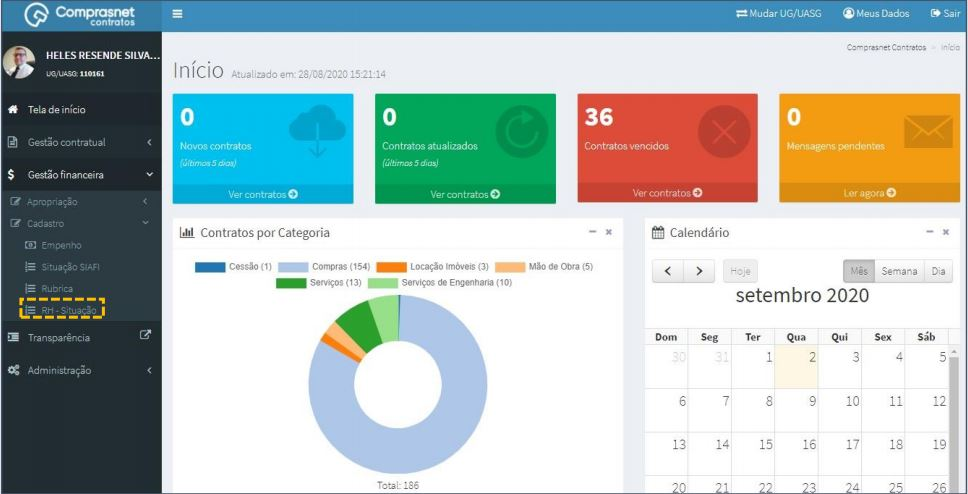
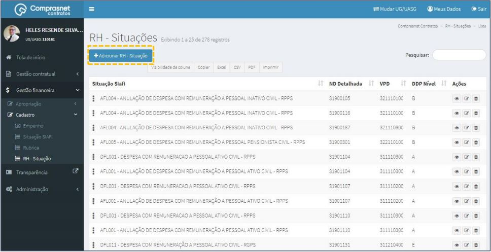
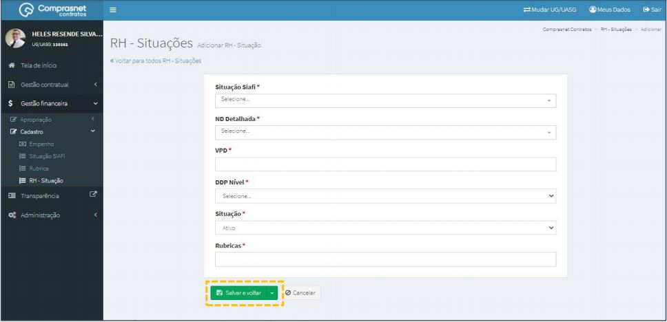
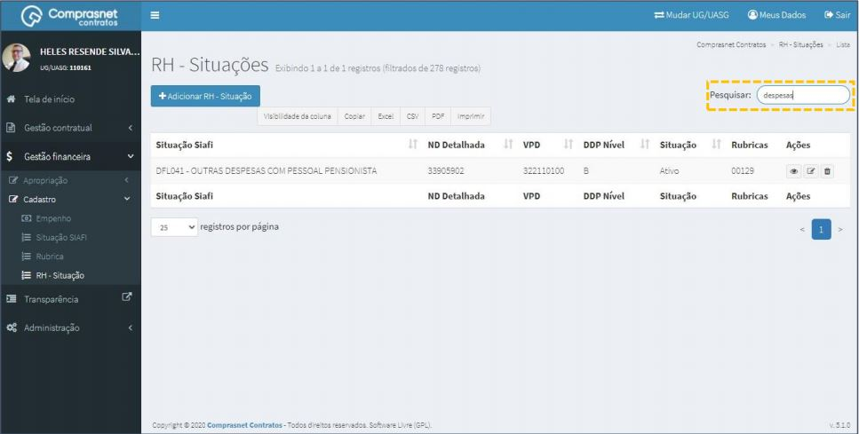
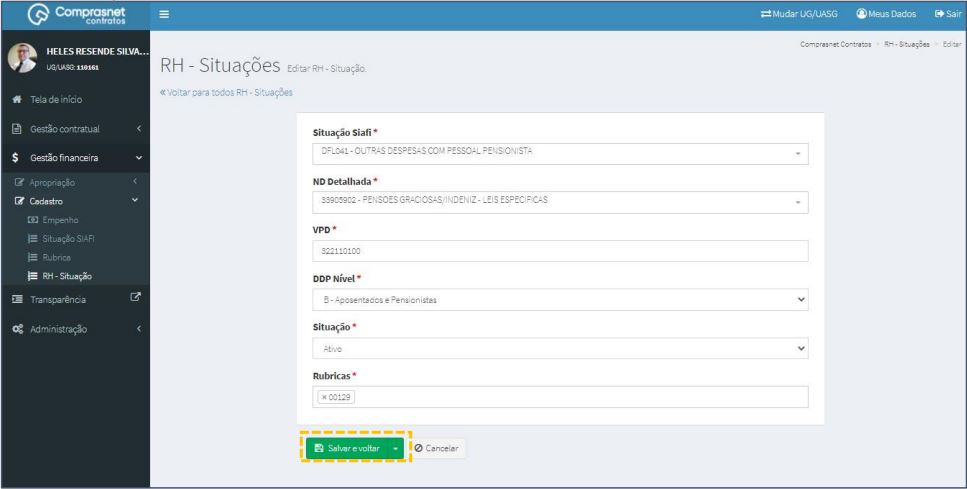
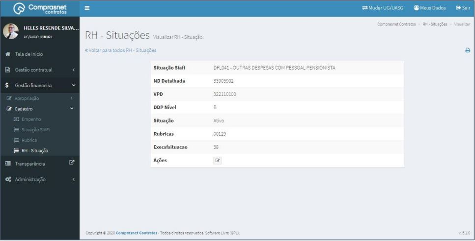
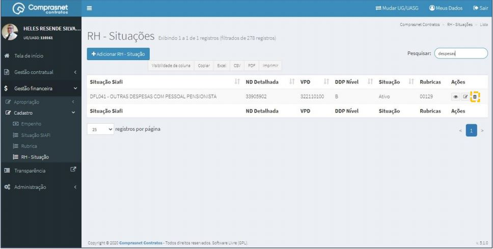

# Cadastro - RH - Situação

[TOC]

## 1. Cadastramento de RH - SITUAÇÃO

Para adicionar uma situação, clique no menu

Gestão Financeira >> Cadastro >> RH - Situação

Será apresentada a tela para realização do cadastro. Para adicionar uma
situação clique em “Adicionar RH - Situação”.

Preencha os campos dos dados solicitados. Após, clique em
“Salvar e voltar”.

Os campos marcados com “*” são de preenchimento obrigatório.

## 2. Pesquisa de Cadastro de RH - SITUAÇÃO

Para pesquisar o cadastro de situações, clique no campo “Pesquisar” e
informe os dados (Tipo RH - Situação,CPF/CNPJ/UG/ID GÉNÉRICO ou
NOME/RAZÃO SOCIAL).

Na tabela de situações serão apresentados os resultados da pesquisa.

## 3. Editar Cadastro de RH – SITUAÇÃO

Para editar o cadastro de situações, clique no ícone ““.

Será apresentada uma tela com os dados da situação para edição.

Após a edição, clique em “Salvar e voltar”

## 4. Detalhar Cadastro de RH - SITUAÇÃO 

Para detalhar o cadastro de situações, clique no ícone ““.

Será apresentada uma tela com os detalhes do cadastro da situação
selecionada.

JPG
## 5. Exclusão Cadastro de RH - SITUAÇÃO

Para excluir o cadastro de situações, clique no ícone ““.

