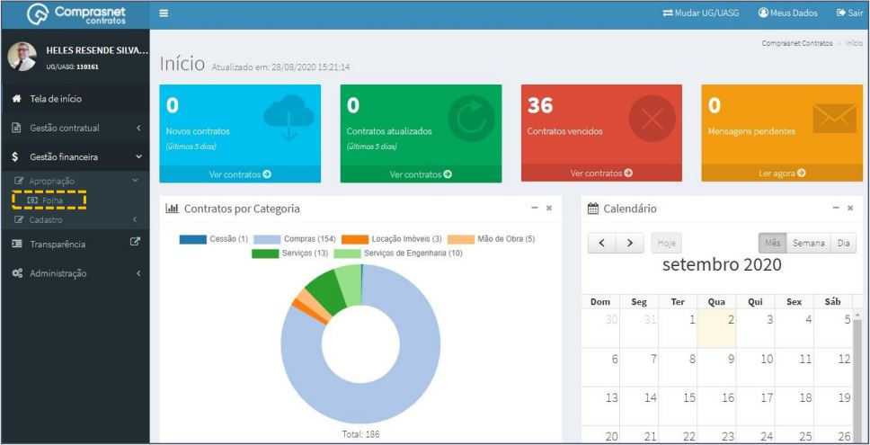
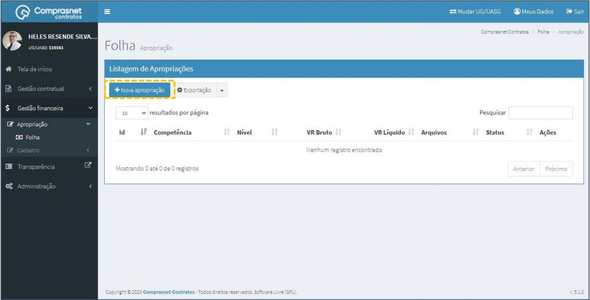
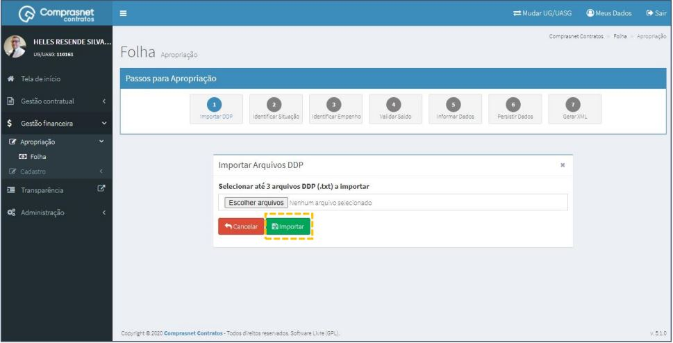
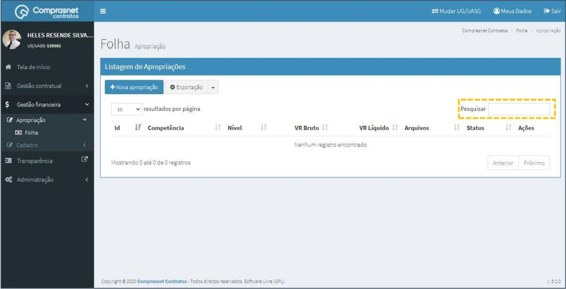
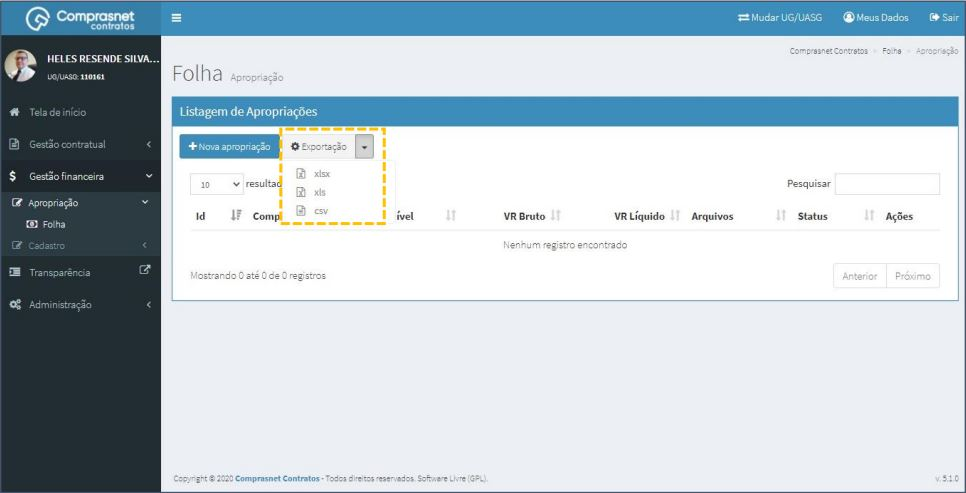

# Funcionalidades – Apropriação

[TOC]

## 1.  Cadastramento de APROPRIAÇÃO
Para cadastrar uma apropriação, clique no menu

Gestão Financeira >> Apropriação >> Folha

Será apresentada a tela para realização do cadastro. Para adicionar uma
apropriação clique em “Nova Apropriação”.

Será apresentada uma tela com os 7 passos para a importação dos arquivos
necessários para a criação da apropriação. Após escolher os arquivos clique
em “Importar”, seguindo assim até o passo 7 (Gerar XML).

## 2. Pesquisa de Cadastro de APROPRIAÇÃO
Para pesquisar o cadastro da apropriação, clique no campo “Pesquisar” e
informe os dados (Tipo Apropriação,CPF/CNPJ/UG/ID GÉNÉRICO ou
NOME/RAZÃO SOCIAL).

Na tabela de apropriações serão apresentados os resultados da pesquisa.

## 3. Exportação de Cadastro de APROPRIAÇÃO
Para fazer uma exportação dos cadastros de apropriações, clique no em
“Exportação” e escolha o formato do arquivo desejado para a exportação.

