# Funcionalidades - Empenho
JPG
[TOC]

## 1. Cadastramento de EMPENHO
Para cadastrar empenho, clique no menu

Gestão Financeira >> Contrato >> Empenho

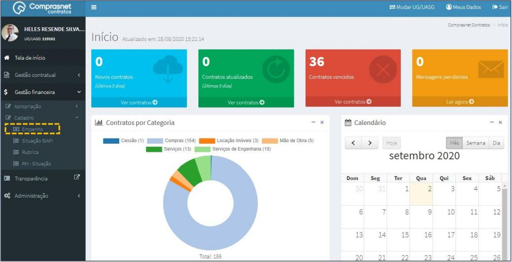

Será apresentada a tela para realização do cadastro. Para adicionar um
empenho clique em “Adicionar Empenho”.

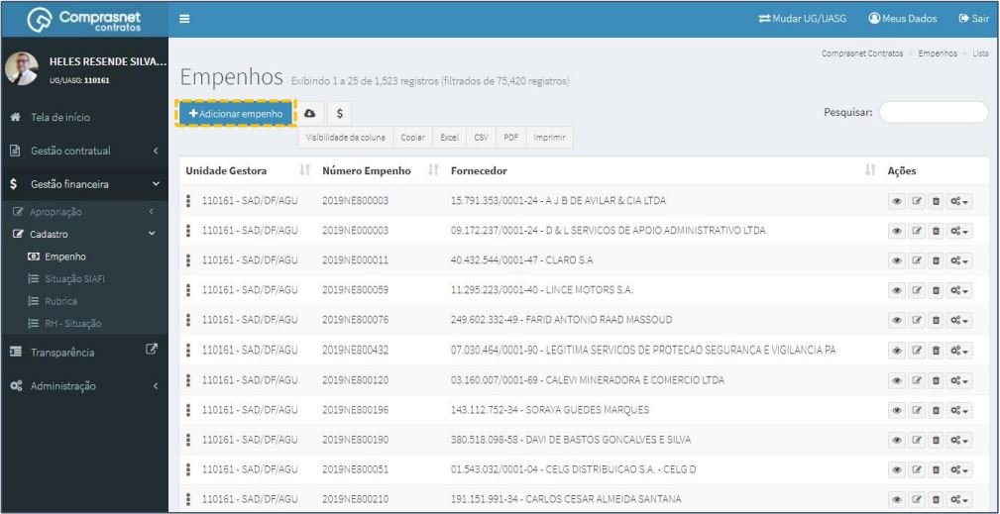

Preencha os campos dos dados solicitados. Após, clique em
“Salvar e voltar”.

Os campos marcados com “*” são de preenchimento obrigatório.

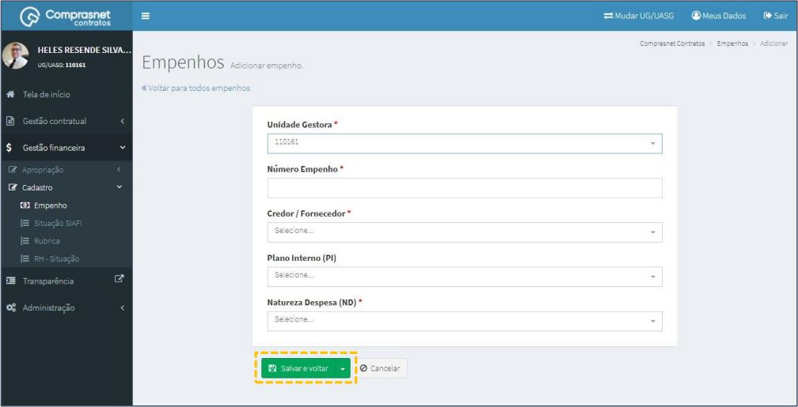

## 2. Pesquisa de Cadastro de EMPENHO
Para pesquisar o cadastro de empenho, clique no campo “Pesquisar” e
informe os dados (Tipo Empenho,CPF/CNPJ/UG/ID GÉNÉRICO ou
NOME/RAZÃO SOCIAL).

Na tabela de empenhos serão apresentados os resultados da pesquisa.

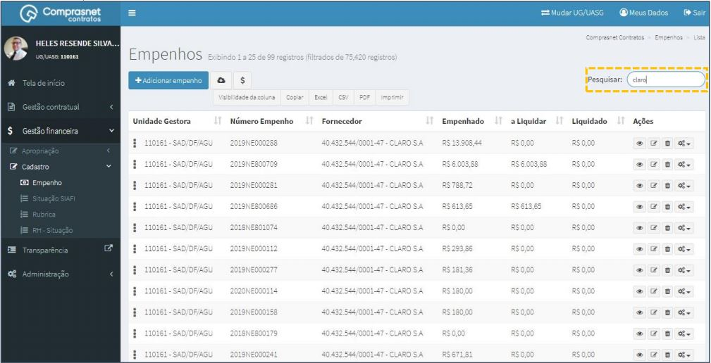

## 3. Editar Cadastro de EMPENHO
Para editar o cadastro de empenho, clique no ícone ““.

Será apresentada uma tela com os dados do contrato para edição.

Após a edição, clique em “Salvar e voltar”

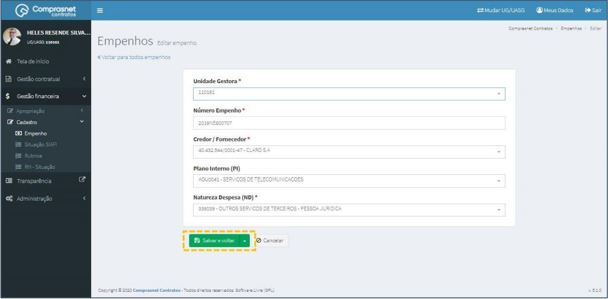

## 4. Detalhar Cadastro de EMPENHO
Para detalhar o cadastro de empenho, clique no ícone ““.

Será apresentada uma tela com os detalhes do cadastro de empenho
selecionado.

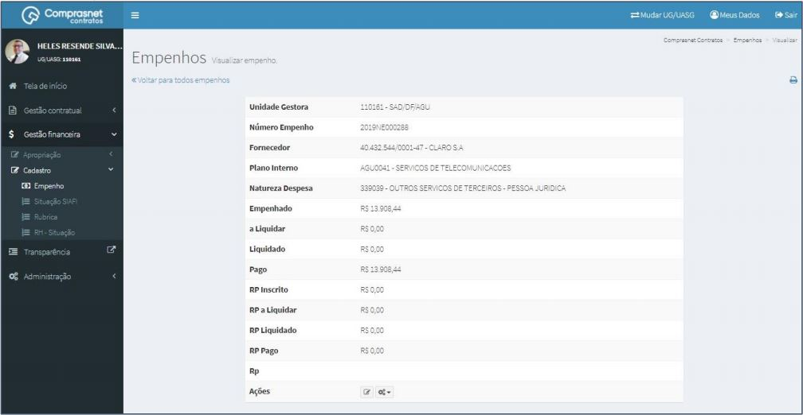

## 5. Exclusão Cadastro de EMPENHO
Para excluir o cadastro de empenho, clique no ícone ““.

## 6. Baixar EMPENHO
Para baixar empenhos, clique no ícone ““.

## 7. Atualizar Saldos de EMPENHO
Para atualizar os saldos de empenho, clique no ícone ““

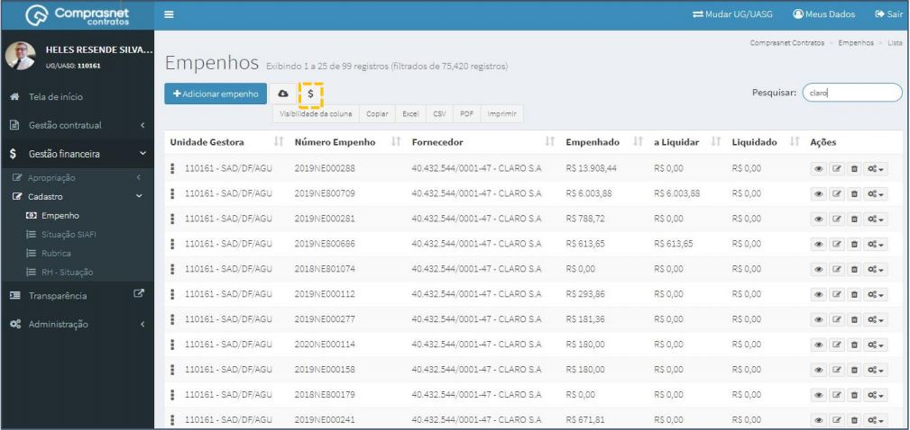

## 8. Cadastro de EMPENHO DETALHADO
Para cadastrar empenho detalhado, clique no ícone “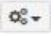“.

Será apresentada a tela para realização do cadastro. Para adicionar um
empenho detalhado clique em “Adicionar Empenho Detalhado”.

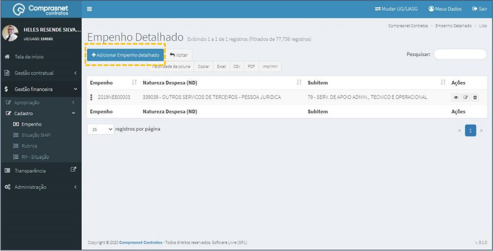

Preencha os campos dos dados solicitados. Após, clique em
“Salvar e voltar”. 

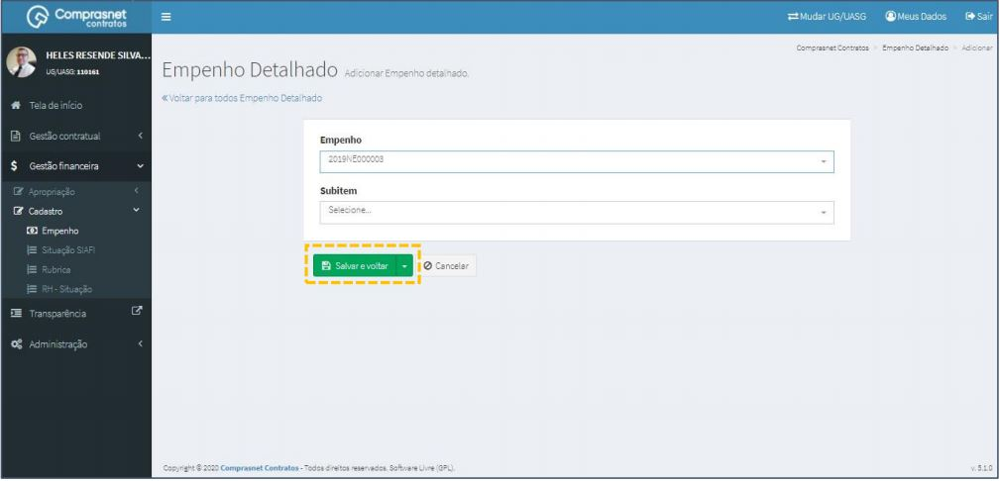

## 9. Editar Cadastro de EMPENHO DETALHADO
Para editar o cadastro de empenho detalhado, clique no ícone ““.

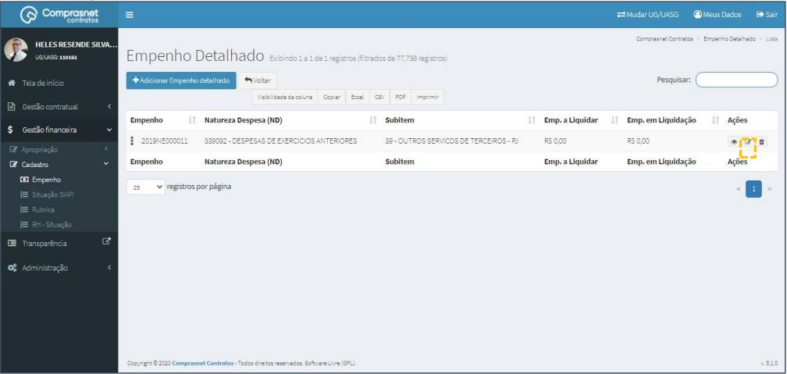

Será apresentada uma tela com os dados do contrato para edição.

Após a edição, clique em “Salvar e voltar”

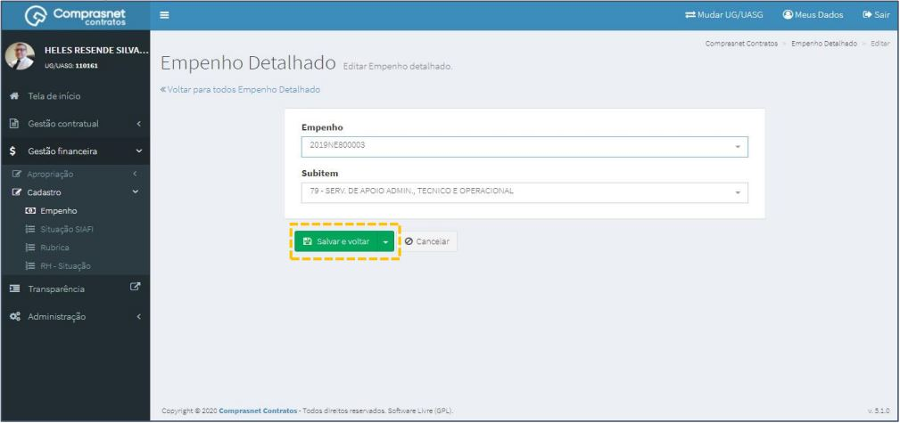

## 10. Detalhar Cadastro de EMPENHO DETALHADO
Para detalhar o cadastro de empenho detalhado, clique no ícone ““.

Será apresentada uma tela com os detalhes do cadastro do contrato
selecionado.

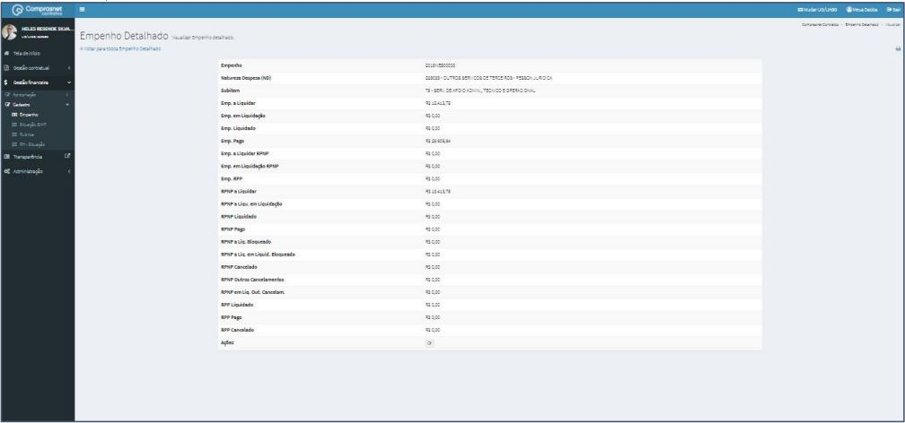

## 11. Exclusão Cadastro de EMPENHO DETALHADO
Para excluir o cadastro de empenho detalhado, clique no ícone ““.

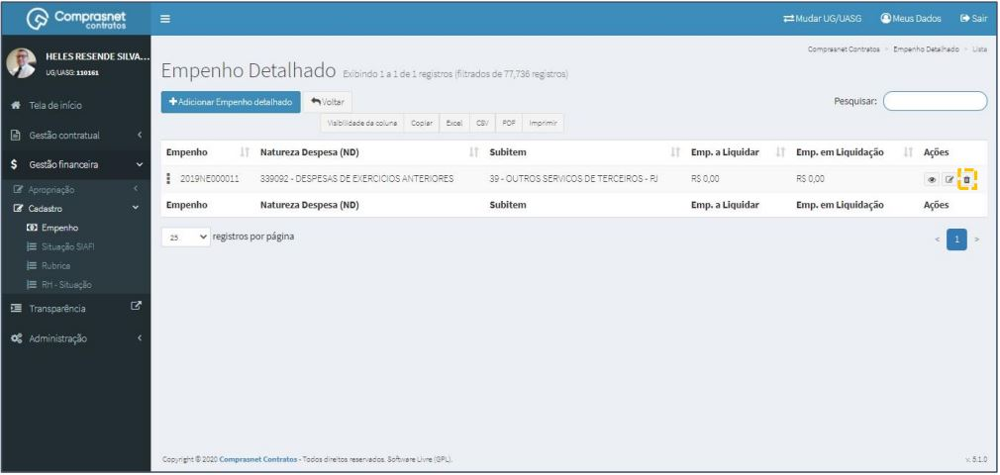
