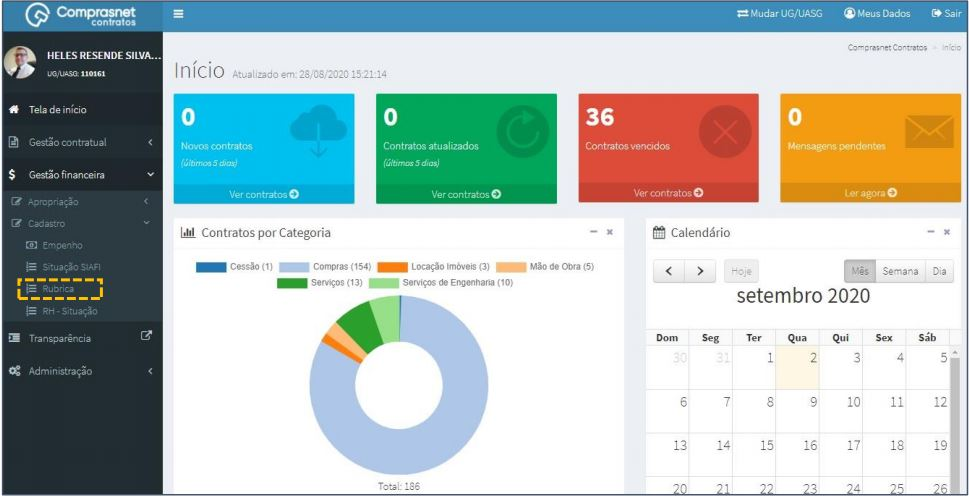
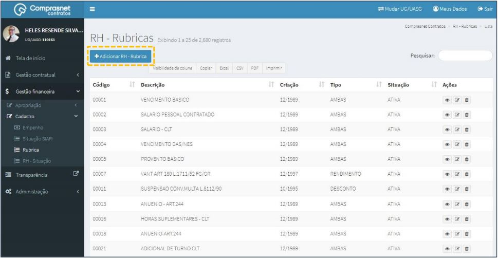
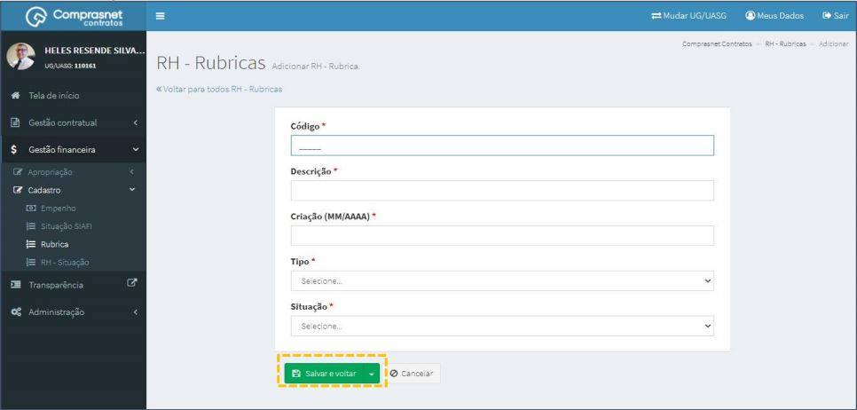
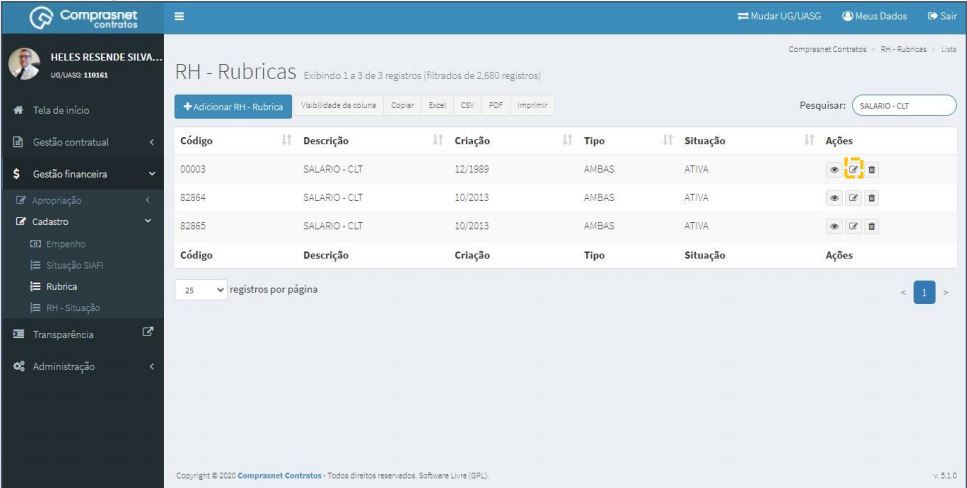
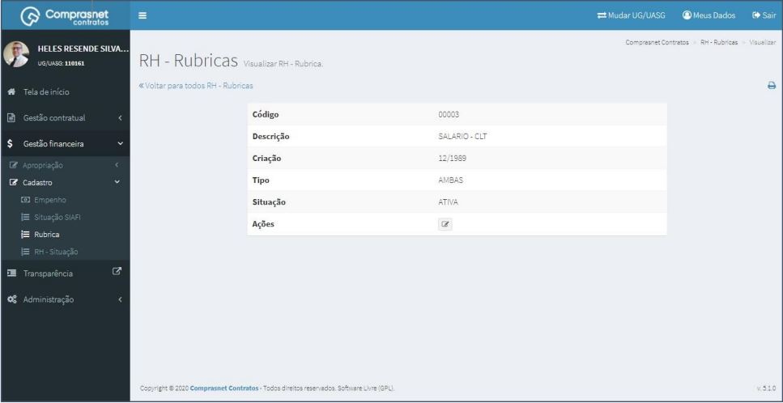

# Cadastro - Rubricas

## 1. Cadastramento de RH - RUBRICAS

Para adicionar uma rubrica, clique no menu:

Gestão Financeira >> Cadastro >> Rubrica

Será apresentada a tela para realização do cadastro.

Para adicionar uma rubrica clique em “Adicionar RH - Rubrica”.

Preencha os campos dos dados solicitados. Após, clique em
“Salvar e voltar”.

Os campos marcados com “ * ” são de preenchimento obrigatório.

## 2. Pesquisa de Cadastro de RH - RUBRICAS
Para pesquisar o cadastro de rubrica, clique no campo “Pesquisar” e informe
os dados (Tipo RH - Rubricas,CPF/CNPJ/UG/ID GÉNÉRICO ou NOME/RAZÃO
SOCIAL).

Na tabela de rubricas serão apresentados os resultados da pesquisa.

## 3. Editar Cadastro de RH - RUBRICAS
Para editar o cadastro de rubricas, clique no ícone ""

Será apresentada uma tela com os dados da rubrica para edição.

Após a edição, clique em “Salvar e voltar”

## 4. Detalhar Cadastro de RH - RUBRICAS
Para detalhar o cadastro da rubrica, clique no ícone ""

Será apresentada uma tela com os detalhes do cadastro rubrica selecionada.

## 5. Exclusão Cadastro de RH - RUBRICAS

Para excluir o cadastro de rubricas, clique no ícone ““.

